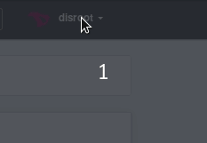

Obtaining data you provided to Diaspora is fully automated and can be done at any time. All you need to do is:

1. Login to diaspora at [https://pod.disroot.org](https://pod.disroot.org)

2. Go to account settings:

3. Once on settings page, scroll all the way down and choose what data you want to request. you can either obtain all your posts or images you've uploaded.

Once you hit any of the request buttons, you'll need to wait few moments (depending on the size of your account) until the request is processed and you are ready to download your data

4. Once the data is ready to be downloaded you can do so by clocking "Download" button back at the bottom of settings.

