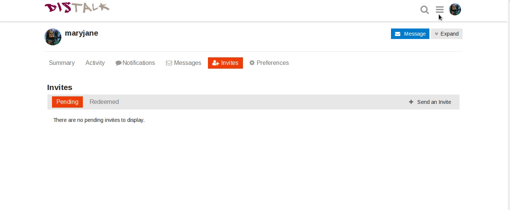

Discourse, the software used by Disroot for Forum, allows you to export the text content off all your posts to a .csv file, (which is supported by most calc/spreadsheet software's, Libreoffice, Openoffice, Gnumeric, Excel).

**To export your posts from Discourse:**
- Press your Gravatar on the upper right corner of the screen 
- Press the button with your username 
- Press the button _"Download my posts"_ 
- Press _"yes"_ when the pop-up window asks if you want to download your posts and then press _"ok"_

**NOTE:** The data can only be downloaded once every 24h
 

You will get a message from the system notifying you that the data is ready to be downloaded, and providing you a link to download the .csv file with a copy of your posts.
If you have enabled notifications via email, you will also get an email with this information. Just press the link to download the file.

The data is compressed as a gzip archive. If the archive does not extract itself when you open it, use the tools recommended here: http://www.gzip.org/#faq4

The link will be available for 48h, after that it will expire and you will have to export your data again.

Once you extract the file you can open it in your spreadsheet program.
