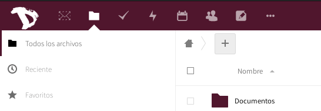
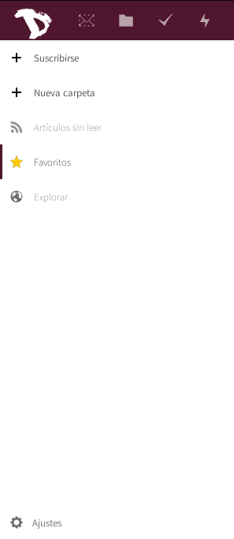

Exportar tus fuentes de noticias y suscripciones es sencillo como en cualquiera de las aplicaciones de Nextcloud.

1. Inicia sesión en la [nube](https://cloud.disroot.org)

2. Selecciona la aplicación **Noticias**
 

3. Selecciona Ajustes, abajo a la izquierda, en la barra lateral.

5. Dependiendo de tus necesidades, puedes elegir exportar:
  - Tus suscripciones (OPML): Esto es especialmente útil si quieres cambiar tu proveedor de fuentes de noticias (lector RSS) o simplemente tener un respaldo de la actual lista de sitios de noticias.
  - Artí­culos Sin leer/Favoritos: Si quieres exportar el contenido mismo del artí­culo ya sea para leerlo fuera de lí­nea, con el propósito de archivarlo o de migrar. Los artí­culos leí­dos son removidos en forma regular.
 

