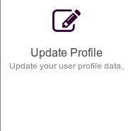
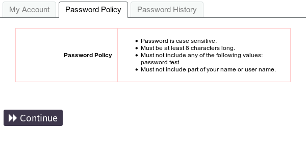
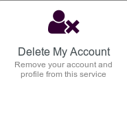

## User Self Service Center

The **User Self Service Center** is the place where you can manage your **Disroot** account settings.

Log in with your **Disroot** username and password.

## Change your password

Click on this option to change your current password.

Follow the password creation rules and enter the new one twice.

Once you've changed your password you will need to make sure to change your encryption key in the **Cloud**, since all your files in **Nextcloud** are encrypted with a key that is generated from your password.

1. Go to **[https://cloud.disroot.org](https://cloud.disroot.org)** and log in with your new password.
You will see a yellow message on top of the page: 

    `Invalid private key for Encryption App. Please update your private key password in your personal settings to recover access to your encrypted files.`

2. Click on your name in the top right corner and select **Personal** from the menu.

3. Scroll down to **Basic Encryption Module** and type in your old password and your new password and click **Update Private Key Password**.

4. Log out of **Nextcloud** and log back in and that's it, you're all set and can view your file again.

| **NOTE**|
|:--:|
|If you lose your password, you won't be able to retrieve your files on the cloud as they're encrypted, so even the server administrators can't see their content. |

## Setup Security Questions

In case you forget/lose your password, you can reset it without Admins intervention by seting up the security questions first.

The proccess is pretty simple: click on ***Setup Security Questions***.

Write the first question and its answer, then select the next two questions from the drop-down list and write the answers as well. 

Once the answers meet the requirements, just click ***Save Answers***.

## Updating the Profile

Whether it's to receive notifications or reset your password, you can add a secondary address to your profile. You can also modify your screen name (the name that will appear on the services screen)

## Account information

Here you can find a summary of the **account and password information**, **the password policy** (the rules that a password must comply with) and the **history** of the password management.

## Account Deletion

If for any reason you want to delete your account, just click this option. Once you're sure about deleting the account, check the **I Agree** box and finally **Delete**.

| **NOTE**|
|:--:|
|**This process is irreversible.** Once confirmed, **you won't be able to log in** to your account or ask **to restore it** later. **All your remaining data will be deleted** within 48 hours, and **your current user name will not be available** when creating a new account.
