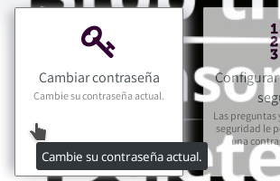

Primero, necesitas acceder al **Centro de Autoservicio** en https://user.disroot.org y seleccionar **Cambiar contraseña**.

||
|:--:|
||

Una vez que hayas cambiado la contraseña, necesitarás asegurarte de cambiar tu clave de encriptado en **Nextcloud**, ya que tus archivos allí están encriptados con una clave generada a partir de tu contraseña.
1. Ve a **[https://cloud.disroot.org](https://cloud.disroot.org)** y accede con tu nueva contraseña.
Verás un mensaje amarillo en la parte superior de la página:
`Invalid private key for Encryption App. Please update your private key password in your personal settings to recover access to your encrypted files.`
2. Haz click sobre tu nombre en la esquina superior derecha y selecciona la opción **Personal** del menú.
3. Deslízate hacia abajo hasta **Módulo de encriptado básico de Nextcloud** y escribe tu antigua contraseña y tu nueva contraseña y haz click en **Actualizar Clave Privada de Contraseña**.
4. Cierra la sesión de Nextcloud y vuelve a ingresar. Eso es todo - ya estás listo y puedes ver tus archivos de nuevo.

| **AVISO**|
|:--:|
|Si pierdes tu contraseña, no podrás recuperar tus archivos en la nube ya que están encriptados, y tampoco los administradores del servidor pueden ver su contenido. |
