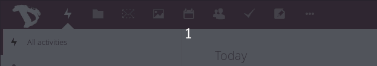
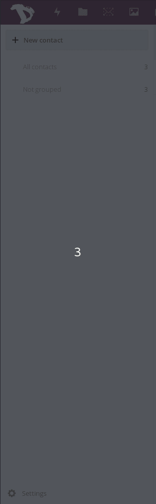

Contacts can be exported in any time in very simple way.

1. Login to your cloud account at [https://cloud.disroot.org](https://cloud.disroot.org)

2. Select *"Contacts"* App.
 

3. Select **Settings** option at the bottom of the left side-bar.

4. Select *"three dot"* Menu next to the addressbook you want to export.

5. Select to *"Download"* to get your contacts. Contacts are saved in .vcf format.
 

