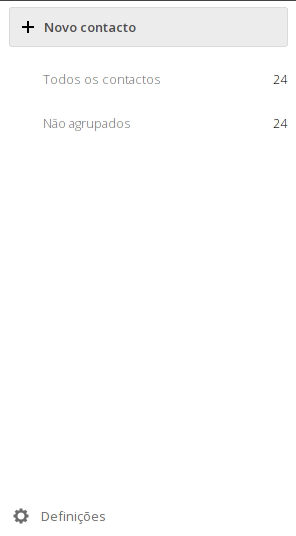

Os seus contactos podem ser exportados a qualquer altura de uma forma muito simples.

1. Faça login na sua conta de cloud em [https://cloud.disroot.org](https://cloud.disroot.org)

2. Selecione a aplicação *"Contactos"*.

3. Selecione a opção **Definições** no fundo da barra lateral esquerda.

4. Carregue no botão com *"três pontinhos"* ao lado do livro de endereços que quer exportar.

5. Carregue em *"Transferir"* para obter uma cópia dos seus contactos. Os contactos são guardados no formato  .vcf.

