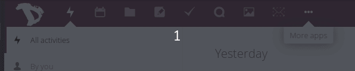

Exportar os seus bookmarks armazenados na cloud é muito fácil com o Disroot.

1. Faça login na sua conta de [cloud](https://cloud.disroot.org)

2. Selecione a aplicação Bookmark

3. Selecione 'Settings' (no fundo da página à direita) e carregue no botão **"Export"**

