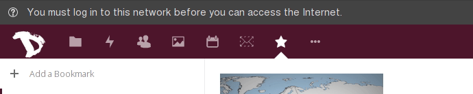

Exportar calendários é possível muito fácilmente. Basta:

1. Fazer login na sua conta de [cloud](https://cloud.disroot.org)

2. Selecionar a aplicação Calendário

3. Para exportar qualquer um dos seus calendários ou calendários que tenha subscrito.
Selecione o botão *"três pontinhos"* ao lado do calendário que quer exportar carregue em  *"Transferir"*. O calendário transferido será guardado num ficheiro no formato .ics.

Repita o processo para todos os outros calendários que quiser exportar.
