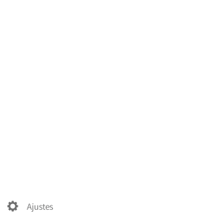

Los Contactos se pueden exportar de manera sencilla en cualquier momento.

1. Inicia sesión en la [nube](https://cloud.disroot.org)

2. Selecciona la aplicación *"Contactos"*.
 

3. Selecciona la opción **Ajustes** que está abajo en la barra lateral izquierda.

4. Haz click en el menú de *"tres puntos"* que estará al lado de la libreta de direcciones que quieras exportar.

5. Selecciona *"Descargar"* para obtener tus contactos en un archivo para guardar en formato .vcf.
 

