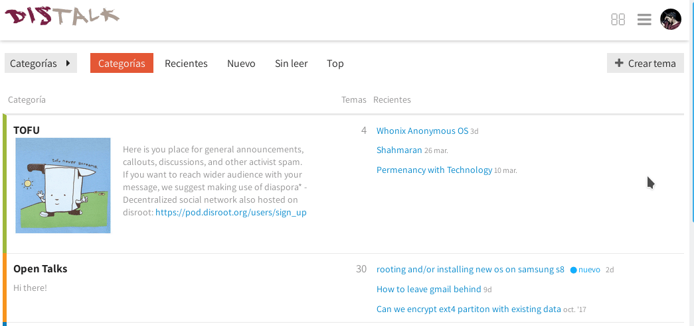

Discourse, el software utilizado por Disroot para el Foro, te permite exportar el contenido escrito de todas tus publicaciones en un archivo de formato .csv (que es soportado por la mayoría de los programas que manejan hojas de cálculo: Libreoffice, Openoffice, Gnumeric, Excel).

**Para exportar tus publicaciones desde Discourse:**
- Presiona tu Gravatar en la esquina superior derecha de la pantalla  

- Presiona el botón con tu nombre de usuario  

- Presiona el botón *"Descargar mis posts"*  

- Se abrirá un cuadro de diálogo pidiendo que confirmes si quieres descargar tus publicaciones, selecciona *"Sí"* y luego *"Ok"* 

**AVISO:** La información solo puede descargarse una vez cada 24hs. 

Recibirás un mensaje del sistema notificándote cuando los datos estén listos para descarga y un link a un archivo .csv, con la copia de todas tus publicaciones.
Si tienes habilitadas las notificaciones por correo, también recibirás uno con esta información. Solo haz click en el link para descargar el archivo.

Los datos son comprimidos en un archivo gzip. Si el mismo no se puede extraer cuando lo intentas abrir, utiliza alguna de las herramientas recomendadas aquí: http://www.gzip.org/#faq4

El link estará disponible durante 48hs, luego expirará y tendrás que realizar el proceso nuevamente para exportar tus datos otra vez.

Una vez extraído el archivo, puedes abrirlo con tu programa de hojas de cálculo.
