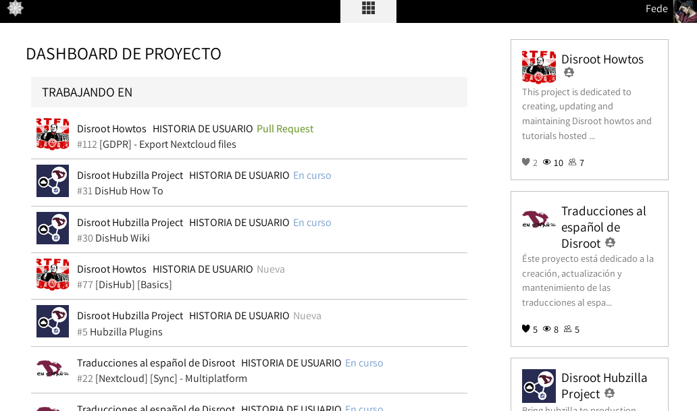
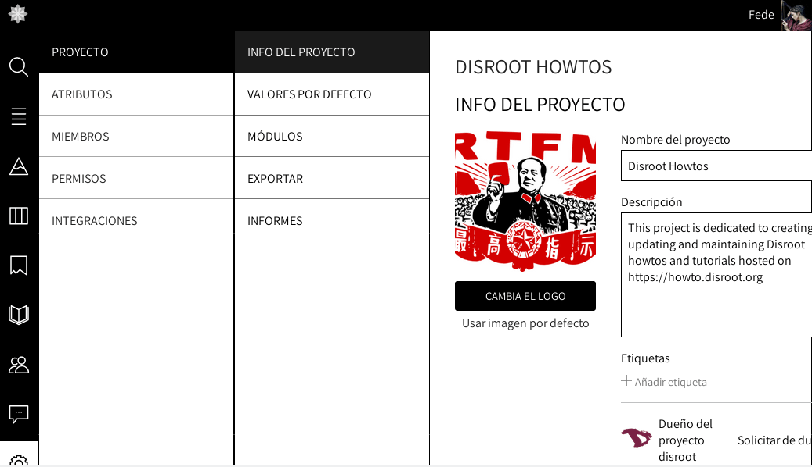

 
Sigue los pasos a continuación para exportar la información de tu proyecto desde la interfaz de Taiga:

1. Ve a https://board.disroot.org e inicia sesión.
2. Selecciona el proyecto que quieres exportar y ve a las configuraciones de Admin (abajo en la barra lateral izquierda).
 

 

3. Dentro de la pestaña Proyecto encontrarás la opción Exportar. Haz click en el botón  para general un archivo .json con toda la información del proyecto. Puedes utilizarlo como un respaldo o iniciar un nuevo proyecto basado en él.

 

 
