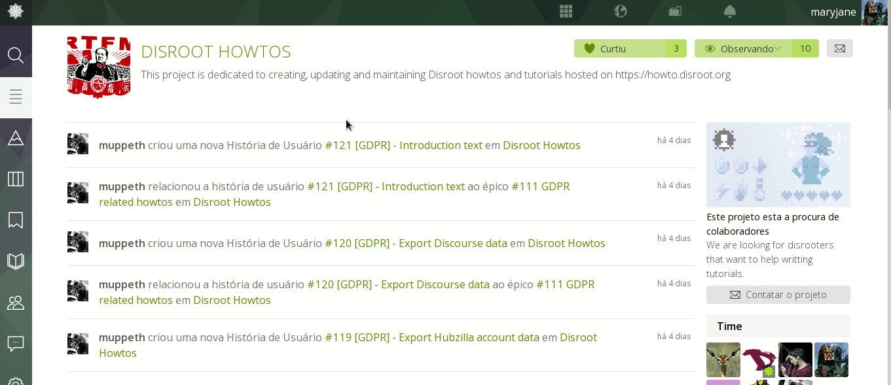
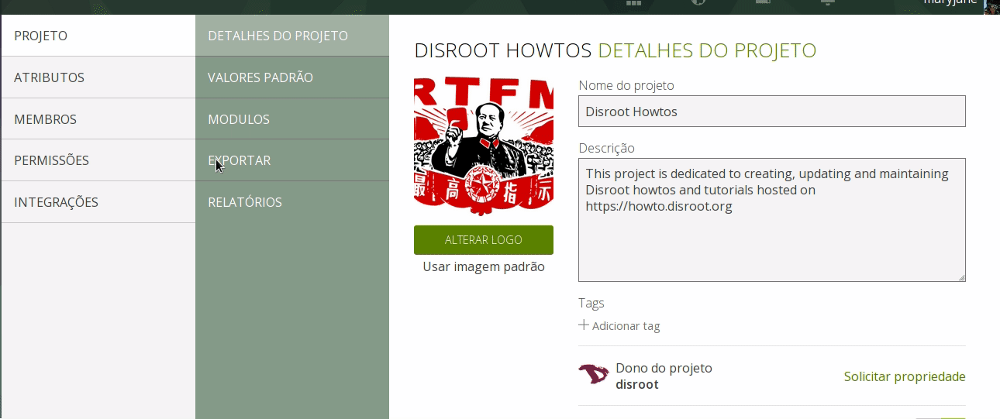

 
Siga estes passos para exportar os dados do seu projeto a partir do interface do Taiga:

1. Vá a https://board.disroot.org e faça login.
2. Selecione o projeto que quer exportar e vá à seção Administrador.

 

 
3. No painel do projeto irá encontrar a opção de exportar. Carregue no botão   para criar um ficheiro .json com todas as informações do projeto. Você pode usar isso como uma cópia de backup ou para começar um novo projeto baseado nesta cópia

 

 
