Nextcloud es el servicio medular de Disroot y la interfaz de usuario más importante que intentamos integrar con la mayoría de las aplicaciones que ofrecemos. En este pequeño manual nos gustaría abarcar lo más elemental de la interfaz explicando el concepto de Interfaz de Usuario principal (UI), así como algunas acciones básicas sobre archivos y configuraciones personales.
 
 
 
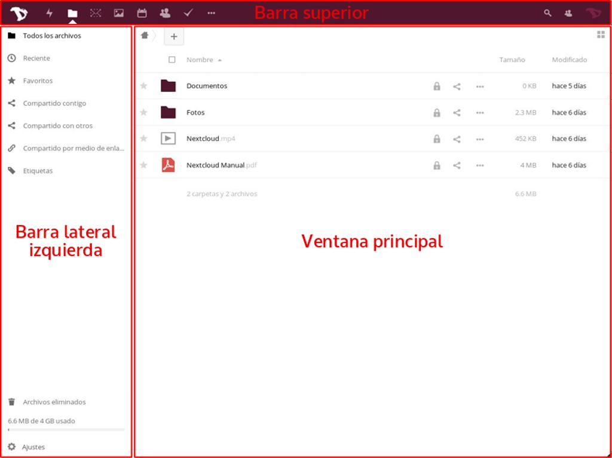

----------

# Vista general de la Interfaz de Usuario

La experiencia del usuario a través de la aplicación web en la nube es consistente y directa.

A los fines de este manual, nombraremos algunos de los bloques de la interfaz para ayudarte a identificarlos más adelante:

 - **Barra superior:** es la barra en la parte superior con links a todas las aplicaciones, tus configuraciones personales, las que están actualmente iniciadas y las notificaciones.
 - **Barra lateral izquierda:** es donde puedes encontrar las Opciones, Filtros, Configuraciones, etc.
 - **Ventana principal:** la ventana principal de la aplicación.
 - **Barra lateral derecha:** pantalla emergente que se abre cuando ciertas acciones son disparadas (información de archivos, creación avanzada de eventos de calendario, etc).

Para navegar a diferentes aplicaciones, simplemente haz click en un ícono en la barra superior.

----------

# Configuraciones Personales
Comencemos mirando lo que puedes configurar y personalizar en tu cuenta en la nube. Haz click sobre tu avatar en la esquina superior derecha y elige la configuración **"Personal"** (si no has establecido el avatar aún, está en el ícono de “engranaje” en la esquina superior derecha de la barra superior).

Las configuraciones están divididas en secciones. Puedes usar los links rápidos en *barra lateral izquierda* para acceder a ellos fácilmente.

## Información Personal
Información Personal es el lugar donde puedes agregar información sobre ti mismo, que luego puedes elegir compartir con otros. Puedes, además, escoger el nivel de acceso que deseas darle a la información que puede ser “compartida”.

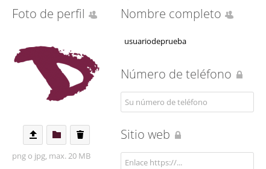

Por lo tanto:

  - **Privada:** Tú eres la única persona que puede ver esta información.
  - **Local:** Significa que esta información estará habilitada para ser vista por otras cuentas de Disroot (sólo si conocen tu nombre de usuario).
  - **Contactos:** Significa más o menos lo mismo que Local, pero con la adición de tener esta información compartida cuando compartes datos con usuarios en otras instancias de Nextcloud.
  - **Pública:** Significa que los datos serán enviados a la libreta de direcciones global (puede ser vista por cualquiera).

Deberías prestar especial atención cuando completas esta información *(lo cual es opcional)* y decidir cuánta información sobre ti mismo deseas revelar al mundo.

## Grupos e idioma
Abajo puedes ver a cuáles **grupos** perteneces (si los hubiera). Por defecto las cuentas de Disroot no están asociadas con ningún grupo. También puedes cambiar tu idioma preferido.

## Sesiones
Aquí puedes ver cuántos dispositivos están actualmente conectados a tu cuenta. Si ves dispositivos conectados a ella que no deberían estar listados, esto podría significar que tu cuenta está comprometida y deberías proceder a cambiar tu contraseña. *(Ten presente que cada navegador, móvil, ordenador, etc., serán mostrados como dispositivos separados cada vez que, por ejemplo, cambies tu red; así que no te asustes de entrada, y verifica todo en serio dos veces, antes de entrar de lleno en modo paranoide)*.

## Actividad
En la sección de actividad puedes decidir cómo deseas ser informado acerca de los eventos que sucedan en tu nube. Puedes elegir entre recibir notificaciones por correo y/o ser notificado en el flujo de Actividad, o incluso no ser notificado en absoluto. Puedes decidir recibir tus notificaciones por correo: **Por hora**, **Diariamente** o **Semanalmente**.

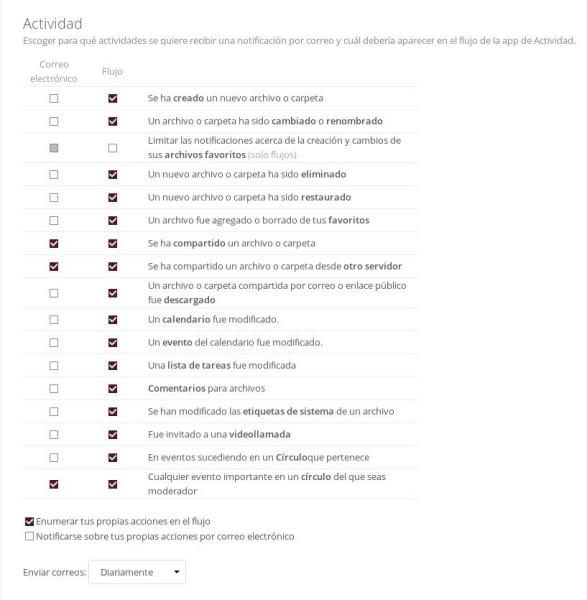

## Módulo de encriptado básico
Aquí puedes decidir si un administrador estará habilitado o no para recuperar tus archivos en caso que pierdas tu contraseña. Esta opción está deshabilitada por defecto ya que posibilita a los administradores de Disroot a desencriptar y ver tus archivos. **¡Habilitar esta opción después de perder la contraseña no recuperará tus archivos!** Necesitas tomar esta decisión de antemano. **Te recomendamos enfáticamente no perder nunca tu contraseña, en primer lugar, y mantenerla guardada en forma segura.** Esta es la mejor manera de mantener tus archivos y tu cuenta a salvo. De verdad, no queremos tener acceso a ellos.

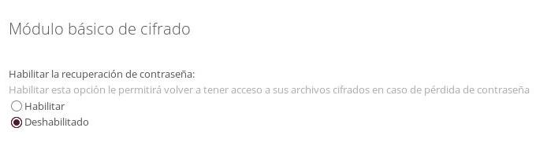

## Nube federada
¿Qué es una nube federada? Igual que los correos, que pueden ser enviados entre usuarios de diferentes servidores (gmail, riseup, disroot, etc) también Nextcloud te da la posibilidad de compartir archivos, contactos, calendarios, etc, con personas fuera de Disroot que utilicen también soluciones en nube (Owncloud y/o Nextcloud). Esto da a los usuarios la libertad de usar la plataforma de su elección, a la vez que posibilita la colaboración de unos con otros. En esta sección puedes ver tu ID de federación. Puedes compartirla con otros enviando un link o vía plataformas predefinidas (para lo cual puedes agregar tus preferidas que no estén incluidas, por supuesto).

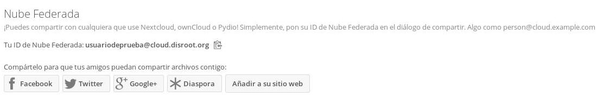

## Video llamadas con Spreed
A menos que tengas acceso a tu propio servidor TURN, **deberías dejar estos campos en blanco**. Esta opción es para configurar un servicio que ayude a determinar tu dirección IP cuando estás usando aplicaciones de "llamadas" para conferencias de audio/video en Disroot. Por defecto, todas las cuentas de disroot están utilizando el servidor TURN de Disroot.

## Códigos de respaldo de dos-factores
Esta opción es utilizada para autenticación de dos factores, que no está habilitada de momento.

----------

# ARCHIVOS

La principal tarea de la nube es administrar archivos. Puedes fácilmente subir, descargar, compartir y comentar.

La *barra izquierda* te permite filtrar archivos basados en ciertos criterios. La *ventana principal* es tu navegador de archivos. Deberías estar familiarizado con esto si alguna vez has utilizado un ordenador :P.

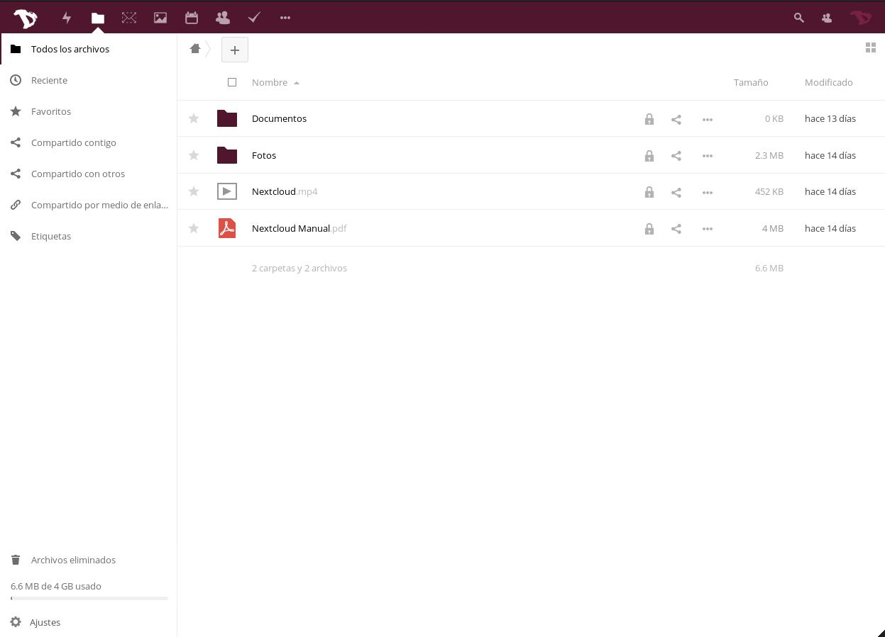

## Crear nuevos archivos o directorios
Para crear un archivo nuevo, sólo haz click sobre el botón **"+"** y elige el tipo de archivo de la lista. Puedes crear tanto directorios como archivos de textos y blocks de notas.

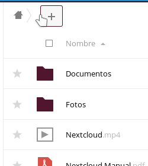

## Subir archivos
Hay dos maneras de subir archivos.
Puedes hacerlo arrastrando archivos desde tu equipo (navegador de archivos) hacia la ventana de navegación de la nube. La otra manera es utilizando el ícono **"+"** y seleccionar la opción **"Subir un archivo"**.

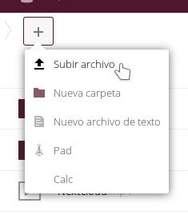

## Compartir archivos
Compartir archivos y directorios es una parte esencial de cualquier servicio de almacenamiento en la nube. Puedes elegir compartir archivos con otros usuarios de Disroot o tu grupo entero, pero también con otros usuarios que utilicen Owncloud/Nextcloud en diferentes plataformas. También puedes compartir con cualquiera a través de la opción Enlace público.

Para compartir un archivo o un directorio, simplemente haz click en el "*ícono compartir*" justo al lado del nombre del objeto que deseas compartir. Una barra derecha emergente aparecerá con todas las opciones para que elijas una manera de hacerlo.

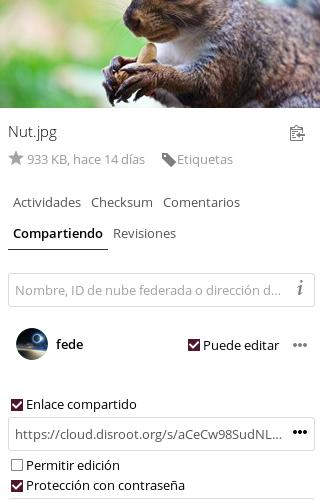

Puedes decidir compartir con otros usuarios, grupos o usuarios en diferentes servidores de nube, utilizando la dirección federada o tipeando el nombre de usuario completo (**no proveemos autocompletado por razones de seguridad**). Cuando compartes con otros usuarios o grupos puedes decidir si los usuarios tienen o no privilegios para editar/modificar el contenido de lo compartido (borrar archivos, subir, editar), y si pueden volver a compartirlo con respecto a otros usuarios.

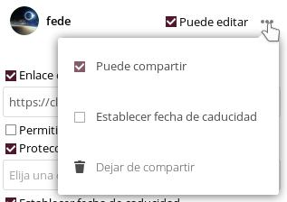

Además de compartir con otros usuarios, puedes compartir tus datos con cualquiera utilizando "Compartir Enlace", que puedes copiar/pegar a quien quieras. Cualquiera que conozca la dirección (url) podrá acceder a los archivos. La persona no necesita tener una cuenta válida. Compartir un enlace te da la opción extra de proteger lo que compartes con contraseña y fecha de caducidad.

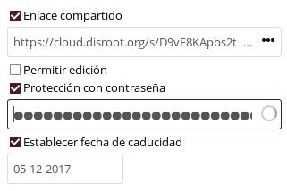

## Comentarios, Actividades, Versión
Como habrás notado cuando configurabas Compartir, hay más opciones en la barra derecha.

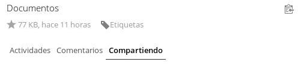

 - **Actividades:** te da un resumen de todas las actividades con el archivo. El momento en que fue creado, cuándo fue compartido, editado, comentado, etc.
 - **Comentarios:** son muy útiles cuando trabajas sobre el archivo con otros usuarios. Todos aquellos con los que has compartido el archivo pueden leer y agregar comentarios.
 - **Versiones:** te permite ver todos cambios realizados al archivo. Puedes descargar revisiones previas del archivo, así como restaurar a una versión previa (borrando todos los cambios realizados posteriormente).

## Otras operaciones de archivo
Haciendo click en el ícono de **"tres puntos**" próximo al nombre del archivo o directorio, te da opciones extra. Esas opciones se explican solas. Puedes "Renombrar", "Mover", "Descargar" o borrar el archivo o directorio.

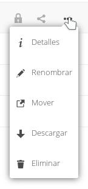

----------

#Actividades

Cuando tu cuenta comience a ponerse agitada, empieces a colaborar con muchos otros usuarios y grupos, podrías encontrar muy útil la aplicación **"Actividades"**. Aquí tienes un resumen general de todas las actividades sucediendo dentro de tu cuenta en la nube (cambios de archivos, comentarios, compartidos, contactos, pendientes, calendarios, etc).

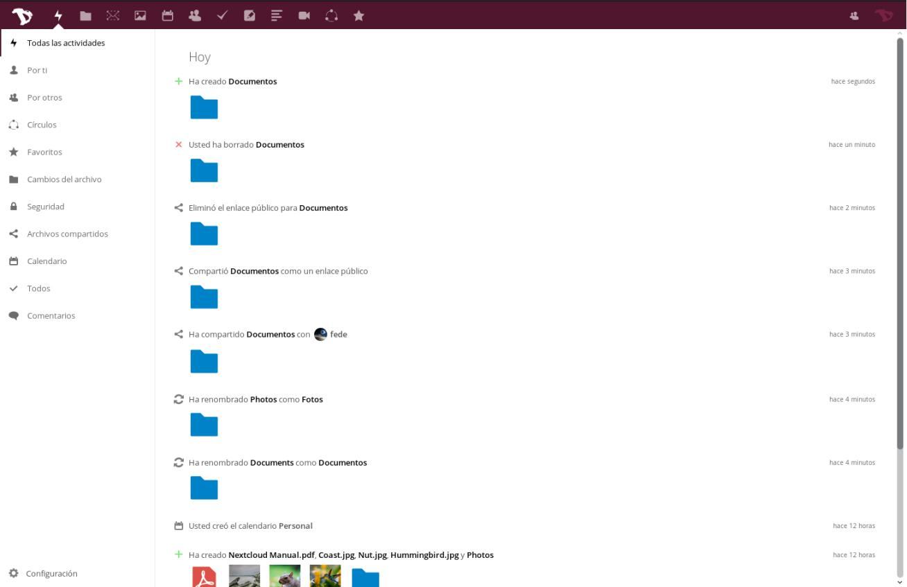

La ventana principal te da una línea de tiempo con todas las actividades, y la barra lateral izquierda te permite filtrar la información según un criterio.

Adicionalmente puedes crear un aviso de actualizaciones RSS de tus actividades (Presiona el "botón configuraciones" al final de la barra lateral izquierda), que puedes seguir utilizando tu lector preferido de RSS, compartirlo con alguien o integrarlo en tu aplicación o sitio web (agregar el feed a tu sala matrix, por ejemplo).

----------
