Nextcloud est le service de base de disroot et la principale interface utilisateur que nous essayons d'intégrer avec la plupart des applications que nous offrons. Dans ce petit guide, nous aimerions passer en revue les bases de l'interface expliquant le concept principal de l'interface utilisateur), ainsi que quelques actions de base sur les fichiers et les paramètres personnels.
 
 
 
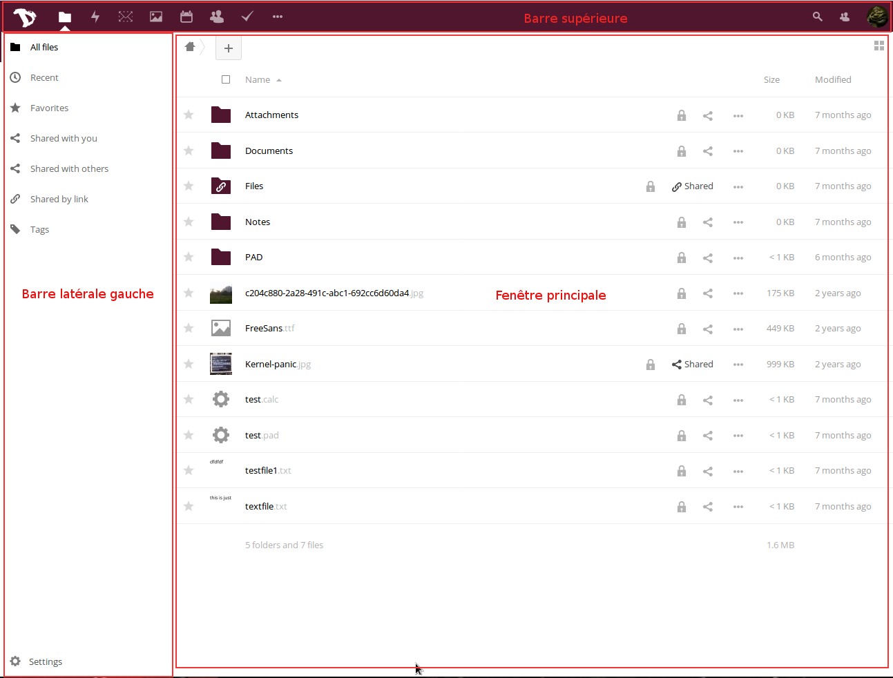

----------

# L'interface utilisateur générale

L'expérience utilisateur sur l'ensemble de la webapplication du cloud est cohérente et simple.

Pour les besoins de ce mode d'emploi, nous nommerons certains des blocs de l'interface pour aider à les identifier plus tard:

 **Barre supérieure** - est la barre en haut avec des liens vers toutes les applications, vos paramètres personnels, l'application en cours d'utilisation et les notifications.
  - **Barre latérale gauche** - C'est là que vous pouvez trouver Options, Filtres, Paramètres, etc.
 - **Fenêtre principale** - la fenêtre principale de l'application
 - **Barre latérale droite** - Écran pop-up qui s'ouvre lorsque certaines actions sont déclenchées (informations sur les fichiers, création avancée d'événements du calendrier, etc.)

Pour naviguer vers différentes applications, il vous suffit de cliquer sur une icône dans la barre supérieure.

----------

# Paramètres personnels
Commençons par regarder ce que vous pouvez configurer et personnaliser sur votre compte cloud. Cliquez sur votre avatar dans le coin supérieur droit et choisissez Paramètres **"Personnel"** (si vous n'avez pas encore défini d'avatar, c'est l'icône 'roue dentée' dans le coin en haut à droite de la barre du haut).

Les réglages sont divisés en sections. Vous pouvez utiliser des liens rapides sur la *barre latérale gauche* pour y accéder facilement.

## Informations personnelles
Les informations personnelles sont l'endroit où vous pouvez ajouter diverses informations sur vous-même, que vous pouvez ensuite choisir de partager avec d'autres. Vous pouvez également choisir le niveau d'accès auquel vous souhaitez que ces informations soient "partagées".

Ainsi :

- **Private**  Vous êtes la seule personne qui peut voir cette information.
  **Local** - signifie que cette information sera visualisée par d'autres comptes disroot (seulement s'ils connaissent votre nom d'utilisateur)
  **Contacts** - signifie à peu près la même chose que Local, mais en plus,  ces informations sont partagées lors du partage de données avec les utilisateurs d'autres instances de Nextcloud.
  **Public** - signifie que les données seront envoyées au carnet d'adresses global (cela peut être vu par tout le monde)

Vous devriez faire particulièrement attention lorsque vous remplissez ces informations *(ce qui est facultatif)* et décider de la quantité d'informations sur vous-même que vous voulez révéler au monde.

## Groupes et langue
Ci-dessous vous pouvez voir à quels **groupes** vous appartenez (le cas échéant). Par défaut, les comptes disroot ne sont associés à aucun groupe.
Vous pouvez également changer votre langue préférée.

## Sessions
Vous pouvez voir ici combien d'appareils sont actuellement connectés à votre compte. Si vous voyez des périphériques connectés à votre compte qui ne devraient pas être listés, cela pourrait signifier que votre compte a été compromis et vous devriez procéder à la modification de votre mot de passe. *(Veuillez garder à l'esprit que chaque navigateur, mobile, ordinateur, etc. sera affiché comme appareil séparé chaque fois que vous changez votre réseau par exemple, alors ne paniquez pas au début, et vérifiez vraiment tout, avant de passer en mode paranoïaque)*.

## Activité
Dans la section Activité, vous pouvez décider comment vous souhaitez être informé des événements qui se déroulent sur votre cloud. Vous pouvez choisir entre recevoir une notification par mail et/ou être notifié dans le flux d'activité, ou même choisir de ne pas être notifié du tout. Vous pouvez décider de recevoir vos notifications par courriel sur une base horaire, quotidienne ou hebdomadaire.

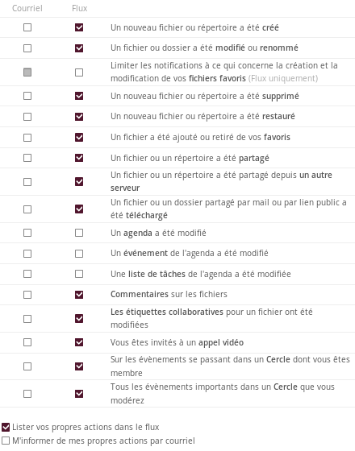

## Module de chiffrement basique
Ici, vous pouvez décider si un administrateur pourra récupérer vos fichiers au cas où vous perdriez votre mot de passe. Cette option est désactivée par défaut car elle permet aux administrateurs de déchiffrer et de visualiser vos fichiers. **Activer cette option après la perte de votre mot de passe ne récupérera pas vos fichiers!** Vous devez prendre cette décision à l'avance. **Nous vous encourageons fortement à ne jamais perdre votre mot de passe et à le conserver en lieu sûr.** C'est la meilleure façon de protéger vos fichiers et votre compte. Nous ne voulons vraiment pas y avoir accès.

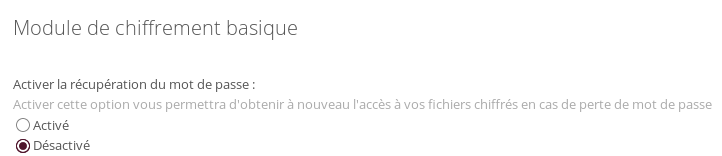

## Cloud fédéré
Qu'est-ce que le cloud fédéré? Tout comme les courriels qui peuvent être envoyés entre utilisateurs sur différents serveurs (gmail, riseup, disroot, etc) aussi nextcloud vous donne la possibilité de partager des fichiers, contacts, calendriers, etc. avec des personnes en dehors de disroot qui utilisent également la même solution cloud (owncloud et / ou nextcloud). Cela donne aux utilisateurs la liberté d'utiliser la plate-forme de leur choix tout en étant en mesure de collaborer entre eux. Dans cette section, vous pouvez voir l'identifiant de votre fédération. Vous pouvez le partager avec d'autres en envoyant simplement un lien ou via des plateformes prédéfinies (auxquelles vous pouvez bien sûr ajouter vos préférées qui ne sont pas incluses).

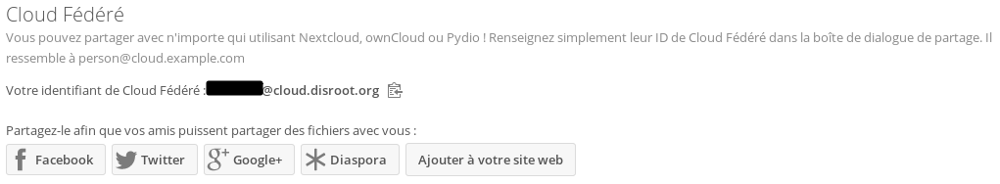

## Appels vidéo Spreed
Si vous n'avez pas accès à votre serveur TURN personnel, vous devez **laisser ces champs vides**. Cette option permet de configurer un service qui vous aide à déterminer votre adresse IP lorsque vous utilisez l'application "Appels" pour la conférence audio/vidéo sur disroot. Par défaut, tous les comptes disroot utilisent le serveur TURN de disroot.

## Codes de récupération pour l'authentification en deux étapes
Cette option est utilisée pour l'authentification en deux étapes qui n'est pas activée pour le moment.

----------

# FICHIERS

La tâche principale du cloud est la gestion des fichiers. Vous pouvez facilement téléverser, télécharger, partager et commenter.

La *barre latérale gauche* vous permet de filtrer les fichiers en fonction de certains critères. La fenêtre principale est votre navigateur de fichiers. Vous devrez être habitué si vous avez déjà utilisé un ordinateur : P.

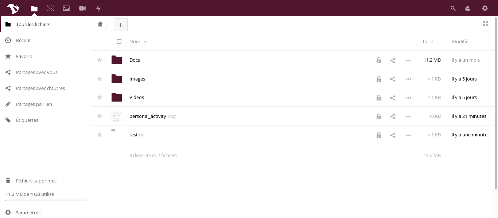

## Créer de nouveaux fichiers ou répertoires
Pour créer un nouveau fichier, cliquez simplement sur le bouton **"+"** et choisissez le type de fichier dans la liste. Vous pouvez créer des répertoires ainsi que des fichiers texte et des pads.

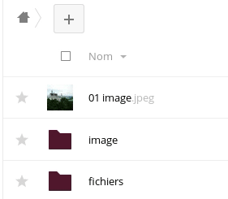

## Téléverser des fichiers
Il y a deux façons de téléverser des fichiers.
Vous pouvez le faire soit en faisant simplement glisser les fichiers de votre "ordinateur" (navigateur de fichiers) sur la fenêtre du navigateur du cloud.
L'autre façon est d'utiliser l'icône **"+"** et de sélectionner l'option "**Téléverser un fichier**".

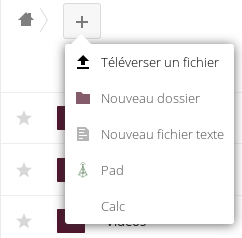

## Partage de fichiers
Le partage de fichiers et de répertoires est un élément essentiel de tout service de stockage dans le cloud. Vous pouvez choisir de partager des fichiers avec d'autres utilisateurs disroot, votre groupe entier, mais aussi avec d'autres utilisateurs utilisant owncloud/nextcloud sur d'autres plates-formes. Vous pouvez également partager avec n'importe qui via l'option de lien public.

Pour partager un fichier ou un répertoire, cliquez simplement sur l'icône "*Partage*" à côté du nom de l'élément que vous souhaitez partager. Une fenêtre contextuelle apparaîtra avec toutes les options de partage disponibles.

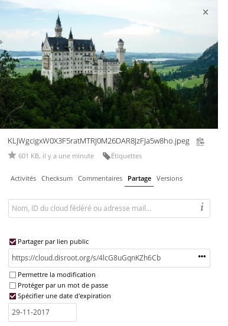

Vous pouvez décider de partager avec d'autres utilisateurs, groupes ou utilisateurs sur différents serveurs cloud utilisant l'adresse de la fédération, en tapant leur nom d'utilisateur complet (**nous ne fournissons pas d'auto-complétion pour des raisons de confidentialité**). Lors d'un partage avec d'autres utilisateurs ou groupes, vous pouvez décider si les utilisateurs ont le droit d'éditer/modifier le contenu du partage (supprimer des fichiers, télécharger, éditer), et s'ils peuvent le partager à nouveau avec d'autres utilisateurs.

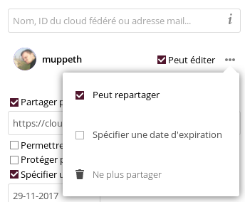

En plus du partage avec d'autres utilisateurs, vous pouvez partager vos données avec n'importe qui en utilisant le lien "Partager" que vous pouvez copier/coller à n'importe qui que vous voulez. Toute personne connaissant l'adresse (url) pourra accéder aux fichiers. La personne n'a pas besoin d'avoir un compte valide. Le lien Partager vous donne une option supplémentaire pour protéger votre partage avec le mot de passe et la date d'expiration.

## Commentaires, activités, version
Comme vous l'avez remarqué lors de la configuration du partage, il y a plus d'options dans la barre de droite.

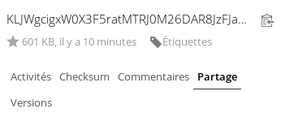

- **Activités** - vous donne un aperçu de tous les événements du fichier. La date de création, de partage, d'édition, lorsqu'il a été commenté, etc.
- **Commentaires** - sont très utiles lorsque vous travaillez sur le fichier avec d'autres utilisateurs. Tous ceux avec qui vous partagez le fichier peuvent lire et ajouter des commentaires.
- **Versions** - vous permet de visualiser toutes les modifications apportées au fichier. Vous pouvez télécharger les révisions précédentes du fichier ainsi que restaurer la version précédente (supprimer toutes les modifications effectuées par la suite).

## Autres opérations sur les fichiers
Cliquer sur l'icône **"Trois points"** à côté du nom de fichier ou du répertoire vous donne des options supplémentaires. Ces options sont simples à comprendre. Vous pouvez "Renommer","Déplacer","Télécharger" ou "Supprimer" le fichier ou le répertoire.

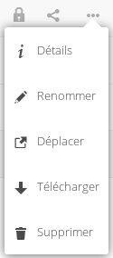

----------

#Activité

Lorsque votre compte devient occupé, vous commencez à collaborer avec beaucoup d'autres utilisateurs et groupes, vous trouverez peut-être l'application **"Activité"**  très utile. Vous avez ici une vue d'ensemble générale de tous les événements qui se produisent dans votre compte cloud (modifications de fichiers, commentaires, partages, contacts, liste de tâches, calendriers, etc.)

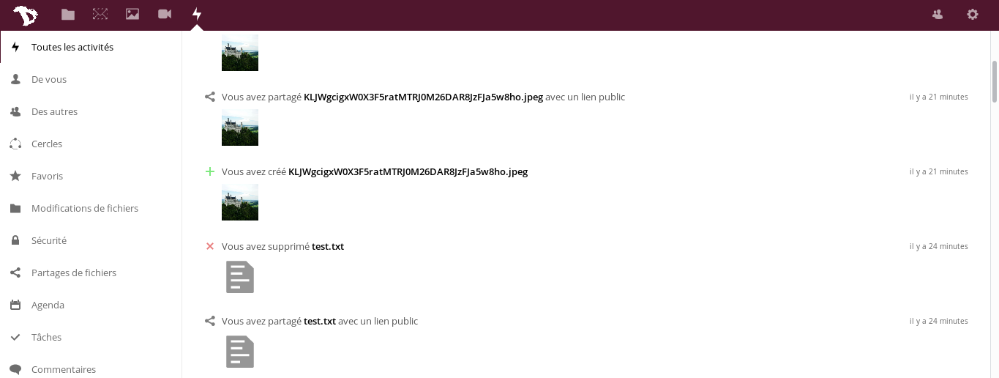

La fenêtre principale vous donne une chronologie avec tous les événements, et la barre de gauche vous permet de filtrer les informations en fonction des critères.

De plus, vous pouvez créer des flux RSS de vos activités (Pressez le bouton "Paramètres" en bas à gauche), que vous pouvez suivre à l'aide de votre lecteur RSS préféré, partager avec quelqu'un ou l'intégrer dans votre application ou site web (ajoutez le flux à votre salle matrix par exemple).

----------
