A Nextcloud a Disroot alapvető szolgáltatása és a fő felhasználói felülete, mely intergrálva van a legtöbb általunk kínált alkalmazással. Ebben a kis útmutatóban szeretnénk végigmenni a felület alapjain, megmagyarázva a felhasználói felület fogalmát és néhány alapfájlműveletet és személyes beállítást is.
 
 
 
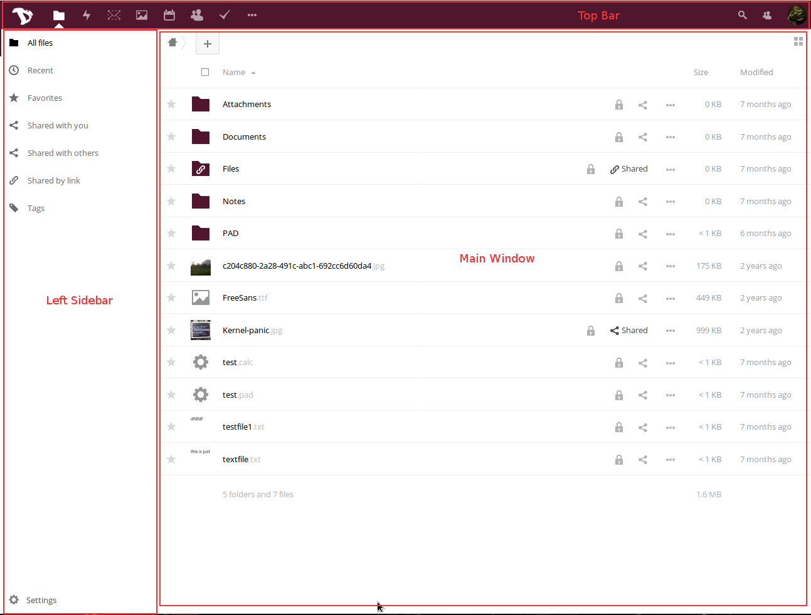

----------

# Általános felhasználói felület

Az egész felhő-webalkalmazás egységes és egyértelmű felhasználói élményt nyújt.

Ebben a leírásban megnevezzük a felület egyes részeit, hogy később könnyebben lehessen felismerni őket:

 - **Felső csík**: az oldal tetején található csík, rajta az összes alkalmazásra mutató linkekkel, a személyes beállításaiddal, a jelenleg megnyitott alkalmazás gombjaival és értesítésekkel
 - **Bal oldali sáv**: itt találod a beállításokat, szűrőket stb.
 - **Főablak**: a fő alkalmazásablak
 - **Jobb oldali sáv**: felugró terület, amely bizonyos műveletek esetén jelenik meg (pl. fájlinformáció, összetett eseménylétrehozás a naptárban)

A más alkalmazásokhoz történő navigáláshoz egyszerűen kattints egy ikonra a felső csíkon!

----------

# Személyes beállítások

Kezdjük azzal, hogy mit tudsz beállítani és testre szabni a felhőfiókodban! Kattints a profilképedre a jobb felső sarokban és válaszd ki, hogy **Személyes** a személyes beállításokhoz! (Ha még nem állítottál be profilképet, egy fogaskerék jelenik meg a helyén.)

A beállítások szekciókra vannak osztva. Könnyen elérheted őket a *bal oldali sávon* lévő gyorslinkekkel.

## Személyes információk

A Személyes információknál különféle információt adhatsz hozzá magadról, amiket aztán megoszthatsz másokkal. Ezen kívül hozzáférési szinteken keresztül megadhatod, hogy ennek az információnak melyik részéhez kik férhetnek hozzá.

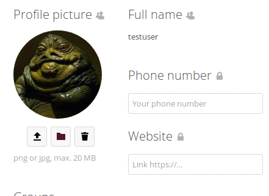

A következő hozzáférési szintek állnak rendelkezésre:

  - **Privát**: egyedül te látod ezt az információt
  - **Helyi**: más Disroot fiókok is láthatják ezt az információt (csak akkor, ha tudják a felhasználónevedet)
  - **Névjegyek**: lényegében ugyanaz, mint a Helyi, csak ezen kívül más Nextcloud szerverek felhasználói is láthatják
  - **Nyilvános**: az adat el lesz küldve a globális névjegyzékbe (bárki megtekintheti)

Figyelj oda, miközben kitöltöd ezeket az információkat (amely *nem kötelező*), és döntsd el, mennyi információt akarsz magadról felfedni a világnak!

## Csoportok és nyelv

Lentebb láthatod, mely csoportokhoz tartozol (ha egyáltalán tartozol leglább egyhez). Alapértelmezetten egy Disroot fiók sincs hozzákapcsolva egy csoporthoz sem. Megváltoztathatod az előnyben részesített nyelvedet is.

## Munkamenetek

Itt láthatod, hány eszköz csatlakozik jelenleg a fiókodhoz. Ha olyan eszközöket látsz, amelyeknek nem kellene szerepelniük a listában, lehet, hogy illetéktelenek fértek hozzá a fiókodhoz és meg kellene változtatnod a jelszavadat. (Ne feledd, hogy minden böngésző, mobileszköz, számítógép stb. külön eszközként szerepel, valahányszor pl. hálózatot váltasz, úgyhogy először ne ilyedj meg, hanem nézz át alaposan mindent, mielőtt paranoiás módba kapcsolnál.)

## Tevékenység

A Tevékenység szekcióban eldöntheted, hogyan akarsz értesülni a felhődben történő eseményekről. Választhatod az emailértesítést és/vagy a tevékenységfolyamot, vagy akár azt is, hogy semmilyen értesítést ne kapj. Azt is eldöntheted, hogy **óránként**, **naponta** vagy **hetente** legyenek kiküldve az értesítések.

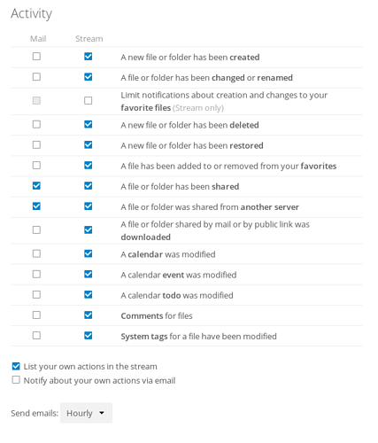

## Alap titkosítási modul

Itt eldöntheted, hogy képes legyen-e egy adminisztrátor helyreállítani a fájljaidat, ha netán elveszítenéd a jelszavadat. Ez a lehetőség alapértelmezetten ki van kapcsolva, mivel ez lehetővé teszi, hogy a Disroot adminisztrátorok dekódolják és megnezzék a fájljaidat. **Nem lehet helyreállítani a fájljaidat, ha a jelszód elvesztése után kapcsolod be a beállítást!** Előre kell meghoznod ezt a döntést. **Erősen javasoljuk, hogy inkább ne veszítsd el a jelszavadat és tárold biztos helyen.** Így tudod a legnagyobb biztonságban tartani a fájljaidat és a fiókodat. Mi nagyon nem akarunk hozzáférni.

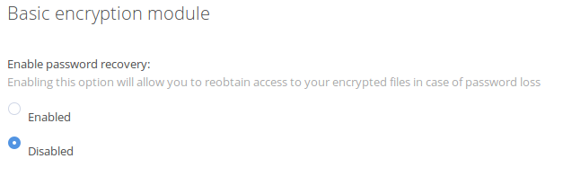

## Egyesített felhő

Mi az egyesített felhő? Mint ahogyan emaileket tudnak küldeni különböző szerverek felhasználói (GMail, Riseup, Disroot stb.), a Nextclouddal lehetőséged van olyan Disrooton kívüli emberekkel megosztani fájlokat, névjegyeket, naptárakat stb., akik hasonló felhőalapú megoldást használnak (ownCloud és/vagy Nextcloud). Ez lehetővé teszi a felhasználóknak, hogy szabadon válasszák meg a platformukat az együttműködéshez.

Ebben a szekcióban láthatod az egyesített felhő azonosítódat. Megoszthatod másokkal egy link küldésén keresztül vagy előre meghatározott platformokon keresztül (természetesen tetszőleges platformokat is hozzáadhatsz).

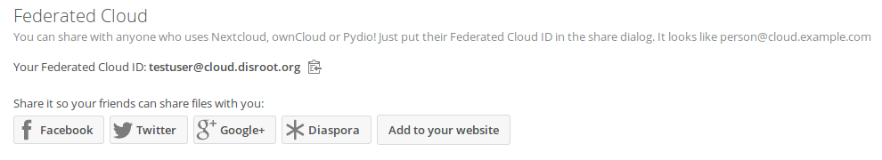

## Spreed videóhívások

Kivéve ha rendelkezel saját TURN szerverrel való hozzáféréssel, **hagyd ezt a mezőt üresen!** Ezzel a lehetőséggel egy olyan szolgáltatást állíthatsz be, amely segíti meghatározni az IP címedet, amikor a „Videóhívások” alkalmazást használod hang-/videókonferenciákhoz a Disrooton. Alapértelmezetten mindegyik Disrootfiók a Disroot Turn szerverét használja.

## Kétlépcsős biztonsági kódok

Ez a lehetőség a kétlépcsős azonosításhoz használatos, amely pillanatnyilag nincs engedélyezve.

----------

# FÁJLOK

A felhő legfőbb feladata a fájlok kezelése. Könnyen feltölthetsz, letölthetsz, megoszthatsz fájlokat és hozzájuk is szólhatsz.

A *bal oldali sávon* adott kritériumok szerint szűrhetsz. A *főablak* a te fájlböngésződ. Biztosan tudod, hogyan kell használni, ha már használtál valaha számítógépet. :P

## Új fájlok vagy könyvtárak létrehozása

Új fájlok létrehozásához csak kattints a „**+**” gombra és válaszd ki a fájltípust a listából. Könyvtárakat, szöveges fájlokat és jegyzettömböket is létrehozhatsz.

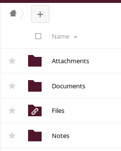

## Fájlok feltöltése

Két féleképpen tudsz feltölteni fájlokat: a számítógéped fájlkezelőjéből az egérrel egyszerűen a felhőt tartalmazó böngészőablakba húzol fájlokat, vagy pedig a „**+**” ikont használva kiválasztod a „Fájl feltöltése” lehetőséget.

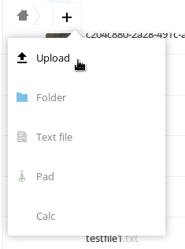

## Fájlok megosztása

A fájlok megosztása bármilyen felhőszolgáltatás létfontosságú része. Megoszthatsz fájlokat más Disrootfelhasználókkal, az egész csoportoddal vagy akár más platformokon lévő ownCloud/Nextcloud felhasználókkal. A publikos link funckióval pedig bárkivel megoszthatsz.

Egy fájl vagy könyvtár megosztásához kattints a „megosztási ikonra” a megosztani kívánt fájl vagy könyvtár neve mellett! Meg fog jelenni egy jobb oldali sáv az összes megosztási lehetőséggel.

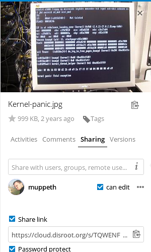

Megoszthatsz más felhasználókkal, csoportokkal vagy más felhőszerver felhasználóival az egyesített felő azonosítón keresztül a teljes felhasználónevük megadásával (az automatikus kiegészítés nálunk nem engedélyezett magánszféravédelmi okokból). Amikor más felhasználókkal vagy csoportokkal osztasz meg, eldöntheted, hogy a felhasználóknak legyen-e engedélyük változtatni a megosztott tartalmon (törölni, feltölteni, szerkeszteni) és hogy ismét meg tudják-e osztani másokkal.

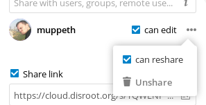

Ezen kívül bárkivel megoszthatod az adatodat a „Megosztás hivatkozással” lehetőséggel. Bárki, aki ismeri a hivatkozást, képes lesz hozzáférni a fájlokhoz. Akivel megosztod, nem szükséges, hogy rendelkezzen érvényes fiókkal. A „Megosztás hivatkozással” lehetőséged ad egy jelszóval és lejárati dátummal való védelemre is.

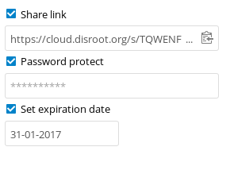

## Hozzászólások, tevékenységek, verziók

Amint észrevetted, amikor megosztást állítottál be, további lehetőségek vannak a jobb oldali sávon.

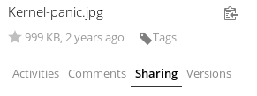

 - **Tevékenységek**: egy áttekintést ad a fájl összes eseményeiről. Megmutatja, mikor lett lérehozva, megosztva, szerkesztve, hozzászólva stb..
 - **Hozzászólások**: nagyon hasznos, amikor egy fájlon dolgozol együtt másokkal. Mindenki, akivel fájlt osztasz meg, olvashat és hozzáadhat hozzászólásokat.
 - **Verziók**: megmutatja az összes a fájlon végzett változtatást. Letölthetsz korábbi változatait a fájlnak és vissza is térhetsz rá (ami törli az összes utána végzett változtatást).

## Egyéb fájlműveletek

A fájl- vagy könyvtárnév melletti három pont ikonra kattintva további lehetőségeket láthatsz. Azok a lehetőségek meguktól értetődőek. Itt átnevezhetsz, áthelyezhetsz, letölthetsz vagy törölhetsz fájlokat vagy Könyvtárakat.

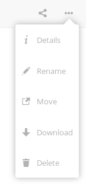

----------

# Tevékenységek

Amikor gyakran használod a fiókodat, sok más felhasználóval és csoporttal dolgozol együtt, a „Tevékenységek” alkalmazás nagyon hasznosnak bizonyulhat. Itt láthatod a fiókoddal történő összes eseményt (fájlváltoztatások, hozzászólások, megosztások, névjegyek, teendők, naptárak stb.).

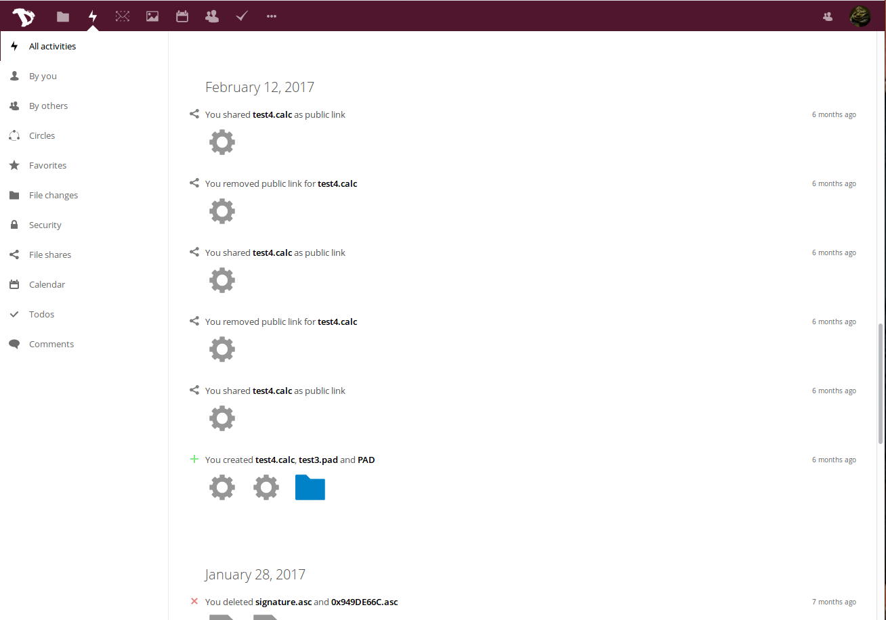

A főablak mutat egy idővonalat az összes eseményről, a bal oldali sávval szűrheted a megjelenített információt.

Továbbá készíthetsz egy RSS-hírfolyamot a tevékenységeidről (ehhez nyomd meg a „Beállítások” gombot a bal alsó sarokban), amelyet követhetsz a kedvenc RSS-hírolvasóddal, megoszthatod valaki mással vagy beágyazhatod az alkalmazásodba vagy weboldaladba (például hozzáadhatod a Matrixszobádhoz.)

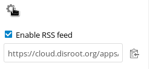

----------
