O Nextcloud é o serviço principal fornecido pelo Disroot e o interface principal que tentamos integrar com a maioria das aplicações que oferecemos. Neste pequeno tutorial gostaríamos de demonstrar, no geral o interface de utilizador principal, os seus princípios e lógica de funcionamento, bem como algumas tarefas básicas com ficheiros e configuração das definições pessoais.

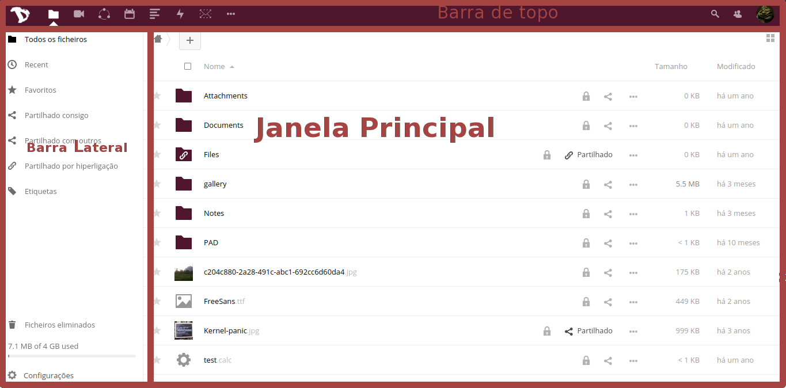

# Interface de utilizador

O interface de utilizador de toda a aplicação web do nextcloud é consistente e simples.

Para efeitos deste tutorial iremos dar nomes a algumas pares do interface para ajudar a identificar essas mesmas partes ao longo do tutorial:

 - **Barra de topo** - É a barra no topo do ecrã com links para todas as aplicações da cloud, as suas definições pessoais e notificações.
 - **Barra Lateral** - é onde pode encontrar Opções, Filtros, Definições, etc
 - **Janela Principal** - A janela principal da aplicação
 - **Barra Lateral Direita** - ecrã pop-up que aparece quando se realizam certas ações (informação acerca de ficheiros, criação de eventos no calendário, etc)

Para ir às diferentes aplicações disponíveis na cloud, basta carregar no respetivo ícone, na barra de topo.

# Definições pessoais
Vamos começar por dar uma olhada naquilo que é possível personalizar na sua conta de cloud. Carregue na sua foto de perfil no canto superior direito e escolha **"Personal"** (se ainda não tiver colocado uma foto de perfil então o botão será representado por uma roda dentada).

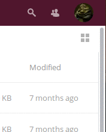

As definições pessoais estão divididas em seções. Pode usar as opções na *barra lateral esquerda* para aceder rapidamente às diferentes opções.

## Informações Pessoais
Informações Pessoais é o sítio ode pode adicionar várias informações acerca de si, que depois pode optar por partilhar com outros. Pode adicionalmente escolher quanta desta informação é "partilhada".

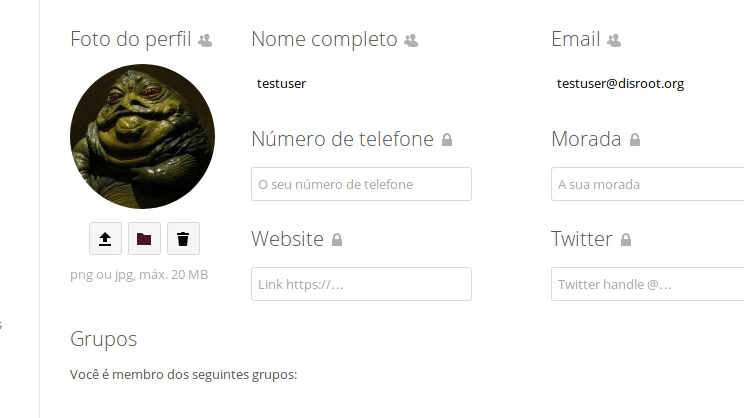

E então:

  - **Private** - Você é a única pessoa que pode ver esta informação
  - **Local** - signfica que esta informação pode ser visualizada por outros utilizadores do Disroot, (mas apenas se eles souberem o seu nome de utilizador)
  - **Contacts** - significa praticamente o mesmo que Local, mas para além disso a sua informação será partilhada quando partilha informação (ficheiros) com utilizadores noutras instâncias de Nextcloud alojados noutros serviços
  - **Public** - significa que estas informações serão enviadas para o livro de endereços global (pode ser visto por qualquer pessoa)

Você deve ter cuidados especiais ao preencher estas informações *(que são opcionais)* e decidir quanta inforção acerca de si é que decide revelar ao mundo

## Grupos e Idioma
Por baixo pode ver a que **grupos** você pertence (caso pertença a algum). Por defeito as contas do Disroot não estão associadas a nenhum grupo.
Também pode alterar o idioma da sua conta.

## Segurança
Aqui pode ver quantos dispositivos estão atualmente ligados à sua conta. Se vir dispositivos ligados à sua conta que não deveriam, pode querer dizer que a sua conta foi comprometida e deve mudar a sua palavra-passe.  *(Tenha em conta que qualquer browser, computador, telemóvel, etc. aparecerá aqui como um dispositivo diferente cada vez que se ligar de uma rede diferente, por isso não entre em paranoia logo ao início, e verifique com cuidado todos os acessos antes de entrar em modo paranoico)*.

## Atividade
Na secção de "Atividade" pode decidir acerca de como quer ser informado dos diferentes eventos que acontecem na sua cloud, (ficheiros criados/apagados, etc). Pode escolher entre receber notificações de email / ou ser notificado no sistema de mensagens da sua conta de cloud em "Atividades" e até pode escolher não ser notificado de todo. POde escolher receber as noticações de email: **Hora a hora**, **Diariamente** ou **Semanalmente**.

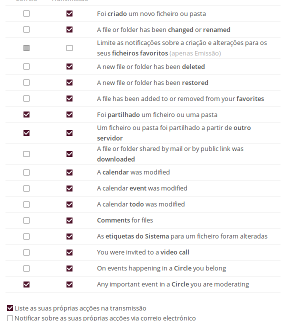

## Basic encryption module
Aqui pode decidir se quer que os administradores sejam capazes de recuperar os seus ficheiros caso perca a sua palavra-passe. Esta opção acima referida está desativada por defeito pois permite aos administradores do Disroot desencriptar e ver os seus ficheiros (algo que não queremos). **Ativar esta opção depois de perder a sua palavra-passe não permite recuperar os seus ficheiros!** Você precisa de tomar a decisão se quer permitir esta opção de antemão. **Nós recomendamos fortemente que nunca perca a sua palavra-passe e que a guarde num local seguro.** É a melhor opção para manter a sua conta e os seus ficheiros seguros. Nós não queremos mesmo ter acesso aos seus ficheiros.

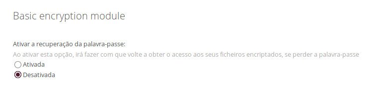

## Nuvem Federada
O que é a Nuvem Federada? Tal como emails que podem ser enviados entre utilizadores em diferentes servidores  (gmail, riseup, disroot etc) o nextcloud dá-lhe a possibilidade de partilhar ficheiros, contatos, calendários, etc. com pessoas que não utilizam o Disroot, mas que utilizam uma solução de cloud semelhante (owncloud e / ou nextcloud). Isto dá aos utilizadores a liberdade de usar a plataforma que preferem mas ao mesmo tempo poderem colaborar entre si. Nesta secção pode ver a sua Id da Nuvem Federada. Pode partilhá-la com outras pessoas enviando um link, ou através de plataformas pré-definidas (às quais pode adicionar as suas plataformas preferidas que não estejam incluídas na lista claro).

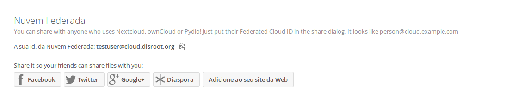

## Chamadas de vídeo Spreed
A não ser que tenha o seu próprio TURN Server, deve **deixe este campo em branco**. Esta opção serve para criar um serviço que ajuda a determinar o seu endereço de IP quando está a utilizar a app "Video Calls"para chamadas/conferências áudio/vídeo no Disroot. Por defeito todas as contas de utilizador no Disroot estão a utilizar o TURN Server do Disroot.

## Second-factor backup codes
Esta opção é utilizada para autenticação de dois fatores.

# Ficheiros

A principal função da cloud é gerir ficheiros. Você pode facilmente carregar, descarregar, partilhar e comentar ficheiros.

A *barra-lateral esquerda* permite-lhe filtar ficheiros por certos critérios. *Janela principal* é onde pode navegar pelos ficheiros. Deve estar familiarizado com isso se alguma vez utilizou um computador no passado :P.

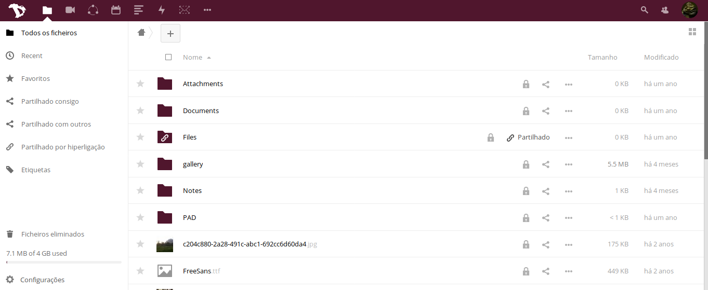

## Criar um novo ficheiro ou pastas/diretórios
Para criar um novo ficheiro basta carregar no botão **"+"** e escolher o tipo de ficheiro que quer a partir da lista. Pode criar pastas, ficheiros de texto e pads.

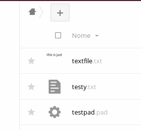

## Carregar ficheiros
Existem duas maneiras de carregar ficheiros para a sua cloud.
Pode simplesmente arrastar um ficheiro do seu "computador" (navegador de ficheiros) para a janela da sua cloud no browser de Internet.
A outra opção é utilizar o botão **"+"** e escolher a opção "**Upload file**".

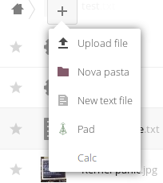

## Partilha de Ficheiros
Partilhar ficheiros e pastas é uma parte essencial de qualquer serviço de armazenamento de ficheiros online. Você pode escolher partilhar ficheiros com outros utilizadores do Disroot, com todo o seu grupo, mas também com outras pessoas que utilizem owncloud/nextcloud noutras plataformas/serviços. Também pode partilhar com outras pessoas utilizando a opção de link publico.

Para partilhar um ficheiro ou pasta basta carregar no "*botão partilhar*" ao lado do nome do item que quer partilhar. Aparecerá uma barra do lado direito do ecrã com todas as opções possíveis que pode escolher para a partilha.

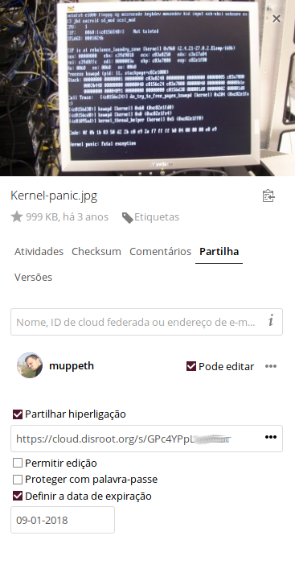

Você pode decidir o que partilhar com outros utilizadores, grupos, ou utilizadores de outros servidores de cloud usando o endereço de federação ou escrevendo o nome de utilizador inteiro (**nos não temos a opção de completar automaticamente o nome de utilizador por motivos de privacidade**). Quando partilha um ficheiro com outros utilizadores ou grupos pode decidir se as pessoas que receberem o item que partilhou têm o direito a editar/modificar os conteúdos da partilha (apagar ficheiros, carregar ficheiros, editar), e se eles podem partilhar com terceiros.

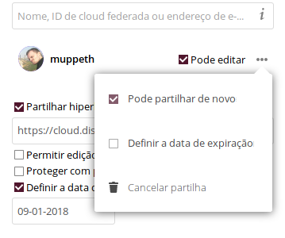

Para além de partilhar com outros utilizadores, pode partilhar os seus itens com qualquer pessoa utilizando a "partilha de hiperligação" que geram um link que pode ser copiado e partilhado com quem quiser. Qualquer pessoa que saiba o endereço (url) poderá ter acesso aos ficheiros. A pessoa em causa não precisa de ter uma conta de utilizador. A partilha de hiperligação dá-lhe a opção extra de proteger o link com uma palavra-passe e com uma data de validade para o link.

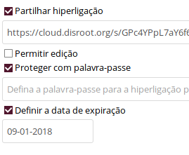

## Comentários, Atividades, Versões
Como deve ter notado ao criar a partilha existem mais opções na barra lateral direita.

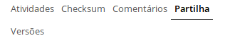

 - **Atividades** - dá-lhe uma informação geral de todos os "eventos" que aconteceram com o ficheiro. Quando foi criado, partilhado, editado, comentado, etc.
 - **Comentários** -  são muito úteis quando se está a trabalhar num ficheiro com outros utilizadores. Todas as pessoas com quem partilhou o ficheiro podem ler os comentários e também comentar.
 - **Versões** -  permite-lhe ver todas as alterações realizadas no ficheiro. Pode descarregar versões anteriores do ficheiro tal como restaurar uma versão antiga (apagar todas as alterações feitas depois dessa versão especifica).

## Outras operações de ficheiros
Carregando no botão **"três pontinhos"** ao lado do nome do ficheiro ou pasta apresenta-lhe opções adicionais. Estas opções são bastante óbvias. Você pode "Renomear", "Mover", "Descarregar" ou apagar o ficheiro ou a pasta.

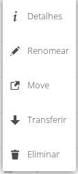

## Atividade 

Quando a sua conta estiver a ficar muito utilizada, você começar a colaborar com muitas outras pessoas e grupos, poderá achar a aplicação **"Atividade"** muito útil. Aqui tem uma lista detalhada de todos os "eventos" na sua cloud, (alterações de ficheiros, comentários, partilhas, contactos, calendários, tarefas, etc).

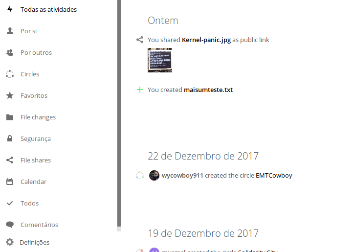

A janela principal permite-lhe ter um feed com todos os eventos e a barra lateral esquerda permite-lhe filtrar eventos por determinados critérios.

Para além disso pode criar um feed de RSS das suas atividades (Carregue no botão "definições" no fundo da barra lateral esquerda), que pode seguir utilizando o seu agregador de RSS favorito, partilhá-lo com outras pessoas ou integrá-lo numa aplicação ou num website (por exemplo adicionar este feed de RSS à sua sala de matrix).

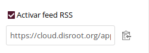
