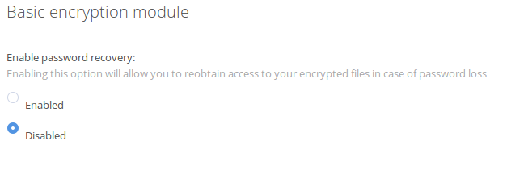
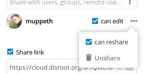

Nextcloud is disroot's core service and the main user interface we try to integrate with most of the apps we offer. In this little howto we would like to go through the basics of the interface explaining the main UI (User interface) concept, as well as some basic actions on files and personal settings.

----------

##General UI

The user experience across the entire cloud webapp is consistent and straight forward.

For the purpose of this howto we will name some of the blocks of the interface to help identify them later on:

 - 1.**Top bar** - is the blue bar on top with links to all the apps, chat, your personal settings, and currently launched on app name.
 - 2.**Left side-bar** - is where you can find Options, Filters, Settings etc.
 - 3.**Main window** - the main window of the application
 - 4.**Right side-bar** - pop-up that opens when certain actions are triggered (file information, advanced calendar event creation, etc)

To navigate to different apps, you simply click an icon on the topbar.

----------

##Personal Settings
Lets start from looking at what can you setup and customize on your cloud account. Click on your name/avatar and choose **"Personal"** settings

The settings are divided into sections. You can use quick links on the left-sidebar to get to them easily.
###Personal Info
Personal Info is the place where you can add various information about yourself, which then you can choose to share with others. You can additionally choose the access level you want this information to be "shared".  

And so:

  - **Private** - You are the only person that can see the information
  - **Local** - means this information will be viewable by other disroot accounts (only if they know your username)
  - **Contacts** - means pretty much the same as Local but with the addition to have this information shared when sharing data with users on other nextcloud instances
  - **Public** - means the data will be sent to global address book (it can be viewed by anyone)

You should pay extra attention when filling up this information (which is optional) and decide how much information about your self you want to reveal to the world
###Groups and language
Below you can see to which **groups** you belong to if any (by default disroot accounts are not associated with any group), and you can change your preferred language.

###Sessions
Here you can see how many devices are currently connected to your account. If you see devices connected to your account that shouldn't be connected, it might mean your account has been compromised and you should proceed to change your password. *(Keep in mind every browser, mobile, computer etc. will be shown as separate device each time you change your network for example, so do not freak out at first, and really double check everything, before you go full on paranoid mode)*.

###Activity
In activity section you can decide how you want to be informed about events going on on your cloud. You can choose between getting mail notification and / or being notified in the Activity stream (link that part of tutor) or even choose not to get notified at all. You can decide to have your email notifications sent to you on: Hourly, Daily or weekly basis.

###Basic encryption module
Here you can decide whether or not an administrator will be able to recover your files in case you loose your password. This option is disabled by default as it enables admins of disroot to decrypt and view your files. **Enabling this option after your password was lost will not recover your files!** You need to make this decision beforehand. **We strongly encourage you to never loose your password in the first place and keep it stored safe.** This is the best way to keep your files and your account safe.

### Federated cloud
What is federated cloud? Just like emails that can be send between users on different servers (gmail, riseup, disroot etc) also nextcloud gives you opportunity to share files, contacts, calendars etc. with people outside of disroot that also use similar cloud solution (owncloud and / or nextcloud). This gives the freedom to the users to use platform of their choice while being able to collaborate with each other. In this section you can see your federation ID, you can share it with others by just sending a link or via predefined platforms (to which you can add your preferred ones that are not included).

### Spreed video calls
Unless you have access to your personal TURN Server, you should **leave this fields blank**. This option is for setting up a service that helps determine you IP address when you are using "calls" app for audio/video conferencing in disroot. By default all disroot accounts are using disroot's TURN Server.

###Second-factor backup codes
This option is used for two factor authentication which is not enabled at this moment.

----------

## FILES 
The main task of the cloud is managing files. You can easily upload, download, share and comment.

The left-sidebar let's you filter files based on certain criteria. Main window is your filebrowser you should be familiar with if you ever used computer before :P.

### Create new file or directories
To create new file, just click on   button and choose the type of file from the list. You can create directories as well as text files and pads (link to the howto).

### Upload files
There are two ways to upload files.
You can either do that by simply dragging files form your "computer" (file browser) onto the cloud webbrowser window.
The other way is to use  icon and select "Upload a file" option.

### File Sharing
Sharing files and directories is an essential part of any cloud storage service. You you can choose to share files with other disroot users, your entire group, but also with other users using owncloud/nextcloud on different platforms. You can also share with anyone out there via the public link option.

To share a file or directory just click  right next to the name of the item you wish to share. A right-bar popup wind will show up with all the sharing options for you to choose from.

You can decide to share with other users, groups, or users on different cloud server using the federation address, by typing their entire username (**we do not provide autocompletion for privacy reasons**). When sharing with other users or groups you can decide if the users have right to edit/modify content of the share (delete files, upload, edit), and if they can re-share it further to other users.

On top of sharing with other users, you can share your data with anyone using "Share link" that you can copy/paste to anyone you want. Anyone who knows the address (url) will be able to access the files. The person does not need to have valid account. Share link gives you extra option to protect your share with password and expiry date.

### Comments, Activities, Version
As you noticed when setting up sharing, there is more options in the right-sidebar.

 - **Activities** - gives you an overview of all events with the file. The time it was created, when it was shared, edited, commented on etc.
 - **Comments** -  are very useful when working on the file with other users. Everyone you share the file with can read and add comments.
 - **Versions** -  lets you view all changes done to the file. You can download previous revisions of the file as well as restore to previous revision (deleting all changes done after).

###Other file operations
Clicking  icon next to the filename or directory gives you extra options. Those options are self explanatory. You can "Rename", "Move", "Download" or delete the file or directory.

----------

##Activities 

When your account is getting busy, you start collaborating with many other users and groups, you might find **"Activities"** app very helpful. Here you have the general overview on all the events happening within your cloud account (file changes, comments, shares, contacts, todos, calendars etc).

Main window gives you a timeline with all events, and left-sidebar let's you filter the information based on criteria.

Additionally you can create RSS feed of your activities (Press  on the bottom left-sidebar), which you can follow using your favorite rss reader, share it with someone or integrate it in your application or website (add the feed to your matrix room for example).

----------
