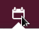
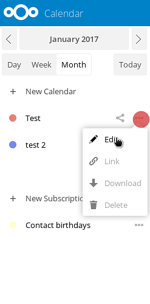
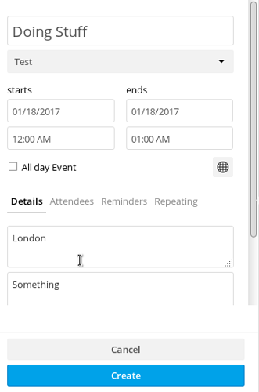

------------
# Using Calendar app

You can access your calendar app by pressing the  icon in the top bar.
*Left-bar* in the calendar window gives you an overview of your calendars, their options and general settings.

--------------
## Create Calendar
To create a new calendar in this options panel press "*create calendar*"
A small prompt will appear where you can type the name you want to give to this new calendar and select a color for it.
Then press "*create*".

You can create multiple calendars for different purposes (work, activism, etc.) by repeating this process. If you do that, you can use different colors to set them apart (last icon is the color picker which allows you to choose any color you want).

-----------------------
## Delete, edit, Download calendar.
On the left panel, you will see your calendars listed. To the right of each calendar you will find a "more" button where you can:

- rename your calendar,
- download it
- get a url link to sync it with other devices
- delete your calendar.

-------------------------
## Create an event
You can create a new event in your calendar by clicking in the calendars *main window* simply on the day of the event. A panel will appear on the right side, where you can fill with the information of the event.

In this panel you can specify:

  - event title
  - start and end date
  - start and end time
  - if it's full day event or not
  - event location
  - event description

If you have multiple calendars, in your disroot calendar app, you need to select to which calendar the event goes to. You can do that below the event title field.

You can set a reminder for the event by pressing "Reminders" and "Add"

You can select what type of reminder you want:

* audio
* email
* pop up

And set the time for it.

Just press the reminder you added and the options will show up.

You can also set if this is a repeating event or not. Just check *repeating* options.

-------------------------------
## Invite people to events

You can also invite people to your event via email by:

* pressing "Attendees"
* Filing the field with the persons email address
* press enter 

The people you invite will receive an automaticly generated email with the invitation. Any changes you make to the event will be automatically sent by email to the person you've added.

When you're done with everything, just press create at the end of the panel, and your event will appear on the screen

----------------------------
## Edit or delete events
To edit or delete an event you've created, just click the event on your screen, edit it and then press "update".
To delete it, you will find the big red button.

----------------------------
## Share calendars
You can share your calendars, either with another disroot user, via email, or public link.

To share with another Disroot user:

* press the the share button on the right of your calendar name
* type the username of the Disroot user that you want to share the calender with
* press enter.

To share calendars via email or public link:

* go to the same "shared" option
* select "Share link"
* fill the email address field with the email of the person you want to share your calendar with
* press enter
* to just get the link press the chain symbol next to the mail envelope symbol

------------------------------
## Import calendars
If you have a ICS file with a calendar to import, go to disroot calendar app then go to "Settings & Import" on the lower left corner of the screen. 

And select import calendar option.

----------------------------------------
