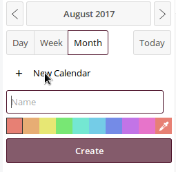
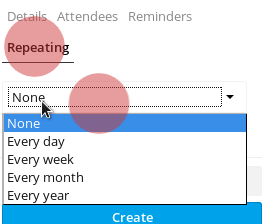

------------
# Utilisation de l'application Calendrier

Vous pouvez accéder à votre application de calendrier en appuyant sur la touche  dans la barre supérieure.
La *Barre de gauche* dans la fenêtre du calendrier vous donne un aperçu de vos calendriers, de leurs options et des paramètres généraux.

--------------
## Créer un calendrier
Pour créer un nouveau calendrier dans ce panneau d'options, appuyez sur "*créer un calendrier*".
Une petite invite apparaîtra et vous pourrez saisir le nom que vous souhaitez donner à ce nouveau calendrier et sélectionner une couleur.
Appuyez ensuite sur "*créer*".

Vous pouvez créer plusieurs calendriers à des fins différentes (travail, activisme, etc.) en répétant ce processus. Si vous faites cela, vous pouvez utiliser des couleurs différentes pour les différencier (la dernière icône est le sélecteur de couleurs qui vous permet de choisir la couleur de votre choix).

-----------------------
## Supprimer, modifier, télécharger le calendrier.
Sur le panneau de gauche, vous verrez la liste de vos calendriers. A droite de chaque calendrier, vous trouverez un bouton "plus" où vous pouvez:
- renommer votre calendrier,
- le télécharger
- obtenir un lien url pour le synchroniser avec d'autres périphériques
- supprimer votre calendrier.

-------------------------
## Créer un événement
Vous pouvez créer un nouvel événement dans votre calendrier en cliquant dans la *fenêtre principale* du calendrier simplement sur le jour de l'événement. Un panneau apparaîtra à droite, où vous pourrez remplir les informations de l'événement.

Dans ce panneau, vous pouvez spécifier:
- le titre de l'événement
- sa date de début et de fin
- son  heure de début et de fin
- si c'est un événement d'une journée complète ou non
- le lieu de l'événement
- la description de l'événement

Si vous avez plusieurs calendriers, dans votre application de calendrier disroot, vous devez sélectionner à quel calendrier l'événement va. Vous pouvez le faire en dessous du champ de titre de l'événement.

Vous pouvez définir un rappel pour l'événement en appuyant sur "Rappels" et "Ajouter".

Vous pouvez sélectionner le type de rappel que vous souhaitez:
* audio
* email
* pop up

Et vous pouvez fixer l'heure.

Appuyez simplement sur le rappel que vous avez ajouté et les options apparaîtront.

Vous pouvez également définir s'il s'agit d'un événement répétitif ou non. Cochez simplement les options *répétition*.

-------------------------------
## Inviter des gens à des événements

Vous pouvez également inviter les gens à votre événement par email:
* en appuyant sur "Participants".
* en remplissant le champ avec l'adresse email des personnes
* en appuyant sur entrer

Les personnes que vous invitez recevront un email généré automatiquement avec l'invitation. Tout changement que vous apportez à l'événement sera automatiquement envoyé par email à la personne que vous avez ajoutée.

Lorsque vous avez terminé, il vous suffit d'appuyer sur créer à la fin du panneau et votre événement apparaîtra à l'écran.

----------------------------
## Éditer ou supprimer des événements
Pour modifier ou supprimer un événement que vous avez créé, cliquez simplement sur l'événement sur votre écran, éditez-le puis appuyez sur "mettre à jour".
Pour le supprimer, vous trouverez le gros bouton rouge.

----------------------------
## Partager les calendriers
Vous pouvez partager vos calendriers, soit avec un autre utilisateur disroot, par email, soit via un lien public.

Pour partager avec un autre utilisateur Disroot:

* cliquez sur le bouton Partager à droite de votre nom de calendrier
* tapez le nom d'utilisateur de l'utilisateur Disroot avec lequel vous souhaitez partager le calendrier
* appuyez sur Entrée.

Pour partager des calendriers par email ou lien public:

* aller à la même option "partagé"
* sélectionnez "Partager le lien".
* remplissez le champ adresse email avec l'adresse email de la personne avec laquelle vous souhaitez partager votre agenda
* appuyez sur Entrée
* pour obtenir simplement le lien appuyez sur le symbole de la chaîne à côté du symbole de l'enveloppe mail

------------------------------
## Importer des calendriers
Si vous avez un fichier ICS avec un calendrier à importer, allez dans le menu déroulant de l'application Calendrier puis cliquez sur "Paramètres & Importer" dans le coin inférieur gauche de l'écran.

Et sélectionnez l'option Importer le calendrier.

----------------------------------------
