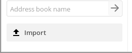
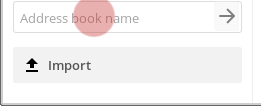

# Contacts
You can access the contacts app by by pressing the contacts icon  on the top bar, in nexcloud:

----------------------
## Create a contact

In the contacts app select "*New contact*"

You will prompted with a form on the "*right-bar*" side you the form to create the new contact.

Just type the information you want/have in the fields. If you need, you can just add more fields at the bottom of the form.

-----------------------
## Delete a contact

* select the contact
* in the contact form header, select the delete icon

-----------------------
## Create contact groups
You can create groups to organize your contacts ex: faculty, work, collective, etc.
In the field group you can assign a new contact to an existing group or create a new group. Or assign a contact to multiple groups by typing the several groups.

On the left side of the screen in your contacts app, you will see the existing groups.
Selecting them will present all contacts in that respective group.

------------------------
## Share address books

Go to "settings" on the lower left corner of the screen in the contacts app.

In settings you can share your address book with other Disroot users by:
selecting share address book
writing the username of the disroot user you want to share the address book with

You can also use a link to share your address book via webDAV, to other contact books (thunderbird, mobile, etc,).

-------------------------
## Import address books

You can import address books or individual contacts, if you have a vcf file of the contact or the address book.

* selecting "import".

Then select the file you want to import, and press ok

-----------------------------
## Create a new address book

Inside settings in the field "Address book name" write the name of the new address book, then press enter.

-----------------------------
