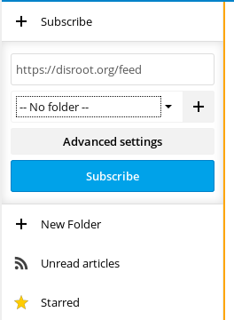

News app is pretty handy tool to keep track of the new articles and posts of all the websites you like to follow in one place. Disroot cloud provides great and simple to use app that does the job for you and syncs it to all your devices. In this tutorial we'll try to cover the basic usage, if you are interested in integrating it with your devices choose your prefered operating system in [this](https://howto.disroot.org/nextcloud/sync-with-your-cloud) section.

----------
# News App on Disroot

To get into the app form webbrowser, just click news app icon  in the top bar. General idea behind the app is very simple. You add RSS-feed of your favorite sites, get notification on new articles, and read then without the need to go to all those websites, by opening lots of tabs and get distracted half way.

So let's get things rolling:

## Add new feeds
Most of the websites provide [RSS](https://en.wikipedia.org/wiki/RSS) or Atom feeds. Once you have the RSS link ready, you can copy it and add it to your news app.
To add the feed simply click on the **"+ Subscribe"** button and fill in the URL of the feed you previously copied.

For better overview and sorting you can create Folders and assign feeds to them. To create new folder hit **"+ New Folder"** button on the left-side bar. Now you can "drag and drop" feeds you wish to add to folders.

## Feed options
Every feed can be optimized to your needs. Clicking on **"Three dot"** icon:

