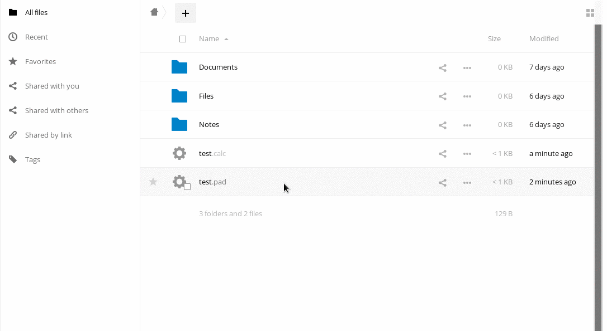

Etherpad y Ethercalc son aplicaciones colaborativas para edición multiusuario en tiempo real de documentos. Puedes acceder a ellas directamente desde tu navegador en: https://pad.disroot.org y https://calc.disroot.org. No es necesario tener una cuenta de usuario para utilizarlos. Sin embargo, nuestra nube viene con un plugin muy útil que te ayuda a mantener un registro de todos tus pads, como si fueran uno de tus archivos.

**¡Nota!** "Pads" y "calcs (hojas de cálculo)" no son archivos que contienen tus datos sino que son links a tu trabajo almacenado en https://pad.disroot.org o en https://calc.disroot.org.

# La idea detrás de los pads
La idea detrás de este programa es muy simple. Es un editor de texto/planilla de cálculo que "vive" en la web. Todo lo que tipeas es escrito en tu bloc automáticamente. Puedes trabajar sobre un documento con muchas personas al mismo tiempo, sin necesidad de salvar y pasarse copias de los documentos unos a otros. Una vez que tu trabajo está hecho, puedes exportar el pad al formato que elijas. Para leer más sobre la Guía General de la interface, puedes ver esta página (en construcción).

# Utilización
Debajo puedes leer cómo hacer uso de ownpad, un plugin para la instancia en la nube de Disroot.

# Creando nuevos pads
La creación de nuevos pads funciona de la misma manera que al crear nuevos archivos. haz click en el ícono "+" y selecciona crear un pad (editor de texto) o un calc (hoja de cálculo). Una vez que le das un nombre, un nuevo archivo con extensión .pad/.calc será creado. Puedes mover o compartir ese archivo igual que cualquier otro que tengas en tu cuenta en la nube.

# Abriendo un nuevo pad
Para abrir un pad creado recientemente, sólo haz click en su nombre. La aplicación abrira tu pad utilizando  pad.disroot.org/calc.disroot.org dentro de la interfaz de la nube. Ahora puedes trabajar fácilmente sobre tu documento; una vez que hayas terminado, utiliza el ícono rojo a tu derecha para cerrarlo. Todos los cambios son guardados desde el momento en que comienzas a escribir así que no hay necesidad de salvarlo de antemano. Ya que el archivo "vive" en la web, puedes volver a él cuando lo desees.

# Compartiendo

Compartir pads con otros usuarios de Disroot es igual que compartir otro tipo de archivos. Haz click en el ícono de "compartir" y selecciona con quién quieres hacerlo. Notarás que utilizar un link público no funcionará tan fácilmente ya que éstos no son archivos corrientes.

Para compartir con alguien fuera de la nube de Disroot, deberías compartir el link actual al pad. Puedes hacerlo abriendo tu pad en el navegador y pasando el puntero encima de su nombre. Verás el link actual al pad, que luego puedes copiar y enviar a quien desees.

# Borrando pads
Es imposible borrar los pads. Una vez creados, permanecen en línea. De hecho, cualquiera que pudiera deducir la dirección url, podría mirarlo. Es por ello que el plugin de la nube de Disroot crea links a tus pads utilizando cadenas de carácteres al azar en lugar del nombre que especificas cuando creas el archivo. De esa manera, los links a los pads son imposibles de deducir y se los asegura del acceso de cualquiera excepto de tí y los usuarios con lo que compartes los pads.
