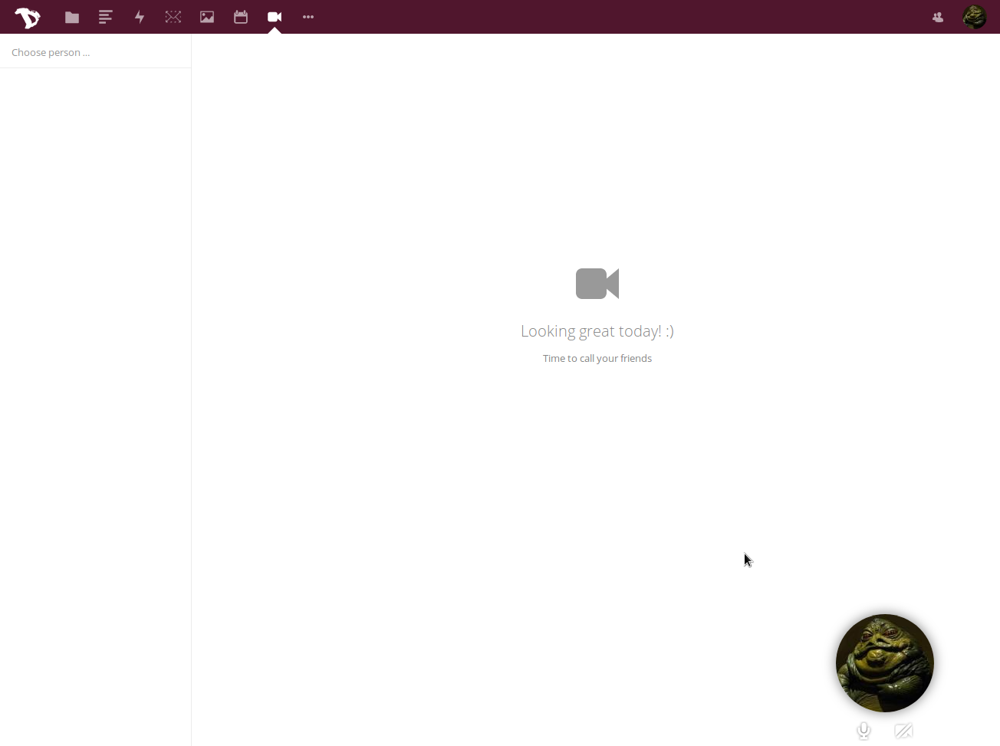
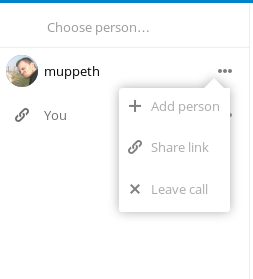

Since January 2017 we've introduced spreed calls to our cloud. It's very simple audio/video conference app you can use to communicate not only with other disroot users but with anyone who has a computer connected to the internet and up to date web browser supporting WebRTC technology.

The interface of the application is very simple. The left side bar shows you the list of rooms you have created.

On the bottom right of the window you will see your avatar and few options where you can:

 - mute/un-mute your microphone
 - switch on/off your camera
 - switch on/off fullscreen mode

That's pretty much it. You should be ready to start your new call

##Creating Calls
To start calling, you need to create a room. Click on **"Choose person"** to do so. In the popup window you have an option to invite existing disroot account, or create public room.
You will see there is a new room listed on the left sidebar.
When clicking on the options button of the room, you can either:
  - invite more people
  - create/delete public link
  - leave the call/room

There is no real difference between disroot user rooms and public rooms as in both cases you can either invite disroot users or create/remove public link rooms.

Once you initiate the call by pressing on the room's name, a notification will be sent to invited disroot user or (in case of public room instance) you will have to wait for at least one other participant to join in.

Once they join, you can start having your video call.
