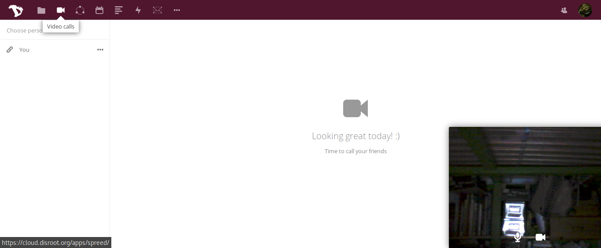
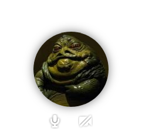
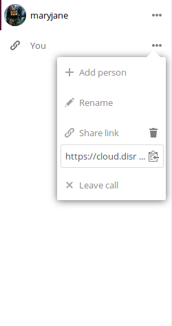

Desde janeiro de que implementámos "spreed calls" na nossa cloud. É uma aplicação de conferências áudio/vídeo muito simples de usar que pode utilizar para comunicar não apenas com outros utilizadores do Disroot mas também com qualquer outra pessoa que tenha um computador ligado à Internet com um browser atualizado que suporte a técnologia WebRTC.

O interface da aplicação é bastante simples. A barra lateral esquerda mostra a lista de salas de conferência que criou.

No canto inferior esquerdo poderá ver a sua imagem (ou no caso de ter desabilitado o vídeo na chamada, o seu avatar) e também algumas opções onde pode:

 - ligar/desligar o seu microfone
 - ligar/desligar a sua câmara
 - Ligar ou desligar o modo de ecrã inteiro (esta opção só aparece depois de começar a chamada)

É basicamente isso. A partir deste ponto está pronto para começar a sua chamada

## Criar chamadas/conferências
Para começar uma chamada precisa de criar uma sala. Carregue em **"Choose person"** para criar a sala. Na janela de popup pode escrever o seu nome de utilizador carregar em **enter** e depois carregar em **"+ New public call"**.
A partir deste momento tem criada uma sala de conferência onde você é o único participante na qual pode convidar outros participantes.
Se souber o nome de utilizador de outro utilizador do Disroot pode procurar esse utilizador e convidar diretamente para a nova conversa.

Irá ver a nova sala criada na barra lateral esquerda.
Quando carrega no botão de opções da sala pode:
  - convidar mais pessoas a juntar-se à sala
  - criar/apagar o link público da sala (que pode ser partilhado permitindo a pessoas que não são utilizadores do Disroot participarem na chamada)
  - abandonar a chamada / sala de conferência
  - alterar o nome da sala, o que facilita a organização das mesmas

Não há diferenças reais entre salas de conferência do Disroot e salas de conferência públicas, porque em ambos os casos pode convidar utilizadores do Disroot e criar e apagar links públicos.

Assim que iniciar a chamada carregando no nome da sala, será enviada uma notificação aos utilizadores do Disroot que convidou para esta chamada ou (no caso de salas públicas com pessoas que estão a utilizar o link público) terá que esperar que pelo menos um participante se junte à chamada.

Assim que se juntarem, você pode começar a chamada vídeo.
