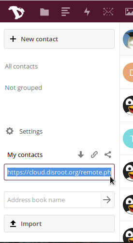
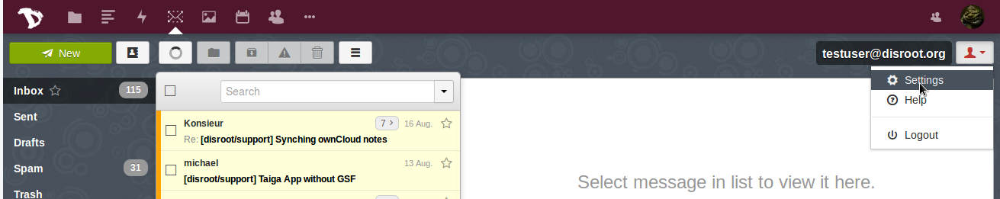
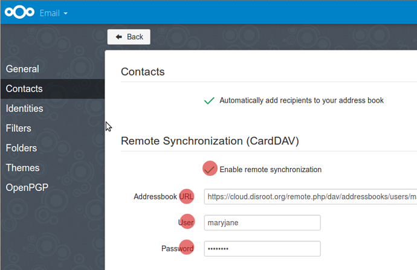

# Synchroniser des contacts cloud avec le webmail
Il est très facile de synchroniser les contacts cloud avec Webmail. Il permettra aux contacts de votre webmail et de votre cloud d'être synchronisés.

Allez d'abord dans votre application Nexcloud Contacts. Cliquez sur l'icône des paramètres dans le coin inférieur gauche.
Sélectionnez l'option "Afficher URL" du carnet d'adresses que vous souhaitez synchroniser avec le webmail, et copiez le lien donné.

Maintenant allez dans l'application Webmail, et cliquez sur l'icône de paramétrage (en haut à droite dans l'application webmail)

Dans vos paramètres, dans la barre de gauche, sélectionnez: **Contacts**.
Dans le menu Contacts:

1. Sélectionnez Activer la synchronisation à distance
2. Dans l'URL du carnet d'adresses, placez l'URL du carnet d'adresses de contacts Nexcloud que vous avez déjà enregistré.
3. Donnez votre nom d'utilisateur
4. Ajoutez votre mot de passe

Puis rafraîchissez les deux pages. Maintenant vos contacts resteront synchronisés.
