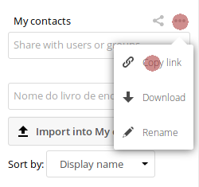
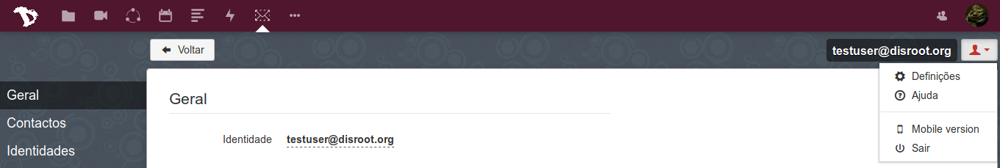
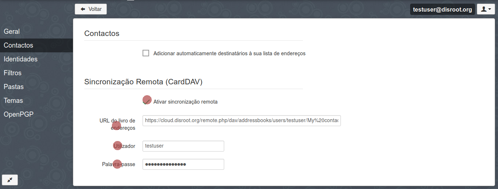

# Sincronizar os contactos da cloud com o webmail
Sincronizar os contactos da sua cloud com o webmail é bastante fácil. Permitirá os seus contactos estarem sincronizados entre o serviço de email e a cloud.

Primeiro vá à aplicação de contactos do Nextcloud. Carregue no botão "Definições", no canto inferior esquerdo.
Selecione "Copy Link" no livro de endereços que quer sincronizar com o seu email.

Agora vá à aplicação de webmail e carregue no botão definições (no canto superior direito a aplicação de webmail)

Nas suas definições, na barra lateral esquerda selecione: **Contactos**

Quando estiver no menu de contactos:

1. Selecione Ativar sincronização remota
2. Em "URL do Livro de endereços" coloque o link URL do livro de endereços que copiou anteriormente do Nextcloud.
3. Adicione o seu nome de utilizador
4. Adicione a sua password

Depois recarregue ambas as páginas. A partir de agora os seus contactos estarão sincronizados.
