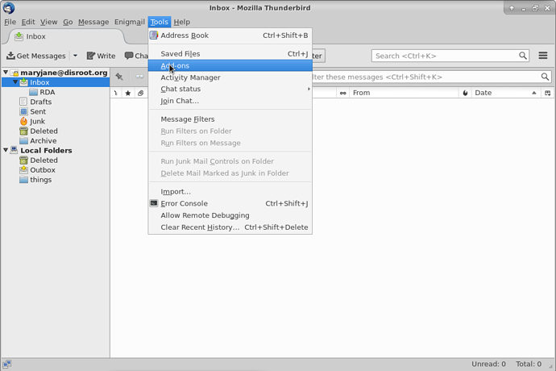
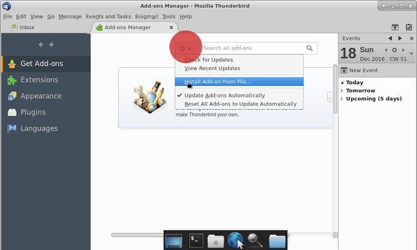
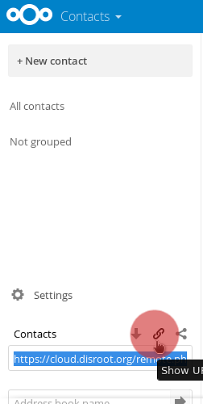
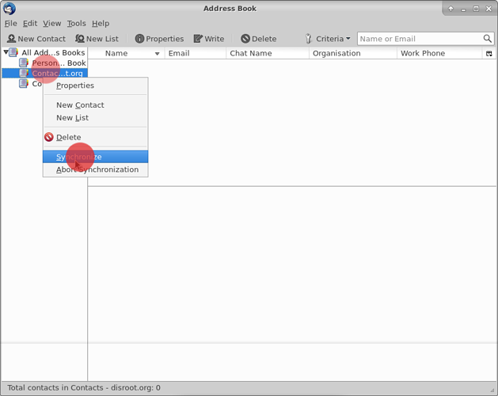

The contact and calendar features in Disroot/Nexcloud are pretty cool but if you have your Disroot email connected to an email client like Thunderbird it's nice to have the contacts and calendars from Disroot integrated with Thunderbird aswell and access them from one place on your desktop.

---------

# 1 - Installing Needed Add-ons

In order to sync all your calendars, tasks and contacts to thunderbird, you will need to install those Add-ons:

* **Lightning** - a calendar for Thunderbird
* **SoGo Connector**  -to sync you contacts

**Note!** Even if you just want to sync your contacts you will still need the lightning add-on. So says the Nextcloud manual [here](https://docs.nextcloud.com/server/9.0/user_manual/pim/sync_thunderbird.html)

## Installing Lightning

In Thunderbird go to > tools > Add-ons

In the Add-ons page on the upper right corner you will find a search bar. Just search for "Lightning". Once thunderbird finds it for you, press install.

You will need to restart Thunderbird in order to finish the installation of both Add-ons

## Installing So Go Connector

This Add-on is not listed in the Add-ons menu so we have to download it straight from the developers website [here](https://sogo.nu/download.html#/frontends)

On the website select **"SoGo Connector"**. Then once downaloaded, go back to thunderbird's  Add-ons menu and select install from file option.

Now select SoGo connector file (.xpi extension) you've just downloaded from the website.
The following image should appear next, just press install

For both Add-ons to finish their installations you will need to restart Thunderbird

## 2 - Integrating calendar with Thunderbird

First login to your [Disroot cloud](https://cloud.disroot.org) and go to calendar app. Select options of the calendar you want to sync to thunderbird.
Now, copy the link URL of your calendar. You will need it to sync with thunderbird.

 

Now in Thunderbird. Either go to: File > New > Calendar or go directly to Calendar window and select *"New calendar"* by right clicking on the calendar list.

Now configure your calendar to sync:
1- select the option **CalDAV**
2 - In the location field, paste the link of your Disroot Calendar that you copied earlier
3 - Select offline support, if you want to keep a local copy of you calendar, in case you need to work offline
4 - Press next

Give your calendar a name and assign a color.
Then press next.

Then press finish.
Your calendar is now synced with Thunderbird. Any event created in thunderbird will apear on disroot cloud and vice versa.

**Note!**
If you have multiple calendars in your Disroot account, just repeat this process for each calendar. You can use a different color to each calendar to set them apart. This method works for any nextcloud/owncloud provider out there.
Additionally you can sync any calendars form any provider as long as they support caldav protocol (check with your provider for more details)

### Adding events with multiple calendars
If you have multiple calendars in Thunderbird, when creating an event you need to to select to which calendar it goes to, otherwise you maybe end up looking for it online in the wrong place

If you right click the calendars in Thunderbird you will have a set of options, from:

* Show or hide a Calendar
* Export Calendar
* Unsubscribe Calendar (remove it from Thunderbird)
* Making it read only (in Thunderbird)
* Synchronize Calendar  

# Contacts - Integration with Thunderbird

The process is similar to the integration of Calendars in Thunderbird. First you need to get the link from the contacts in your Disroot account.

Go to the contacts app in Disroot webapp ,then go to settings ('gear' icon in the bottom left-panel).Select the share "url button" so that it presents you with a link.
Copy that link and save it, you will need it later.

In Thunderbird, select Tools > Address Book

Then select: File > New > Remote Address Book

In the next panel you will be asked to set the name and url:

* The name is the name you want to give to your address book in thunderbird
* The url is the link that you got earlier from the contact app in Disroot

In this same panel
You can set the periodic syncing to 5 minutes (the default is 15 minutes)
You can set the contacts to read only if you want to (but if you do that you wont be able to edit the contacts in Thunderbird)

When you are done press "ok"

Right click your new remote address book and select Synchronize

You will be prompted to insert your Disroot account credentials
Username: your Disroot Username
Password: your Disroot password

Select the option: **"Use password manager to remember this password"** so that Thunderbird remembers the password and doesn’t ask for it every time you use Thunderbird

Then press **"ok"**

Your contacts in your Disroot account are now synced with the remote contacts address book you created in Thunderbird

Any contacts you add/remove/edit in your Disroot account will be altered accordingly in your Thunderbird remote calendar and vice versa.

If you want to move contacts from your Thunderbird Personal Address Book or Collected Addresses to your new remote address book so that they sync to your Disroot contacts, just select and drag the contact to your remote address book.

However it is advised that you create backups of your contacts. Just in case :wink:
