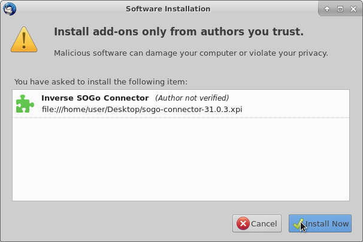
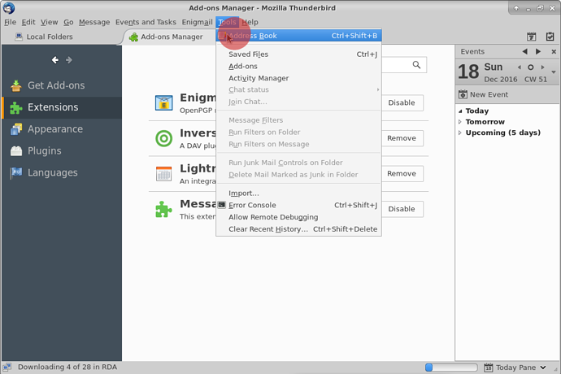

Les fonctionnalités de contact et de calendrier dans Disroot/Nexcloud sont assez cool mais si vous avez votre email Disroot connecté à un client de messagerie comme Thunderbird, il est agréable d'avoir les contacts et les calendriers de Disroot intégrés à Thunderbird également et d' y accéder d'un seul endroit sur votre bureau.

---------

# 1 - Installation des modules complémentaires nécessaires

Afin de synchroniser tous vos calendriers, tâches et contacts avec thunderbird, vous devrez installer ces modules complémentaires:

* **Lightning** - un calendrier pour Thunderbird
* **SoGo Connector** -pour synchroniser vos contacts

**Note!** Même si vous voulez juste synchroniser vos contacts, vous aurez toujours besoin de l'extension Lightning. C'est ce que dit le manuel Nextcloud [ici](https://docs.nextcloud.com/server/9.0/user_manual/pim/sync_thunderbird.html)

## Installer Lightning

Dans Thunderbird, allez dans > Outils > Modules complémentaires

Dans la page Modules complémentaires dans le coin supérieur droit, vous trouverez une barre de recherche. Cherchez "Lightning". Une fois que thunderbird l'a trouvé, appuyez sur installer.

Vous devrez redémarrer Thunderbird pour terminer l'installation des deux modules complémentaires.

## Installation du connecteur So Go Connector

Ce module complémentaire n'est pas listé dans le menu Modules complémentaires donc nous devons le télécharger directement depuis le site des développeurs[ici](https://sogo.nu/download.html#/frontends)

Sur le site Web, sélectionnez **"SoGo Connector"**. Puis, une fois le téléchargement terminé, retournez au menu Modules complémentaires de thunderbird et sélectionnez l'option Installer à partir du fichier.

Sélectionnez maintenant le fichier connecteur SoGo (extension .xpi) que vous venez de télécharger sur le site.
L'image suivante doit apparaître ensuite, il suffit d'appuyer sur installer

Pour que les deux modules complémentaires puissent terminer leurs installations, vous devrez redémarrer Thunderbird

## 2 - Intégrer le calendrier avec Thunderbird

Connectez-vous d'abord à votre [cloud Disroot](https://cloud.disroot.org) et accédez à l'application Calendrier. Sélectionnez les options du calendrier que vous voulez synchroniser avec Thunderbird.
Copiez maintenant l'URL du lien de votre calendrier. Vous en aurez besoin pour synchroniser avec Thunderbird.

 

Maintenant dans Thunderbird. Allez dans: Fichier > Nouveau > Calendrier ou allez directement dans la fenêtre Calendrier et sélectionnez *"Nouveau calendrier"* en cliquant avec le bouton droit sur la liste des calendriers.

Configurez maintenant votre calendrier pour qu'il se synchronise:
1- sélectionner l'option **CalDAV***.
2 - Dans le champ Emplacement, collez le lien de votre Calendrier Disroot que vous avez copié précédemment.
3 - Sélectionnez le support hors ligne, si vous souhaitez conserver une copie locale de votre calendrier, au cas où vous auriez besoin de travailler hors ligne.
4 - Appuyer sur Suivant

Donnez un nom à votre calendrier et attribuez lui une couleur.
Ensuite, appuyez sur Suivant.

Appuyez ensuite sur Terminer.
Votre calendrier est maintenant synchronisé avec Thunderbird. Tout événement créé dans thunderbird se produira sur le cloud Disroot et vice versa.

**Note!**
Si vous avez plusieurs calendriers dans votre compte Disroot, répétez cette procédure pour chaque calendrier. Vous pouvez utiliser une couleur différente pour chaque calendrier afin de les distinguer. Cette méthode fonctionne pour n'importe quel autre fournisseur nextcloud/owncloud.
De plus, vous pouvez synchroniser tous les calendriers de n'importe quel fournisseur du moment qu'ils supportent le protocole caldav (consultez votre fournisseur pour plus de détails).

### Ajout d'événements avec plusieurs calendriers
Si vous avez plusieurs calendriers dans Thunderbird, lors de la création d'un événement, vous devez sélectionner dans quel calendrier il va, sinon vous finirez peut-être par le rechercher en ligne au mauvais endroit.

Si vous cliquez avec le bouton droit de la souris sur les calendriers dans Thunderbird vous aurez un ensemble d'options:

* Afficher ou masquer un calendrier
* Exporter le calendrier
* Se désabonner Calendrier (le supprime de Thunderbird)
* Le rendre en lecture seule (dans Thunderbird)
* Synchroniser le calendrier  

# Contacts - Intégration avec Thunderbird

Le processus est semblable à l'intégration des calendriers dans Thunderbird. Vous devez d'abord obtenir le lien depuis les contacts de votre compte Disroot.

Allez dans l'application Contacts de Disroot, puis dans Paramètres (icône 'roue crantée' en bas à gauche dans le panneau inférieur), sélectionnez le bouton de partage "url" pour qu'il vous fournisse un lien.
Copiez ce lien et sauvegardez-le, vous en aurez besoin plus tard.

Dans Thunderbird, sélectionnez Outils > Carnet d'adresses

Sélectionnez ensuite: Fichier > Nouveau > Carnet d'adresses distant

Dans le panneau suivant, il vous sera demandé de définir le nom et l'url:

* Le nom est le nom que vous voulez donner à votre carnet d'adresses dans thunderbird
* L'url est le lien que vous avez récupéré plus tôt dans l'application Contact de Disroot

Dans ce même panneau
Vous pouvez régler la synchronisation périodique sur 5 minutes (la valeur par défaut est 15 minutes)
Vous pouvez régler les contacts en lecture uniquement si vous le souhaitez (mais si vous le faites, vous ne pourrez pas éditer les contacts dans Thunderbird)

Quand vous avez fini, appuyez sur "ok".

Cliquez avec le bouton droit de la souris sur votre nouveau carnet d'adresses distant et sélectionnez Synchroniser

Vous serez invité à insérer vos identifiants de compte Disroot
Nom d'utilisateur: votre nom d'utilisateur Disroot
Mot de passe: votre mot de passe Disroot

Sélectionnez l'option: **"Utiliser le gestionnaire de mots de passe pour mémoriser ce mot de passe"** afin que Thunderbird se souvienne du mot de passe et ne le demande pas chaque fois que vous utilisez Thunderbird.

Puis appuyez sur **"ok"**.

Vos contacts dans votre compte Disroot sont maintenant synchronisés avec le carnet d'adresses des contacts distants que vous avez créé dans Thunderbird.

Tous les contacts que vous ajoutez/supprimez/éditionnez dans votre compte Disroot seront modifiés en conséquence dans votre calendrier distant Thunderbird et vice versa.

Si vous voulez déplacer des contacts de votre carnet d'adresses personnel Thunderbird ou des Adresses collectées vers votre nouveau carnet d'adresses distant afin qu'ils se synchronisent avec vos contacts Disroot, il vous suffit de sélectionner et de glisser le contact dans votre carnet d'adresses distant.

Cependant, il est conseillé de créer des sauvegardes de vos contacts. Juste au cas où  :wink:
