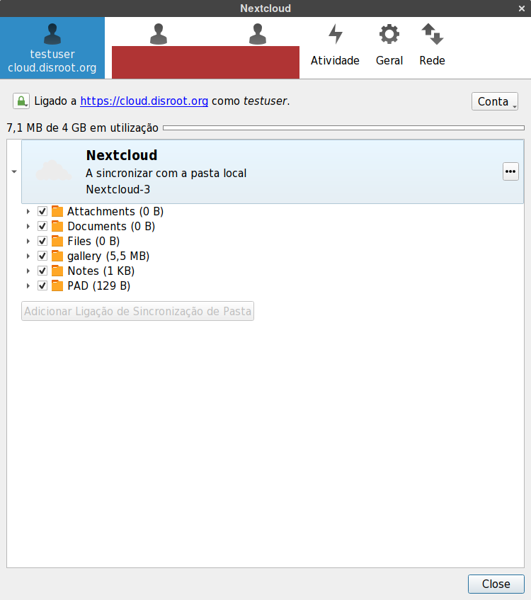

Usar o cliente de sincronização de ficheiros para desktop do Nextcloud permite-lhe sincronizar os ficheiros que tem na sua conta de cloud do Disroot com uma pasta local no seu Desktop
O que significa que pode aceder/editar/adicionar/remover ficheiros na sua conta Disroot sem precisar de fazer o login na sua conta via um browser de Internet.

# Instalar o aplicativo Nextcloud (cliente)

Caso ainda não tenha o aplicativo de desktop do Nextcloud instalada, pode ver como instalar-lo  [aqui](https://nextcloud.com/install/#install-clients).
Utilizadores de ubuntu ou de distros baseadas em ubuntu podem encontrar instruções melhores  [aqui](https://www.c-rieger.de/how-to-install-nextcloud-desktop-client-for-ubuntu/).

# Adicionar uma nova conta

Na primeira vez que abrir o cliente de Desktop do Nextcloud, irão aparecer os campos necessários para adicionar a sua conta.
No campo que diz **"Endereço do Servidor"** escreva o endereço de URL da cloud do Disroot:  **https://cloud.disroot.org**, depois carregue em **"Next"**.

Depois adicione os detalhes da sua conta Disroot:
Nome de utilizador: *o seu nome de utilizador no Disroot*
Senha: *A password da sua conta Disroot*
Depois carregue em **"Next"**

Agora deve escolher o que quer sincronizar e em que pasta no seu computador deve ser sincronizado. POr defeito o Nextcloud irá querer criar uma pasta chamada "Nextcloud" na sua diretoria principal. Esta pasta Será nesta pasta que serão sincronizados os ficheiros e pastas quer sincronizar com o seu computador.

Você pode escolher sincronizar todos os ficheiros e pastas na sua cloud ou então escolher que pastas sincronizar. Isto é útil se o seu espaço de armazenamento na cloud for enorme e não quiser ter uma cópia de tudo no seu computador.
Esta opção pode ser alterada a qualquer momento.

Assim que estiver contente com as suas configurações é só carregar em **"Ligar"**

Depois carregue em **Finish**
Qualquer ficheiro que edite nesta pasta (.txt, folha de cálculo, processador de texto) será sincronizado com a sua cloud do Disroot. Quaisquer ficheiros que adicione ou remova serão adicionados ou removidos da sua cloud do Disroot. Isto também funciona no sentido inverso claro. Qualquer alteração feita a partir da sua cloud do Disroot será sincronizada na pasta.

# Opções Gerais

O cliente de sincronização do Nextcloud por defeito corre no background. Interagindo com o ícone na barra do sistema pode focar a aplicação. 

A aplicação consiste em quatro separadores principais:
 - A sua conta
 - Atividade
 - Geral
 - Rede

## A sua conta
Dá uma visão geral de qual o estado actual da aplicação. Você pode:
 - ver o estado de qualquer sincronização
 - escolher que pastas sincronizar ou não carregando na caixa de seleção
 - confirmar a a assinatura das chaves de TLS/ssl carregando no botão com o "cadeado"

O botão **"Conta"** permite-lhe remover a conta da aplicação ou adicionar uma nova conta. O cliente de sincronização do nextcloud suporta várias contas. Nem sequer tem que ser outra conta do Disroot. Pode adicionar qualquer conta de Nextcloud ou Owncloud de qualquer outro servidor, (incluindo o seu próprio servidor claro).

## Adicionar uma segunda conta
Adicionar uma segunda (ou terceira) conta é o mesmo procedimento do que para adicionar a primeira conta. Ser-lhe-à feito as mesmas perguntas quando adicionou a primeira conta. O mais importante a ter em conta é que **não pode usar a mesma pasta Nextcloud para duas contas diferentes em simultâneo**. Por isso deve criar uma nova pasta para esta segunda conta e certificar-se que a sua segunda conta está a sincronizar para uma pasta diferente da primeira conta.

Depois de adicionar a segunda conta, esta ira aparecer na barra de topo da aplicação. É nesta barra que pode alternar entre contas e mudar as configurações de cada uma delas.

## Separador "Atividade "
O separador **Atividade** permite ter uma visão geral dos ficheiros e pastas  carregados/descarregados/adicionados/removidos nas suas contas. Semelhante à aplicação Atividades no interface web da cloud do Disroot.

## Separador "Geral"
O separador **Geral** permite-lhe:
 - Decidir se quer que aplicação inicie quando o sistema operativo arranca (se aplicação não estiver ativa não irá sincronizar com a sua conta de cloud)
 - Estipular os limites do tamanho dos ficheiros que descarrega automaticamente para o seu computador
 - Selecionar se quer que aplicação mostre notificações no seu ambiente de trabalho

## Separador "Rede"

 - Configure a aplicação para o seu proxy (caso esteja a usar um proxy)
 - Selecionar qual a largura de banda de rede máxima que pode ser usada para downloads e uploads (pode ser útil em locais com um sinal de Internet fraco)

## Partilhar a partir do seu Desktop (macos and windows only!)

Caso esteja a usar Windows ou MacOS é possível criar links URL para partilha dos ficheiros diretamente a partir da pasta local ou de um ficheiro ou uma sub-pasta para enviar por email a outra pessoa. Carregando com a tecla direita do rato no ficheiro ou pasta.  

E serão apresentadas as mesmas opções de pastilha como se estivesse a aceder aos seus ficheiros a partir da sua conta de cloud do Disroot via um browser de Internet.

Esta funcionalidade ainda não existe em Linux :(
No entanto se estiver a utilizar o gestor de ficheiros "Files" (Nautilus) pode instalar o plugin owncloud-client-nautilus (o nome varia consoante a distribuição, pode ser nextcloud em vez de owncloud).
