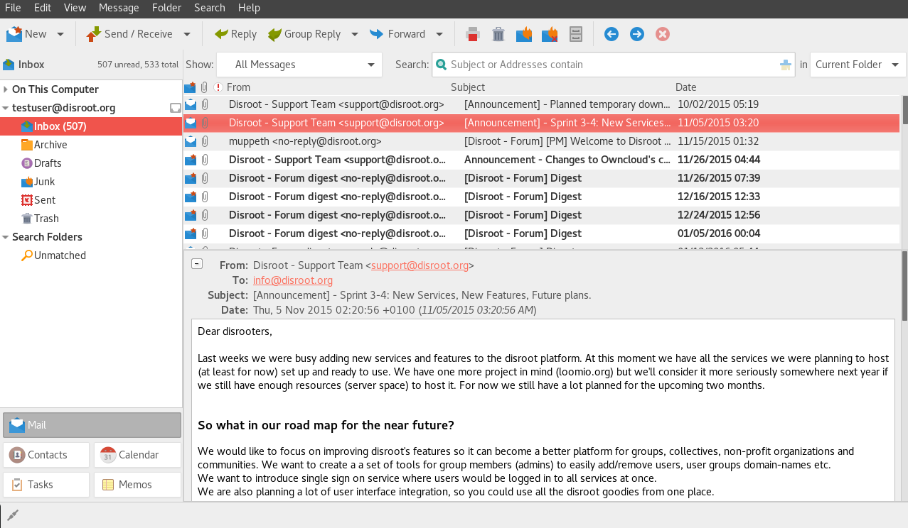

----------

Gnome es entorno gráfico de escritorio para Linux muy popular, logrado, moderno y sencillo de usar. It's my desktop of choice and it is mainly due to it's awesome integration with Disroot's cloud services.

Integración con el entorno de escritorio significa que ya no es necesario seguir accediendo a la nube de Disroot a través del navegador cada vez que necesites agregar o buscar información. Es decir, todo lo que necesitas está disponible directamente en tu escritorio. Además, hace que todo se vea y se sienta unificado con todas las otras aplicaciones que utilizas mientras trabajas.

En este tutorial nos gustaría mostrarte qué fácil y útil es integrar tu nube a tu ordenador. El proceso de configuración no debería tomar más que unos pocos minutos de tu tiempo.

-------
# Configurar las cuentas En línea

Para tener todo funcionando, todo lo que necesitas hacer es:

 - Ir a la **Configuración** de Gnome (p.ej. escribe configuración en la búsqueda del menú)
 - Abre **"Cuentas En Línea"**
 - Seleccciona **"Nextcloud"** (u Owncloud si usas una versión anterior)
 - Sigue las instrucciones para completar tus credenciales:
    - **Dirección:** https://cloud.disroot.org
    - **Usuario:** *tu nombre de usuario*
    - **Contraseña:** *tu_contraseña_súper_secreta*

Si has hecho eso correctamente, ahora puedes elegir qué aspectos de la nube quieres integrar. Puedes habilitarlas o deshabilitarlas en cualquier momento según lo consideres.

--------------
# Calendario

Una de las características más útiles es el Calendario. Notarás que tus calendarios ya están integrados si presionas sobre **tiempo actual** en la barra superior del escritorio. Una ventana emergente con un calendario mostrará automáticamente todos los eventos de tu cuenta en la nube de Disroot. Recibirás también todas las notificaciones sobre eventos próximos, por supuesto.

Para agregar/editar/quitar eventos o tener una mejor perspectiva de todo lo que hay en tu calendario, sugerimos instalar la aplicación Gnome Calendar.
Dependiendo de tu sistema operativo, deberías buscarla en tu gestor de software.

Una vez que la hayas instalado, notarás que tus calendarios ya están integrados gracias a la configuración global de las "Cuentas en línea" que estableciste antes. La aplicación es muy simple, y aún carece de algunas características para ser completa (p.ej. recurrencia) pero te posibilita hacer las cosas básicas tales como crear/borrar/editar entradas de calendarios. Puedes seleccionar qué calendarios te gustaría ver y cuáles deshabilitar (en caso que tuvieras muchos de ellos). Puedes crear/modificar/borrar eventos, y todos serán sincronizados con la nube de Disroot, lo que significa que también con todos los dispositivos conectados a ella.

-----------
# Archivos

Si abres tu aplicación "Archivos" notarás que hay una nueva ubicación de red que apunta a tu cuenta de Disroot. Así es. Puedes fácilmente agregar/quitar/copiar/modificar archivos en tu nube sin necesidad de descargarlos a tu dispositivo o acceder a través del navegador. Esto es muy diferente a utilizar la aplicación "cliente-Nextcloud", ya que esta no sincroniza el contenido de los archivos en la nube a tu ordenador. **Recuerda que estás trabajando directamente en tu almacenamiento en la nube** (lo que sea que cambies, afecta inmediatamente a tus archivos almacenados).

----------

# Tareas

Tareas es una herramienta muy útil para organizar tu trabajo. Gracias a las integraciones, ya no necesitas acceder a la cuenta vía navegador para usarlas. Simplemente ve a la aplicación "Software" (gestor de programas, o cualquier otro medio que utilices para instalar software) y busca la aplicación "GNOME To Do".

Igual que con los Calendarios, verás que todas tus tareas son automáticamente sincronizadas. Ahora puedes añadir fácilmente nuevas tareas, fechas límites, descripciones, agregar notas, prioridades, así como también organizarlas jerárquicamente en tareas principales y relacionadas. La aplicación es bastante intuitiva y sencilla de usar.

----------

# Contactos

Obtener la integración de los contactos es tan fácil como todo lo demás que hiciste hasta ahora. Sólo sigue el mismo patrón. Primero, consigue la aplicación "Contactos" en caso que no la tuvieras instalada por defecto.

Luego necesitas cambiar de tu libreta de direcciones predeterminada a la provista por la nube de Disroot.
En el menú Contacto de la aplicación, selecciona "Cambiar libreta de direcciones". Una vez que seleccionas tu cuenta de Disroot como tu cuenta actual, todos tus contactos serán sincronizados en tu computadora. Todos los nuevos contactos o cualquier modificación será sincronizada de vuelta a tu nube de Disroot y a todos los dispositivos conectados a ella.

----------

# Correo electrónico

Si nunca trabajaste con el cliente de correo de escritorio y siempre utilizaste el webmail para acceder a tu correo, nos parece, simplemente, que **¡no es la mejor manera!**. A pesar de la tendencia reciente de las grandes corporaciones, que intentan convencerte de lo contrario, los clientes de correo te dan una integración con tu trabajo que estabas perdiendo. El cliente de correo de código abierto más importante es Thunderbird (la configuración está incluida en [este tutorial](https://howto.disroot.org/en/email/email-clients/desktop/thunderbird)). Si no te gusta Thunderbird y quisieras integrar tu correo electrónico en Gnome, hay también una sencilla solución para eso. Abre de nuevo la "Configuración de Gnome" y haz click en "Cuentas en línea". Ahora necesitas deslizarte hacia abajo hasta la opción "Otros" y elegirla. Después, seleccionar Cuenta IMAP. En este punto se te harán varias preguntas con respecto a la configuración de tu cuenta y servidor de correo. Sólo sigue la lista de abajo.

**Dirección de correo electrónico:** *tu_nombre_de_usuario*@disroot.org
**Nombre:** Un nombre para tu cuenta (puede ser cualquiera)
**Configuración IMAP:**
**Servidor IMAP:** disroot.org
**Usuario:** *tu usuario de Disroot*
**Contraseña:** *tu contraseña de Disroot*
**Encriptado:** SSL en puerto dedicado

**Configuración SMTP:**
**Servidor SMTP:** disroot.org
**Usuario:** *tu usuario de Disroot*
**Contraseña:** *tu contraseña de Disroot*
**Encriptado:** STARTTLS después de conectar

Ahora tienes tu correo electrónico configurado e integrado con tu escritorio. Puedes usar los clientes de correo "Evolution" o "Geary" y disfrutar de todos tus correos, calendarios, tareas y contactos integrados en una aplicación. Mágico... :)

----------

# Noticias
La aplicación News (Noticias) de la nube de Disroot te permite agregar todas las nuevas publicaciones de tus sitios y servicios, usando contenido RSS, y sincronizarla con todos tus dispositivos. Se vuelve extra útil cuando quieres estar al tanto de inmediato sobre noticias que te interesan. La mayoría de los sitios web ofrecen contenido RSS. Generalmente, puedes encontrarlos a través de esto, o tipeando https://disroot.org/feed

Además de la aplicación web tradicional y la aplicación del móvil, podemos integrar fácilmente News con tu escritorio. Igual que todas las integraciones de aplicaciones previas en este tutorial, el primer paso es descargar el software apropiado. La aplicación que integra el lector de RSS con la nube de Disroot se llama **"FeedReader"**, que debería estar disponible en el gestor de "Software" de tu distribución. Si no está, entonces puedes buscar las instrucciones para instalarla [aquí](https://github.com/jangernert/feedreader).

Una vez que la tengas funcionando, todo lo que necesitas hacer es ingresar tus credenciales de Disroot, y ya estás listo.

Luego de configurar tu cuenta, se llevará a cabo la sincronización inicial. Todos los canales de feeds a los que estés suscrito serán sincronizados en tu escritorio. Igual que en el móvil o en la web ahora puedes leer las últimas noticias, agregar/remover canales de feeds, categorizarlos, etc. Todo será sincronizado de vuelta con tu cuenta en la nube. La aplicación verifica en segundo plano si hay nuevas publicaciones y te envía una notificación en el escritorio, aún cuando esté cerrada, así estás informado.

----------
