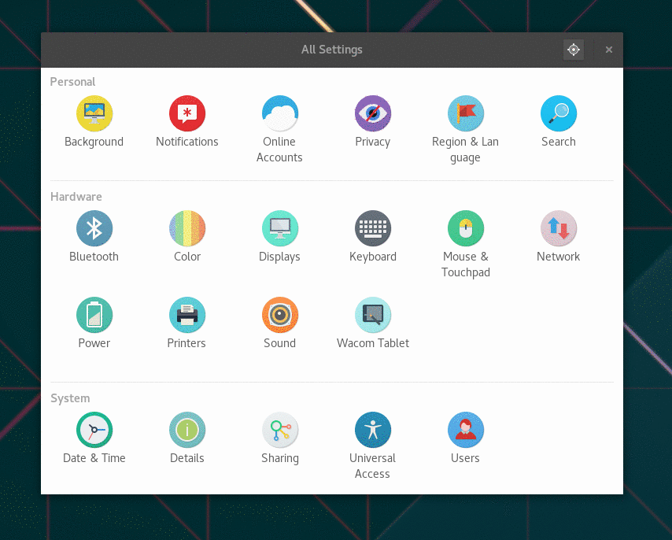
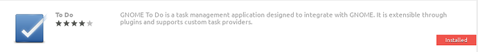
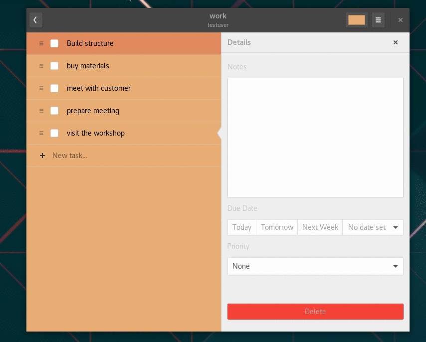
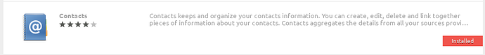
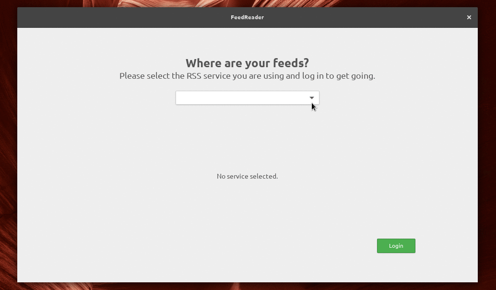
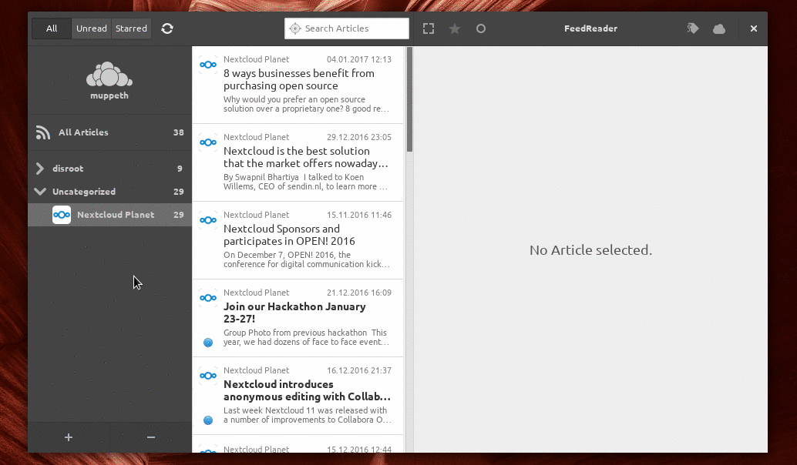

----------

Gnome est un environnement de bureau graphique très populaire, élégant, moderne et facile à utiliser pour Linux. C'est mon bureau de choix et c'est principalement dû à son intégration avec les services cloud de Disroot.

L'intégration avec l'environnement de bureau signifie que vous n'avez plus besoin de vous connecter au cloud Disroot via le navigateur, chaque fois que vous avez besoin d'ajouter ou de rechercher des informations. Cela signifie que tout ce dont vous avez besoin est disponible directement depuis votre bureau. De plus, il donne l'impression d'être unifié avec toutes les autres applications que vous utilisez lorsque vous travaillez. C'est définitivement **LA** façon de faire les choses.

Dans ce tutoriel, j'aimerais vous montrer à quel point il est facile et pratique d'intégrer votre cloud sur votre ordinateur. La procédure d'installation ne devrait pas prendre plus de quelques minutes.

-------
# Régler les comptes en ligne

Pour être opérationnel, tout ce que vous avez à faire, c'est de:

- Accéder aux  **Paramètres** Gnome (par exemple, saisissez paramètres dans la recherche du tableau de bord)
- Ouvrir **"Comptes en ligne"**
- Sélectionne **"Nextcloud"** (ou votre propre cloud si vous utilisez une version plus ancienne)
- Suivre les instructions pour remplir tous vos informations:
   - **Adresse:** https://cloud.disroot.org
   - **Nom d'utilisateur:** *Votre_nom_d'utilisateur*
   - **Mot de passe:** *Votre_mot_de_passe_super_secret*

Si vous l'avez fait correctement, vous pouvez maintenant choisir les aspects du cloud que vous voulez intégrer. Vous pouvez les activer et les désactiver à tout moment selon votre utilisation. Je choisis de tout intégrer.

--------------
# Calendrier

Une des fonctionnalités utiles est le calendrier. Vous remarquerez que vos calendriers sont déjà intégrés si vous appuyez sur **heure actuelle** dans la barre supérieure du bureau. Une fenêtre contextuelle avec un calendrier affichera automatiquement tous les événements de votre compte cloud Disroot. Bien entendu, vous recevrez également toutes les informations sur les événements à venir.

Afin d'ajouter/éditer/supprimer des événements ou avoir une meilleure vue d'ensemble sur tous vos calendriers, je vous suggère d'installer l'application Gnome Calendar.
En fonction de votre système d'exploitation, vous devez le rechercher dans votre application "Logiciels" (l'app store linux ).

Une fois que vous l'aurez installé, vous remarquerez que vos calendriers sont déjà intégrés grâce aux "Comptes en ligne" globaux que vous avez configurés plus tôt. L'application est très simple, et il manque encore certaines fonctionnalités pour être complète (par exemple, la récidive) mais il vous permet de faire des choses de base comme créer/supprimer/éditer des entrées de calendrier. Vous pouvez sélectionner les calendriers que vous souhaitez voir et ceux à désactiver (dans le cas où vous avez de nombreux calendriers). Vous pouvez créer/modifier/supprimer des événements, et ils seront tous synchronisés avec le cloud Disroot, ce qui signifie aussi avec tous les périphériques connectés.

-----------
# Fichiers

Si vous ouvrez votre application "Fichiers", vous remarquerez qu'il y a un nouvel emplacement réseau qui pointe vers votre compte Disroot. Oui, c'est exact. Vous pouvez facilement ajouter/supprimer/copier/modifier des fichiers sur votre cloud sans avoir besoin de les télécharger sur votre appareil ou de vous connecter via un navigateur Web. C'est très différent de l' "application client-nextcloud", car il ne synchronise pas le contenu des fichiers cloud sur votre ordinateur. **Rappelez-vous que vous travaillez directement sur votre stockage cloud** (ce que vous modifiez affecte immédiatement votre stockage cloud).

----------

# Tâches

Tâches est un outil très pratique pour organiser votre travail. Grâce aux intégrations, vous n'avez plus besoin de vous connecter via le navigateur pour les utiliser. Il vous suffit de naviguer vers l'application "Logiciel" (apps tore, ou tout autre moyen que vous utilisez pour installer un logiciel) et de rechercher l'application "GNOME To Do".

Tout comme avec les calendriers, vous verrez que toutes vos tâches sont automatiquement synchronisées. Vous pouvez désormais facilement ajouter de nouvelles tâches, dates limites, descriptions, notes, priorités et les organiser dans l'arborescence des tâches principales et connexes. L'application est assez intuitive et facile à utiliser.

----------

# Contacts

L'intégration des contacts est aussi simple que tout ce que vous avez fait jusqu' à présent. Suivez le même schéma. Obtenez d'abord l'application "Contacts" au cas où vous ne l'auriez pas installée par défaut.

Ensuite, vous devez basculer votre carnet d'adresses par défaut sur celui fourni par le cloud Disroot.
Il vous suffit de sélectionner "Changer le carnet d'adresses" dans le menu de l'application Contact. Une fois que vous avez sélectionné votre compte Disroot comme étant le compte courant, tous vos contacts seront synchronisés avec votre ordinateur. Tous les nouveaux contacts ou toute modification seront synchronisés avec votre cloud Disroot et tous les périphériques qui y sont connectés.

----------

# Email

Si vous n'avez jamais travaillé avec un client de messagerie et que vous avez toujours utilisé l'application Web pour accéder à votre messagerie, vous vous **trompez!** Malgré la tendance récente dans laquelle les grandes entreprises tentent de vous convaincre du contraire, les clients de bureau vous offrent l'intégration avec votre travail qui vous a toujours manqué. Le client de messagerie open source le plus populaire est Thunderbird (le paramétrage est couvert dans [ceci](https://forum.disroot.org/t/email-how-to-setup-email-clients/213#Thunderbird) tutoriel). Si vous n'aimez pas Thunderbird et que vous souhaitez intégrer votre Email dans Gnome, il existe également une solution simple pour cela. Ouvrez à nouveau votre "Gnome Settings" et cliquez sur "Online Accounts". Maintenant, vous devez faire défiler jusqu' à l'option "Autre" et choisir cette option. Sélectionnez ensuite Compte IMAP. A ce stade, plusieurs questions vous seront posées concernant la configuration de votre compte et de votre serveur de messagerie. Suivez la liste ci-dessous.

**Adresse de courriel:** *<votre_nom_d'utilisateur>*@disroot.org
**Nom:** Un nom pour votre compte (peut être n'importe quoi)
**Paramètres de l'IMAP:**
**Serveur IMAP:** disroot.org
**Nom d'utilisateur:** *Votre nom d'utilisateur disroot*
**Mot de passe:** *Votre mot de passe disroot*
**Chiffrement:** SSL sur port dédié

**Réglages SMTP:**
**Serveur SMTP:** disroot.org
**Nom d'utilisateur:** *Votre nom d'utilisateur disroot*
**Mot de passe:** *Votre mot de passe disroot*
**Chiffrement:** STARTTLS après connexion

Maintenant que vous avez configuré votre messagerie et intégré à votre bureau, vous pouvez utiliser le client de messagerie "Evolution" ou "Geary" et profiter de tous vos courriels, calendriers, tâches et contacts intégrés dans une seule application. Magique... :)

----------

# News
L'application News sur le cloud de disroot vous permet d'agréger tous les nouveaux messages de vos sites Web et services préférés à l'aide de flux RSS, et de les synchroniser avec tous vos périphériques. C'est particulièrement utile lorsque vous voulez rester au fait des nouvelles qui vous intéressent. La plupart des sites Web proposent des flux RSS que vous pouvez trouver via ce lien , ou en tapant l'adresse similaire à https://disroot.org/feed

Outre l'application web traditionnelle et l'application mobile, nous pouvons facilement intégrer News avec votre bureau. Comme toutes les intégrations précédentes dans ce tutoriel, la première étape consiste à installer le logiciel approprié. L'application de flux RSS qui s'intègre avec le cloud disroot est appelée **"FeedReader"**, qui devrait être disponible dans votre centre de distribution "Logiciel" (app store). Si ce n'est pas le cas, vous pouvez trouver des instructions pour l'installer [ici](https://github.com/jangernert/feedreader).

Une fois que vous l'aurez mis en marche, tout ce que vous avez à faire est de remplir vos informations d'identification et c'est tout.

Une fois votre compte configuré, la synchronisation initiale aura lieu. Tous vos flux actuellement souscrits seront synchronisés sur votre bureau. Tout comme sur un mobile ou une application web, vous pouvez maintenant lire les dernières nouvelles, ajouter/supprimer des flux, les catégoriser, etc. Tout sera synchronisé de nouveau sur votre compte cloud. L'application vérifie les nouveaux messages en arrière-plan et vous envoie une notification de bureau même si l'application elle-même est fermée, de sorte que vous ne raterez rien.

----------
