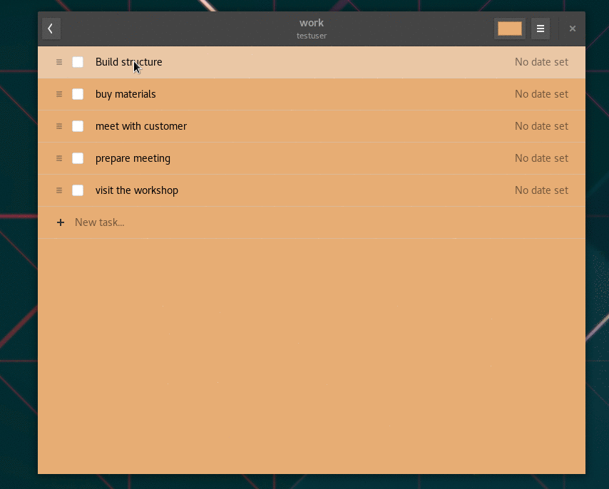

----------

Gnome is a very popular, slick, modern and easy to use graphical desktop environment for Linux. It's my desktop of choice and it is mainly due to it's awesome integration with Disroot's cloud services.

Integration with desktop environment means, you no longer need to login to disroots cloud via the browser, every time you need to add or lookup information. It means everything you need is available to you directly from your desktop. Furthermore it makes it look and feel unified with all other apps you use while you work. It's definitely **THE** way to get things done.

In this tutorial I would like to show you how easy and handy it is to integrate your cloud on your computer. Setup procedure should take no longer then few minutes of your time.

-------
# Set Online accounts

In order to get up and running, all you need to do is:

 - Go to Gnome **Settings** (eg. type settings in the dashboard search)
 - Open **"Online Accounts"**
 - Select **"Nextcloud"** (or owncloud if using older version)
 - Follow instructions to fill in all your credentials:
    - **Address:** https://cloud.disroot.org
    - **Username:** *yourusername*
    - **Password:** *your_super_secret_password*

If you did that correctly now you can choose which aspects of the cloud you want to integrate. You can switch them on and off at any time depending on your use case. I choose to integrate it all.

--------------
# Calendar

One of the useful features is calendar. You will notice that your calendars are already integrated if you press on the  **current time** in your top bar on the desktop. A popup window with a calendar will automatically display all the events from your disroot's cloud account. You will of course receive all notifications on upcoming events as well.

In order to add/edit/remove events or have better overview on all your calendars, I suggest installing Gnome Calendar app.
Depending on your operating system you should search for it in your "Software" application (linux app store).

Once you get it installed, you'll notice your calendars are already integrated thanks to the global "Online Accounts" you set up earlier. The application is very simple, and still missing some features to be complete (eg. recurrence) but it enables you to do basic things such as create/delete/edit calendar entries. You can select which calendars you would like to see and which ones to disable (in case you have numerous calendars). You can create/modify/delete events, and they'll be all synchronized with disroot cloud, which means also with all the devices connected to it.

-----------
# Files

If you open your "Files" app you will notice there is a new network location that points to your disroot account. That's right. You can easily, add/remove/copy/modify files on your cloud without a need to download them onto your device or login via web-browser. This is very different then using "nextcloud client app", as it does not sync the content of the cloud files to your computer. **Remember you are working directly on your cloud storage** (whatever you change, affects your cloud storage Immediately).

----------

# Tasks

Tasks is very handy tool to organize your work. Thanks to integrations you no longer need to login via browser to make use of them. Just navigate to "Software" application (app store, or any other means you use to install software) and look for "GNOME To Do" application.

Just like with Calendars, you will see that all your tasks are automatically synchronized. You can now easily add new tasks, deadlines, descriptions, add notes, priority as well as organize them in main and related task tree. The application is pretty intuitive and easy to use.

----------

# Contacts

Getting contact integration is as easy as everything else you did so far. Just follow the same pattern. First get "Contacts" application in case you don't have it installed by default.

Next you need to switch your default address book to the one provided by disroot cloud.
Just select "Change Address Book" from the Contact app menu. Once you select your disroot account as the current one, all your contacts will be synced to your computer. All new contacts or any modification will be synced back to your disroot cloud and all the devices connected to it.

----------

# Email

If you never worked with email desktop client and always used webapp to access your email, you're simply doing it **wrong!** Despite the recent trend in which big corporations try to convince you otherwise, desktop clients give you integration with your work you always missed. The most popular open source email client is Thunderbird (setup is covered in [this](https://forum.disroot.org/t/email-how-to-setup-email-clients/213#Thunderbird) tutorial). If you don't like Thunderbird and would like to integrate your Email into Gnome, there is also an easy solution for that. Open again your "Gnome  Settings" and click on "Online Accounts". Now you need to scroll all the way down to the "other" option and choose for it. Next, select IMAP Account. At this stage you will be asked several questions regarding your account and mail server setup. Just follow the list below.

**email address:** *<your_username>*@disroot.org
**Name:** A name for your account (can be anything)
**IMAP Settings:**
**IMAP Server:** disroot.org
**Username:** *your disroot username*
**Password:** *your disroot password*
**encryption:** SSL On dedicated port

**SMTP Settings:**
**SMTP Server:** disroot.org
**Username:** *your disroot username*
**Password:** *your disroot password*
**encryption:** STARTTLS after connecting

Now that you have your email setup and integrated with your desktop. You can now use either "Evolution" or "Geary" mail client and enjoy all your emails, calendars, tasks, and contacts integrated in one application. Magic.. :)

----------

# News
News app on disroot cloud lets you aggregate all the new posts of your favorite websites and services using RSS Feed, and sync it with all your devices. It comes extra handy when you want to stay on top of news that interest you. Most of the websites offer RSS feeds.Usually you can find them via this , or by typing address similar to https://disroot.org/feed

Besides traditional web app and mobile app we can easily integrate News with your desktop. Just like all the previous app integrations in this tutorial, first step is to install appropriate software. The RSS Feed application that integrates with disroot cloud is called **"FeedReader"**, which should be available in your distributions "Software" center (app store). if it isn't then you can look for instructions on how to install it [here](https://github.com/jangernert/feedreader).

Once you get it up and running, all you need to do is fill in your disroot credentials, and you are ready to go.

Once your account is setup, initial synchronization will take place. All your currently subscribed feeds will be synced to your desktop. Just like on mobile or webapp you can now read latest news, add / remove feeds, categorize them etc. Everything will be synced back to your cloud account. The app checks for new posts in the background and sends you desktop notification even if the app itself is closed, so you won't miss-out on anything.

----------
