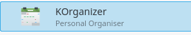
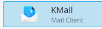

----------
# Sincronizar Contactos y Tareas
Primero configura una cuenta en la aplicación Kaddressbook.

* Para configurarlo, lo que necesitas hacer es:
* Ir a Kontact > Contactos
* Seleccionar Archivo > Nuevo > Añadir libreta de direcciones
* Selecciona Recurso de colaboración DAV
* Sigue las instrucciones para completar tus credenciales:
 * **Usuario:** _tunombredeusuario_
 * **Contraseña:** _tu_contraseña_super_secreta_
* En la opción "Use uno de estos servidores", selecciona: **ownCloud**
* Servidor: introduce la dirección [cloud.disroot.org](http://https:cloud.disroot.org)
* Ruta de instalación: dejalo vacío
* Marca la opción: "Usar conexión segura"
* Presiona:
 * Siguiente
 * Probar conexión
 * Y, si la conexión se concretó con éxito, presiona Terminar

Después de esto, necesitarás agregar manualmente los links URL para los Contactos y Calendarios, en la configuración general.

La Configuración general aparecerá automáticamente después que hayas presionado Terminar.
Luego necesitas:

* Seleccionar CalDAV y Editar
 * Reemplazar la URL remota, con la URL de tu calendario de Disroot: https://cloud.disroot.org/remote.php/dav/calendars/TU_NOMBRE_DE_USUARIO/TUS_CALENDARIOS/
 * Luego haz click en "Obtener" y luego "Aceptar"
* Selecciona CardDAV y Editar
 * Reemplazar la URL remota, con la URL de tus contactos de Disroot: https://cloud.disroot.org/remote.php/dav/addressbooks/users/TU_NOMBRE_DE_USUARIO/TU_LIBRETA_DE_DIRECCIONES/
 * Haz click en "Obtener" y luego "Aceptar"

Puedes encontrar la URL correcta en las opciones para compartir de tus aplicaciones Calendario y Contactos de Disroot.

En la Configuración general también puedes:

* Cambiar el nombre general para mostrar
* Quitar el límite de intervalo de recuperación en los calendarios así se sincronizarán todos tus eventos.

----------

# Calendario
Puedes utilizar la aplicación KOrganizer, que tiene tanto calendarios como tareas.

Tus eventos ya estarán sincronizados.
Agregar/quitar/editar eventos es muy similar a la forma descrita anteriormente para la aplicación Calendario, cualquier modificación será sincronizada con tu calendario de Disroot.

----------

# Archivos

En KDE, necesitas agregar una carpeta de red para acceder en forma remota a tus archivos en Disroot. Abre el Administrador de archivos; y después, haz click en Red.

A continuación:

* Selecciona "Añadir carpeta de red"
* Selecciona "Carpeta Web (Webdav)"
* Sigue las instrucciones para completar tus credenciales:
 * **Nombre:** el nombre que quieras darle a la carpeta
 * **Usuario:** _tu_usuario_de_disroot_
 * **Servidor:** [cloud.disroot.org](https://cloud.disroot.org)
 * **Carpeta:** /remote.php/dav/files/tu_usuario_de_disroot/
 * Selecciona "Usar cifrado"
 * Click en "Guardar y conectar"
 * Se te solicitará tu contraseña

Luego de esto, podrás ver en el Administrador de archivos, en la carpeta "Red", tus archivos de Disroot. Como ya mencionamos:
Puedes agregar/quitar/copiar/modificar fácilmente los archivos en tu nube sin necesidad de descargarlos a tu equipo o acceder a través del navegador web. Esto es muy distinto a utilizar el cliente de escritorio "nextcloud-client", porque no está sincronizando el contenido de tus archivos en la nube a la computadora. **Recuerda que estás trabajando directamente en tu espacio en la nube** (lo que modifiques, afecta inmediatamente a lo que está almacenado en tu espacio en la nube).

----------

# Tareas
La aplicación KOrganizer es tu amiga. Como con el calendario, tus tareas ya estarán sincronizadas. Puedes de manera sencilla agregar/editar/quitar tareas y establecer vencimientos.

----------

# Contactos

En KDE puedes usar KAddressBook para organizar tus contactos. Los principios de funcionamiento son idénticos a los de la aplicación "Contactos", que ya describimos antes.

----------

# Correo electrónico
Puedes integrar tu cuenta de correo con la aplicación KMail de KDE

La configuración de las credenciales es la misma que ya describimos. Luego de abrir KMail, ve a:

* Preferencias
* Configurar KMail
* Cuentas

Necesitas configurar las cuentas de recepción (IMAP o POP3) y envío (SMTP).
Para IMAP o POP3 ve a:

* Recepción
* Agregar
* Seleccionar IMAP o POP3
* Completar tus credenciales

Para SMTP ve a:

* Envío
* Agregar
* SMTP
* Completar tus credenciales

----------
