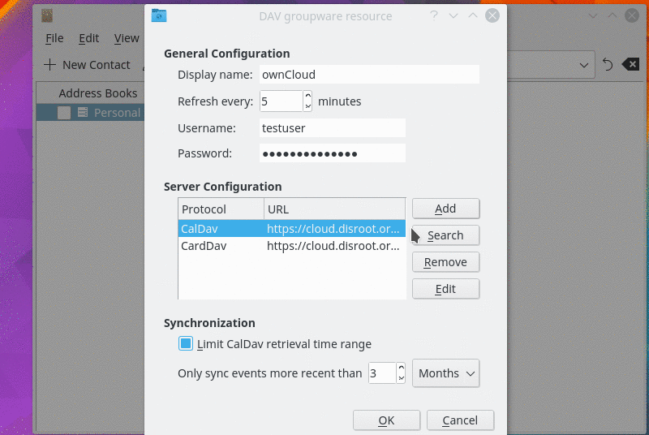
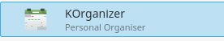
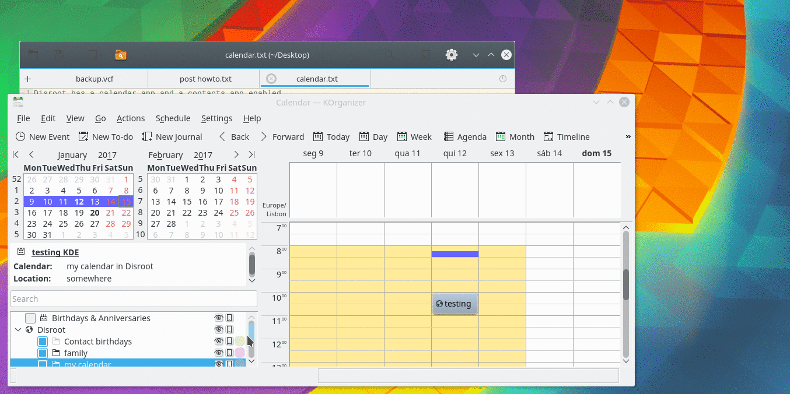
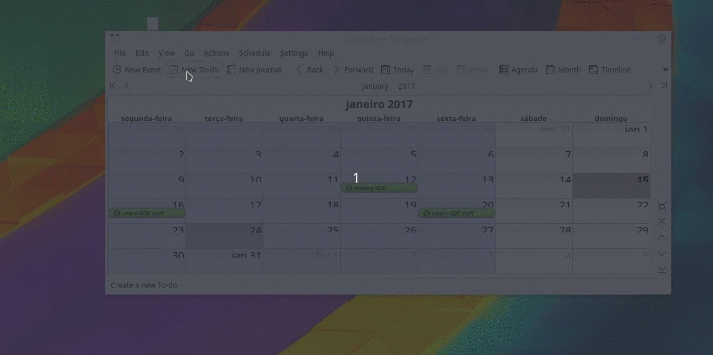
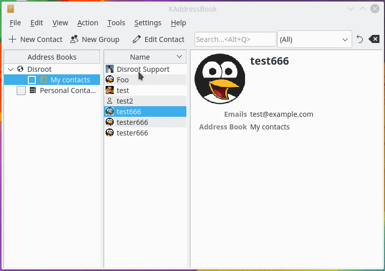
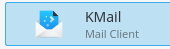

----------
# Synchronisation des Contacts et des Tâches
Configurez d'abord un compte dans l'application Kaddressbook.

* Chemin d'installation: laissez vide
* Sélectionnez l'option "utiliser une connexion sécurisée".
* Appuyez sur:
 * Suivant
 * Test de connexion
 * Et si le test de connexion est bon, appuyez sur Terminer

Ensuite, vous devez ajouter manuellement les liens URL des contacts et des calendriers dans les paramètres généraux.

Les réglages généraux s'affichent automatiquement après avoir appuyé sur Terminer.
Alors vous devez:

* Sélectionnez CalDAV et éditez
 * Remplacez l'URL distante par l'URL de votre calendrier Disroot: https://cloud.disroot.org/remote.php/dav/calendars/YOUR_USERNAME/YOUR_CALENDARS/
 * Appuyer sur "Chercher" et ensuite "Ok".
* Sélectionnez CardDAV et éditez
*  Remplacez l'URL distante par l'URL de vos contacts Disroot: https://cloud.disroot.org/remote.php/dav/addressbooks/users/YOUR_USERNAME/YOUR_ADDRESS_BOOK/
 * Appuyer sur "Chercher" et ensuite "Ok".

Vous pouvez trouver l'URL correcte dans votre calendrier disroot et dans les options de partage de l'application Contacts.

Dans les options générales, vous pouvez également:

* Modifier le nom de l'affichage général
* Supprimer les limites de récupération des calendriers pour synchroniser tous vos événements

----------

# Calendrier
Vous pouvez utiliser l'application KOrganizer, elle a à la fois le calendrier et les tâches.

Vos événements seront déjà synchronisés.
Ajouter/supprimer/éditer des événements est très similaire à l'application Calendrier décrite précédemment, tout changement sera synchronisé avec votre calendrier disroot.

----------

# Fichiers

Dans KDE, vous devez ajouter un dossier réseau pour accéder à distance à vos fichiers disroot. Allez dans le menu de démarrage sélectionnez "Ordinateur" puis "Réseau".

Après ça:

* Sélectionnez "Ajouter un dossier réseau".
* Sélectionnez "Dossier web Webdav".
* Suivez les instructions pour remplir vos informations d'identification:
 * **Nom:** le nom que vous voulez donner au dossier
*  **Utilisateur:** Votre nom d'utilisateur de disroot
*  **Serveur: ** [cloud.disroot.org](https://cloud.disroot.org)
 * **Dossier:** /remote. php/dav/files/YOUR_DISROOT_USERNAME/
 * Cochez la case "Utiliser le cryptage".
 * Pressez "Sauvegarder et se connecter"
 Votre mot de passe vous sera demandé.

Après cela, vous pouvez chercher vos fichiers disroot dans votre application de fichiers dans "network". Comme mentionné précédemment:
Vous pouvez facilement ajouter/supprimer/copier/modifier des fichiers sur votre cloud sans avoir besoin de les télécharger sur votre appareil ou de vous connecter via un navigateur Web. C'est très différent d'utiliser "l'application client nextcloud", car il ne synchronise pas le contenu des fichiers cloud sur votre ordinateur. **Rappelez-vous que vous travaillez directement sur votre stockage cloud** (ce que vous modifiez affecte immédiatement votre stockage cloud).

----------

# Tâches
L'application KOrganizer est votre amie. Comme dans l'option calendrier, vos tâches seront déjà synchronisées. Vous pouvez facilement ajouter/modifier/supprimer des tâches et fixer des délais.

----------

# Contacts

Dans KDE, vous pouvez utiliser votre carnet d'adresses KAddressBook pour organiser vos contacts. Les principes de fonctionnement sont identiques à l'application "Contacts" décrite précédemment.

----------

# Email
Vous pouvez intégrer votre compte de messagerie avec l'application KDE appelée KMail

Les informations d'identification de configuration sont les mêmes que celles décrites précédemment. Après avoir ouvert KMail, allez dans:

* Paramètres
* Configurer KMail
* Comptes

Vous devez configurer les comptes de réception (IMAP ou POP3) et d'envoi (SMTP)
Pour IMAP ou POP3 allez à:

* Réception
* Ajouter
* Sélectionnez IMAP ou POP3
* Remplir les informations

Pour SMTP allez à:

* Envoi
* Ajouter
* SMTP
* Remplir les informations

----------
