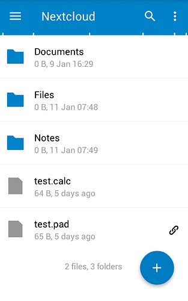
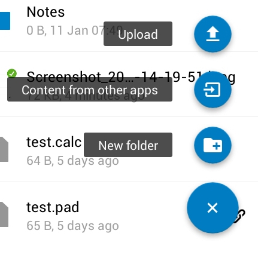
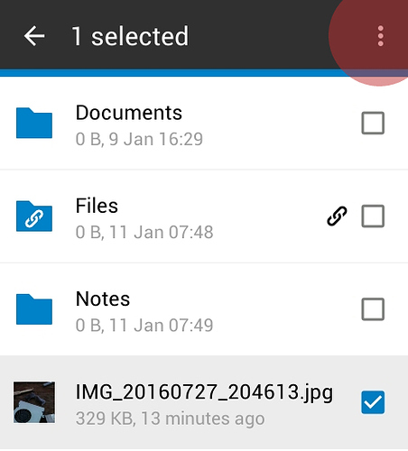

La posibilidad de sincronizar, subir y descargar fácilmente archivos desde tu nube de Disroot a tu móvil puede ser de mucha utilidad en muchos casos.

En este tutorial te mostraremos cómo instalar y trabajar con la aplicación para móviles de Nextcloud. Esta aplicación te permite acceder y sincronizar convenientemente tus archivos en la nube de Disroot y descargar/subir/compartir/borrar desde tu móvil prescindiendo de un navegador para hacerlo o de tener que conectarlo a una laptop para transferir archivos.

Esta aplicación no descarga los archivos a una carpeta local en tu móvil, simplemente muestra los archivos existentes en tu nube. Los archivos sólo son descargados si los seleccionas para hacerlo. De esta manera, se ahorra mucho espacio en el dispositivo. Para los archivos subidos, si quieres conservar una copia local o no de ellos en el móvil, es tu elección.

----------

# Instalar la aplicación Nextcloud para móviles

Para instalar la aplicación en Android, te recomendamos instalar la Tienda de aplicaciones [F-droid](https://f-droid.org/). F-droid provee aplicaciones libres y open source, y es una manera de reducir tu dependencia de Google. Una vez que hayas instalado y configurado F-droid, puedes buscar e instalar la [Aplicación Nexcloud para móviles](https://f-droid.org/repository/browse/?fdfilter=Nextcloud&fdid=com.nextcloud.client/).

Los usuarios de IOS probablemente tengan que pagar alrededor de 0,99€ por él en la Tienda de IOS.

----------

# Configuración de la cuenta
Once the app is installed, start it and login with you Disroot account credentials:

* **Server:** [https://cloud.disroot.org](https://cloud.disroot.org)
* **Username:** _your Disroot username_
* **Password:** _your Disroot password_

----------
# General interface

The general interface is pretty straightforward and easy to use. In the center it shows your files
In the top bar you have:

* A search tool
* A hamburger type button on the left side to access your settings.
* On the right side a button to refresh your account and set the display mode.
* On the lower right side you have the plus button that presents you with upload options.

You can navigate through the folders by pressing on them and then using the "back button" on the upper left corner.

If you press the button with the three vertical dots in the top bar of the app, you can there **Refresh account**, **sort** and **Grid view**.

In **Refresh your account** you can order to synchronize your files (if when you start the mobile app for the first time your files don't appear use this option).
In **sort**, you can decide if your files will be shown alphabetically, by date and so on.
In **Grid view**, you can change how the files are displayed, from a "list files" to Grid view and reverse:

    

----------
## General settings

In the general settings you can:

* Chose to automatically upload any videos and pictures you take/make on your phone to your Cloud
* Set to which folder these uploads go to
* Set if you want to keep a local copy of these uploaded pictures and videos
* Set a password to access the Nexcloud Mobile app
* Set if you want the app to display hidden files
* Install DAVDroid so that you can sync calendars, tasks and contacts

You can access these settings by pressing the hamburger button on the upper left side and then "settings".

**NEEDS TO BE UPDATED**
## Pictures and videos automatic uploads

Uploading your pictures and videos automatically to the could is basically a matter of checking a box in the options.  

when you press instant picture upload or instant video upload, you are presented with all the options.
There you can set whether pictures or videos, are uploaded immediately, or only when you are connected to wifi, if it goes to the "instant upload" folder that is created for this or to another.
 

 

 
At the end of these options you can set what to do with the original files of the picture/video that where uploaded:
  
 

 
The app folder is a local folder on your mobile where the Nextcloud app can store uploaded files. Original folder is, well ... the picture or videos folder.

## Set password
To protect access to your Nextcloud mobile app, you cen checkbox "Passcode Lock". This will prevent anyone with access to your phone to open the app and browse your cloud storage.

**NOTE: If you enable password protection you will be asked for this every time you start the app, and every time you upload a file using your mobile share options (share pictures from gallery, etc).**

## Display hidden files
Nextcloud on Disroot cloud permits uploading *"hiding files"*. By checking *"Show hidden files"* option you'll be allowed to see those files on your mobile app.

----------
# Upload and Download Files

## Upload files from NextcloudApp
You can upload files to your Disroot cloud with the mobile app in two ways:

### The upload option in the app

To upload from within NextcloudApp select the *"plus"* button in the main interface

### Upload using "Share" function form other apps

Most of the apps support "Sharing" functionality, which provides you an option to share content directly to another app. Using this property you can easily share the content directly to NextcloudApp which will result in uploading it. For instance, you can use *"share"* button in Gallery app to upload pictures or videos to your cloud.

# Download files
Select the files you want to download by *"long pressing"* them. The selected file will be highlighted and all files in that folder will have a checkbox to the left of them. Use the checkboxes to select more files you want to download, then press the button on the upper right corner.

----------

##Share files and folders
You can share files or folders to anyone via a public link URL link or with other people that use a cloud based in Nextcloud/Owncloud software even if they are not Disroot users (unlike dropboxes and such).

To share via URL, *"long press"* the file or folder you want to share, then press the three vertical dots button on the upper right corner and select the **"share"** option.
 

Additionally you can decide whether you allow others to edit shared files, set expiration date, or protect the share with additional password.

To share a file or folder with other Disroot or Nextcloud/Owncloud users via Federation, in the share option select "Add user or group", write the persons federated cloud ID, usually:

* **USERNAME@SERVER_ADRESS**

----------
#Manage and add multiple accounts
If you have multiple cloud accounts spread throughout several services that use Nextcloud or Owncloud you can add them all into your mobile app.
Press the *"hamburger button"* on the upper left corner of the main interface, or swipe to the right.

Select the triangle and then "Add account"

You will have to repeat the setup account process for the new account.

Now in order to see files on additional accounts, you have to switch between them by swipping to the right and selecting an account from the menu.
If you are uploading files using the share options of your mobile device, you will be asked to which account  you want the file to be uploaded to.

----------
