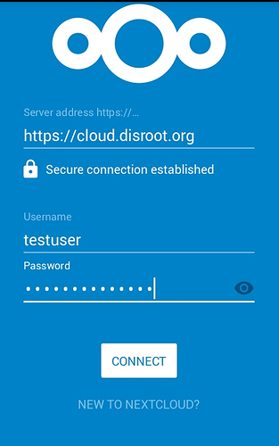
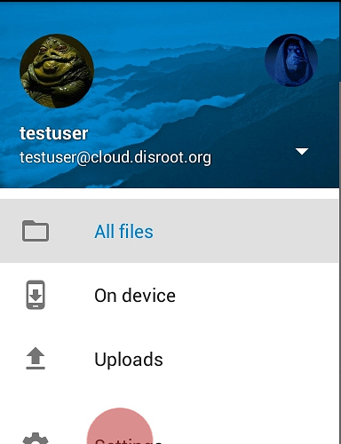
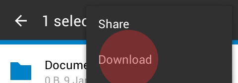
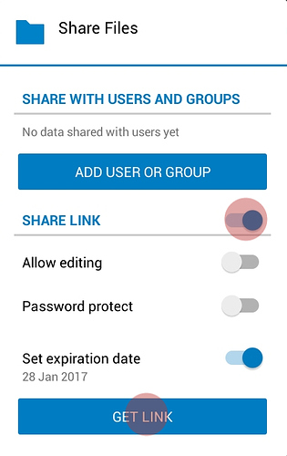

La possibilité de synchroniser, téléverser et télécharger facilement des fichiers depuis votre cloud Disroot vers votre mobile peut être très utile dans plusieurs cas.

Dans ce tutoriel, nous allons vous montrer comment installer et travailler avec l'application mobile Nextcloud. Cette application vous permet d'accéder et de synchroniser facilement vos fichiers cloud Disroot depuis votre mobile et de télécharger/téléverser/transférer/partager/supprimer sans avoir besoin d'utiliser un navigateur dans votre mobile pour le faire ou de le connecter à un ordinateur portable pour transférer des fichiers.

Cette application ne télécharge pas les fichiers dans un dossier local de votre mobile, elle affiche simplement les fichiers existants dans votre cloud. Les fichiers ne sont téléchargés que si vous les sélectionnez pour les télécharger. De cette façon, cela ne prendra pas trop de place dans votre mobile. Pour les fichiers téléchargés, si vous voulez ou non conserver une copie locale dans votre mobile, c'est votre choix.

----------

# Installer Nextcloud Mobile

Pour installer l'application sur android, nous vous recommandons d'installer l'app store [F-droid](https://f-droid.org/). F-droid fournit des applications open source, et c'est une façon de réduire votre dépendance à Google. Après avoir installé et configuré F-droid, vous pouvez rechercher et installer l'application mobile [Nexcloud](https://f-droid.org/repository/browse/?fdfilter=Nextcloud&fdid=com.nextcloud. client/).

Les utilisateurs d'IOS devront probablement payer environ 0,99€ pour cela dans l'app store IOS.

----------

# Configuration du compte
Une fois l'application installée, démarrez-la et connectez-vous avec vos identifiants de compte Disroot:

* **Serveur:** [https://cloud.disroot.org](https://cloud.disroot.org)
* **Nom d'utilisateur:** _votre_nom_d'utilisateur_Disroot_
* **Password:** _votre_mot_de_passe_Disroot_

----------
# Interface générale

L'interface générale est assez simple et facile à utiliser. Au centre, il y a vos fichiers.
Dans la barre supérieure, vous trouverez:

* Un outil de recherche
* Un bouton de type hamburger sur le côté gauche pour accéder à vos paramètres.
* Sur le côté droit, un bouton pour rafraîchir votre compte et régler le mode d'affichage.
* En bas à droite, vous avez le bouton plus qui vous présente les options de téléchargement.

Vous pouvez naviguer dans les répertoires en appuyant sur eux, puis en utilisant le bouton "retour" dans le coin supérieur gauche.

Si vous appuyez sur le bouton avec les trois points verticaux dans la barre supérieure de l'application, vous pouvez y **Rafraichir votre compte**, **trier** et **Vue Grille**.

Dans **Rafraîchir votre compte** vous pouvez demander à synchroniser vos fichiers (si lors du démarrage de l'application mobile pour la première fois vos fichiers n'apparaissent pas utilisez cette option).
Dans **sort**, vous pouvez décider si vos fichiers seront affichés par ordre alphabétique, par date et ainsi de suite.
Dans **Vue Grille**, vous pouvez changer la façon dont les fichiers sont affichés, d'une "liste de fichiers" à la vue Grille et inversement:

    

----------
## Réglages généraux

Dans les réglages généraux, vous pouvez:

* Choisir de téléverser automatiquement sur votre Cloud toutes les vidéos et photos que vous prenez ou faites sur votre téléphone
* Définir vers quel dossier ces téléchargements vont
* Définir si vous voulez garder une copie locale de ces vidéos et photos que vous téléversés
* Définir un mot de passe pour accéder à l'application mobile Nexcloud
* Définir si vous voulez que l'application affiche les fichiers cachés
* Installer DAVDroid pour synchroniser les calendriers, tâches et contacts

Vous pouvez accéder à ces réglages en appuyant sur le bouton hamburger en haut à gauche, puis sur "Réglages".

**NÉCESSITE UNE MISE À JOUR**
## Téléversement automatique d'images et de vidéos

Le téléversement automatique de vos photos et vidéos vers le serveur est essentiellement dû au simple fait de cocher une case dans les options.  

lorsque vous appuyez sur la touche de téléversement instantané d'images ou de vidéos, toutes les options sont affichées.
Vous pouvez y définir si les images ou les vidéos, sont téléversées immédiatement, ou seulement lorsque vous êtes connecté au wifi, si elles vont dans le dossier "téléversement instantané" qui est créé pour cela ou à un autre.
 

 

 
A la fin de ces options, vous pouvez définir ce qu'il faut faire avec les fichiers originaux de l'image ou de la vidéo qui ont été téléchargés:
  
 

 
Le dossier de l'application est un dossier local sur votre mobile dans lequel l'application Nextcloud peut stocker les fichiers téléchargés. Le dossier original est, eh bien... le dossier d'images ou de vidéos.

## Définir le mot de passe
Pour protéger l'accès à votre application mobile Nextcloud, cochez la case "Verrouiller le code d'accès". Cela empêchera toute personne ayant accès à votre téléphone d'ouvrir l'application et de parcourir votre stockage cloud.

**REMARQUE: Si vous activez la protection par mot de passe, il vous sera demandé à chaque fois que vous démarrez l'application, et à chaque fois que vous téléchargez un fichier à l'aide des options de partage mobile (partager les photos de la galerie, etc.).**

## Afficher les fichiers cachés
Nextcloud sur le cloud Disroot permet de téléverser des *"fichiers cachés"*. En cochant l'option *"Afficher les fichiers cachés"* vous serez autorisé à voir ces fichiers sur votre application mobile.

----------
# Téléverser et télécharger des fichiers

## Téléverser des fichiers depuis l'application Nextcloud
Vous pouvez téléverser des fichiers dans votre cloud Disroot avec l'application mobile de deux façons:

### L'option téléverser dans l'application

Pour téléverser depuis l'application Nextcloud, sélectionnez le bouton *"plus"* dans l'interface principale.

### Téléverser en utilisant la fonction "Partager" d'autres applications

La plupart des applications prennent en charge la fonctionnalité "Partage", qui vous permet de partager du contenu directement avec une autre application. En utilisant cette propriété, vous pouvez facilement partager le contenu directement avec l'application Nextcloud, ce qui vous permettra de le téléverser. Par exemple, vous pouvez utiliser le bouton *"Partager"* dans l'application Galerie pour téléverser des photos ou des vidéos dans votre cloud.

#Télécharger des fichiers
Sélectionnez les fichiers que vous souhaitez télécharger par *"pression longue"*. Le fichier sélectionné sera mis en surbrillance et tous les fichiers de ce dossier auront une case à cocher à gauche. Utilisez les cases à cocher pour sélectionner d'autres fichiers que vous souhaitez télécharger, puis appuyez sur le bouton en haut à droite.

----------

## Partager des fichiers et dossiers
Vous pouvez partager des fichiers ou des dossiers à n'importe qui via un lien URL de lien public ou avec d'autres personnes qui utilisent un clou basé sur le logiciel Nextcloud/OwnCloud même s'ils ne sont pas des utilisateurs Disroot (contrairement aux dropboxes et autres).

Pour partager via l'URL, *"appuyez longuement"* le fichier ou le dossier que vous souhaitez partager, puis appuyer sur le bouton trois points verticaux dans le coin supérieur droit et sélectionner l'option **"Partager"**.
 

De plus, vous pouvez décider si vous autorisez d'autres personnes à éditer les fichiers partagés, définir la date d'expiration ou protéger le partage avec un mot de passe supplémentaire.

Pour partager un fichier ou un dossier avec d'autres utilisateurs Disroot ou Nextcloud/Owncloud via la Fédération, dans l'option de partage sélectionnez "Ajouter un utilisateur ou un groupe", écrivez l'identifiant du cloud fédéré de la personne, généralement:

* **NOM_UTLISATEUR@SADRESSE_SERVEUR**

----------
# Gérer et ajouter plusieurs comptes
Si vous avez plusieurs comptes cloud répartis sur plusieurs services utilisant Nextcloud ou Owncloud, vous pouvez les ajouter à votre application mobile.
Appuyez sur le *"bouton hamburger"* dans le coin supérieur gauche de l'interface principale ou faites glisser le curseur vers la droite.

Sélectionnez le triangle puis "Ajouter un compte".

Vous devrez répéter le processus de configuration du compte pour le nouveau compte.

Maintenant, pour voir les fichiers sur des comptes supplémentaires, vous devez passer d'un compte à l'autre en passant à droite et en sélectionnant un compte dans le menu.
Si vous téléchargez des fichiers à l'aide des options de partage de votre appareil mobile, il vous sera demandé vers quel compte vous souhaitez que le fichier soit téléversé.

----------
