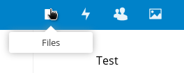
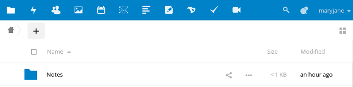

In this tutorial we'll show you how to setup and use your disroot notes in your Android device.

----------

# Install notes app

First of grab **"Nextcloud Notes"** from [F-Droid](https://f-droid.org/packages/it.niedermann.owncloud.notes/) or other commercial app store.    

# Add your disroot account

Once you start the *"Notes"* app, for the first time you will need to add your credentials and URL of disroot cloud server.

- **Server address:** [https://cloud.disroot.org/](https://cloud.disroot.org/)
- **Username:** Your disroot username
- **Password:** Your disroot password

After that just press "*connect*".
Your existing notes from your disroot cloud account should be now synced to your phone.

# Create and delete notes

You can create a new note by pressing the *"plus"* (**+**) button on the lower right corner of the screen.

The editor is very simple:

* the first line of the note is automatically the title of the note.
* After you have written your note press the ok symbol in the upper right corner to create the note.
* To discard the note, press the X symbol on the upper right corner

Notes app uses Markdown formatting so if you are familiar with it you can make them look pretty. If you still dont know what Markdown is, you should definatelly check [this page](http://lifehacker.com/5943320/what-is-markdown-and-why-is-it-better-for-my-to-do-lists-and-notes) which will change your life forever :)

Any change to the notes will be automatically synced to and from disroot cloud.

All the notes you create can be seen in the main menu of the Nextcloud Notes app.

* To edit a particular just press on it.
* To create new notes just press the plus symbol.

To delete a note:

* press on it for a few seconds
* press the garbage button on the upper right corner

# View your notes in Disroot

To view and edit any notes you made in your Android device from your disroot account go to the notes app on the upper bar.

From there you can see and edit the notes.

You can also see and edit your notes in .txt file format in the disroot files app.
Go to the files app.

You will see a folder titled "Notes". Inside it can find your notes in .txt file format. 

 Click on the note to edit it.

Any changes you make to your notes in disroot notes app, or in the .txt file will appear in your Android device in the ownCloud Notes app and vice versa.
