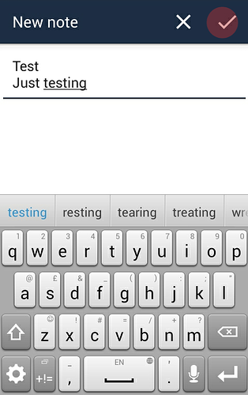
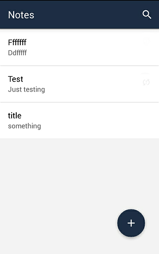
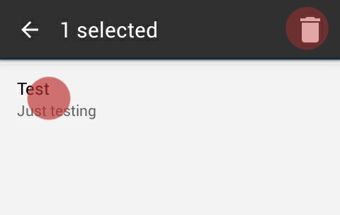
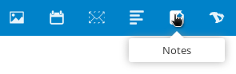
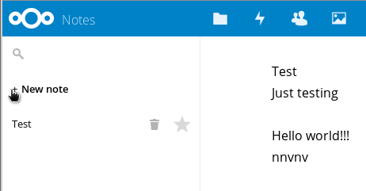
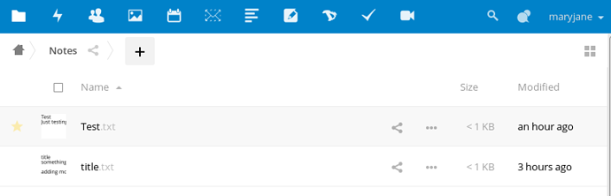

Dans ce tutoriel, nous vous montrerons comment configurer et utiliser vos notes Disroot dans votre appareil Android.

----------

# Installer l'application Notes

Tout d'abord, récupérer **"Nextcloud Notes"** de [F-Droid](https://f-droid.org/packages/it.niedermann.owncloud.notes/) or other commercial app store.    

# Ajouter votre compte Disroot

Une fois que vous démarrez l'application *"Notes"*, pour la première fois vous aurez besoin d'ajouter vos informations d'identification et l'URL du serveur cloud Disroot.

- **Adresse du serveur:** [https://cloud.disroot.org/](https://cloud.disroot.org/)
- **Nom d'utilisateur:** Votre nom d'utilisateur Disroot
- **Mot de passe:** Votre mot de passe Disroot

Ensuite, appuyez simplement sur "*connecter*".
Vos notes existantes de votre compte cloud Disroot doivent maintenant être synchronisées avec votre téléphone.

# Créer et supprimer des notes

Vous pouvez créer une nouvelle note en appuyant sur le bouton *"plus"* (**+**) dans le coin inférieur droit de l'écran.

L'éditeur est très simple:

* la première ligne de la note est automatiquement le titre de la note.
* Après avoir écrit votre note, appuyez sur le symbole ok dans le coin supérieur droit pour créer la note.
* Pour effacer la note, appuyez sur le symbole X dans le coin supérieur droit.

L'application Notes utilise le formatage Markdown donc si vous êtes familier avec elle, vous pouvez les rendre jolies. Si vous ne savez toujours pas ce qu'est Markdown, vous devriez certainement voir [cette page](http://lifehacker.com/5943320/what-is-markdown-and-why-is-it-better-for-my-to-do-lists-and-notes) qui changera votre vie pour toujours:)

Toute modification des notes sera automatiquement synchronisée vers et à partir du cloud Disroot.

Toutes les notes que vous créez sont affichées dans le menu principal de l'application Nexcloud Notes.

* Pour éditer un fichier particulier, il suffit d'appuyer sur la touche.
* Pour créer de nouvelles notes, appuyez simplement sur le symbole plus.

Pour supprimer une note:

* presser dessus pendant quelques secondes
* appuyez sur le bouton poubelle dans le coin supérieur droit

# Voir vos notes dans Disroot

Pour afficher et modifier les notes que vous avez faites dans votre appareil Android à partir de votre compte Disroot, allez dans l'application Notes sur la barre supérieure.

De là, vous pouvez voir et éditer les notes.

Vous pouvez également voir et éditer vos notes au format de fichier .txt dans l'application de Fichiers Disroot.
Allez dans l'application Fichiers.

Vous verrez un dossier intitulé "Notes". A l'intérieur, vous trouverez vos notes au format. txt.

Cliquez sur la note pour la modifier.

Any changes you make to your notes in disroot notes app, or in the .txt file will appear in your Android device in the ownCloud Notes app and vice versa.
