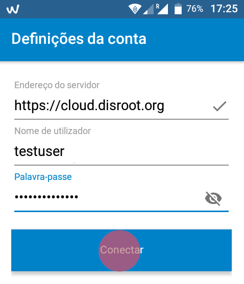
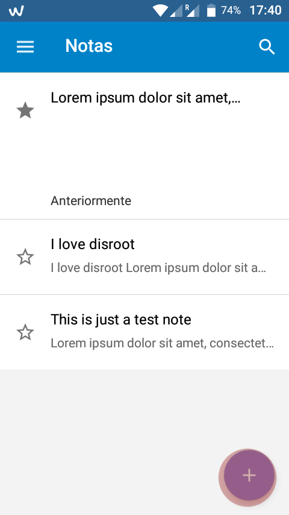
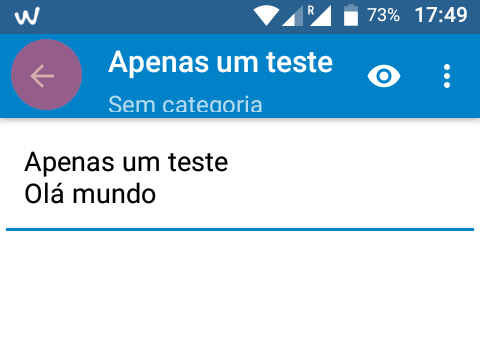
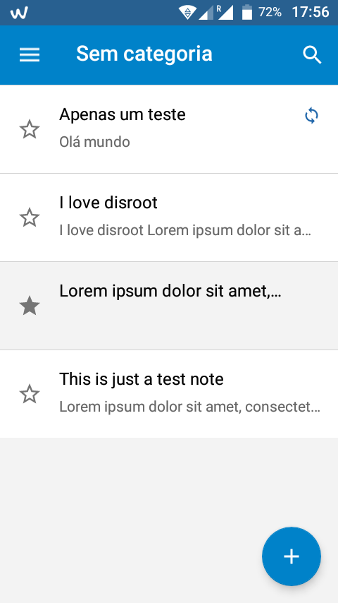
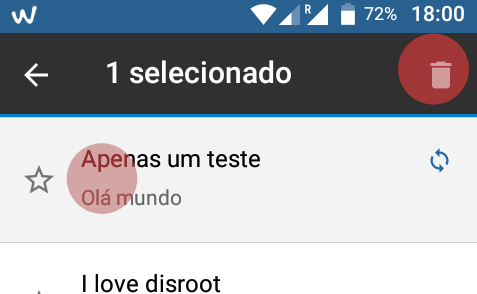
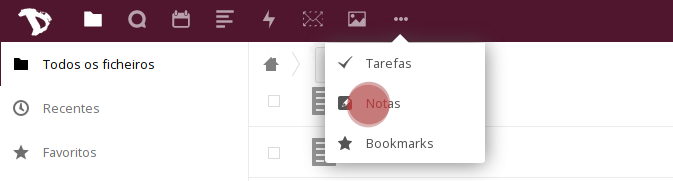
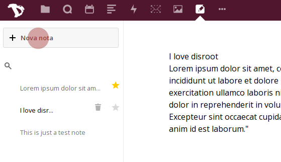
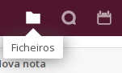
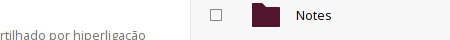
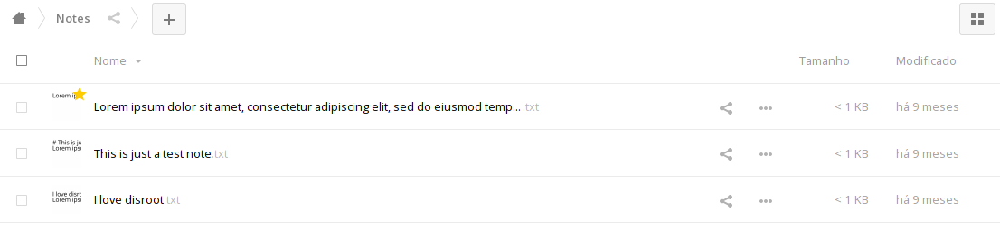

Neste tutorial iremos mostrar-lhe como configurar e utilizar as suas notas do serviço do Disroot no seu dispositivo Android.

----------

# Instalar a aplicação "notas"

Primeiro descarregue a aplicação **"Nextcloud Notes"** a partir do  [F-Droid](https://f-droid.org/packages/it.niedermann.owncloud.notes/) pu qualquer outra loja de aplicações.    

# Adicionar a sua conta Disroot

Assimq eu abrir pela primeira vez a aplicação  **"Notas"**, precisa de adicionar as credenciasi da sua conta e o link URL para o servidor do Disroot.

- **Endereço do Servidor:** [https://cloud.disroot.org/](https://cloud.disroot.org/)
- **Nome de utilizador:** O seu nome de utilizador do Disroot
- **Palavra-passe:** A password da sua conta no Disroot

Depois disso basta carregar em "**conectar**".
As notas que tiver na sua conta de cloud do Disroot irão ser automaticamente sincronizadas com o seu telemóvel.

# Criar e apagar notas

Você pode criar uma nova nota carregando no botão *"mais"* (**+**) no canto inferior direito do ecrã

O editor é muito simples:

* A primeira linha de texto da nota é automaticamente o título da nota .
* Depois de ter escrito a sua nota carregue na seta no canto superior esquerdo para criar a nota.

A plicação de notas utiliza formatação em Markdown, por isso se estiver familiarizado com Markdown pode fazer as suas notas parecerem bonitas. Se ainda não sabe o que é Markdown, recomendamos que veja [esta página](http://lifehacker.com/5943320/what-is-markdown-and-why-is-it-better-for-my-to-do-lists-and-notes) o que irá alterar a sua vida para sempre :)

Quaisquer alterações nas notas serão automaticamante sincronizadas entre a sua cloud do Disroot e o seu dispositivo Android.

Todas as notas que criar podem ser vistas na página principal da aplicação "Notas".

* Para editar uma nota em particular basta carregar nela.
* Para criar uma nova nota basta carregar no botão **"mais"** .

Para apagar uma nota:

* Carregue na respetiva nota por uns segundos
* Carregue no botão de caixote de lixo no canto superior direito

# Ver as suas notas no Disroot

Para ver e editar quaisquer notas que tenha feito no seu dispositivo Android a partir da sua cloud, carregue na sua aplicação de "Notas" na barra superior.

A partir daí pode ver e editar as suas notas.

Você também pode ver e editar as suas notas em formato .txt na página de ficheiros da sua cloud. Vá à aplicação de ficheiros.

Irá ver uma pasta chamada "Notes". Dentro desta pasta pode encontrar as suas notas em formato .txt.

 Carregue na respetiva nota para a editar

Todas as alterações que você fizer nas suas notas na aplicação de notas na sua conta de Cloud do Disroot ou no ficheiro .txt aparecerão na aplicação de notas do Nextcloud no seu dispositivo Android e vice versa.
