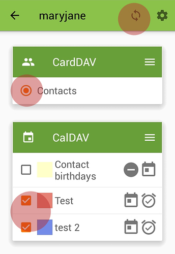

Disroot has calendar, contacts and tasks apps enabled.

In this tutorial we'll show you how to setup and use your disroot calendar, contacts and tasks on your Android device.
To do this you will need to install the DAVdroid app and Open Tasks in Android.
For Open Tasks to work it will need DAVdroid to also be installed, but if you just want to sync your calendar or contacts you don't need to install Open Tasks.

----------
# Install DAVdroid
## From appstore
DAVdroid Is available on your favorite app store. We encourage you to use [F-Droid](https://f-droid.org/).

## From NextcloudApp
If you have nextcloud mobile app installed and linked to your disroot cloud you can install it from there:
 - Open Nextcloud Android App
 - Got to settings > **"Sync calendar and contacts"**

 NextcloudApp will now fetch, install and configure your account automagically.

 ---------------

## Add your disroot account to DAVdroid

If you haven't install DAVDroid via NextcloudApp you will have to manually setup an account.
To get started open-up "DavDroid app" and press the *"plus"* (**+**) button.

Select "login with url and username", and put server address and credentials

> Server address: https://cloud.disroot.org
> Username: your disroot username
> Password: your disroot password

After you setup your account, you need to select which calendars and address books you want to sync from disroot to your android device.
Press the big orange button with the account name.

-------------------

# Calendar
Now your Calendars from disroot will be synced to your device and will appear in your Calendar app of choice. Any event added on the phone will be automatically synced to disroot and vice versa.

After that, the calendars in your disroot account that you selected will be synced and visible in your Android device calendar.
---------------------
# Contacts
Your Contacts should be straight away available and synced with disroot.
**Note:**
If you want to migrate your Android contacts to your disroot contacts and stop syncing with google, then follow [this](https://forum.disroot.org/t/syncing-android-with-owncloud/186) tutorial made by @muzirian

---------------------
#Tasks

[Open Tasks](https://f-droid.org/packages/org.dmfs.tasks/) Is available in F-Droid and in other commercial app stores.

If you have already followed previous steps and your DAVdroid account is setup and syncing your calendars from disroot cloud, all the tasks should be available the moment you install and open *"Open Tasks"* app.
All Tasks are asigned to each calendar. Tapping the name of the calendar will reveal the tasks.

Open tasks is easy to use. You can create additional tasks, group them together, add tags, set due dates and notifications, assign priority levels etc.
All changes will be automatically synced back to the cloud. The main page of the app gives you an overview of all current tasks, grouped by:
* tasks list
* tasks due
* tasks starting
* task priority
* task in progress

-----------------------
