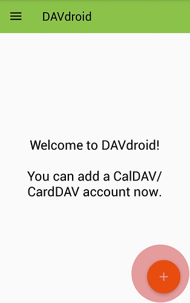
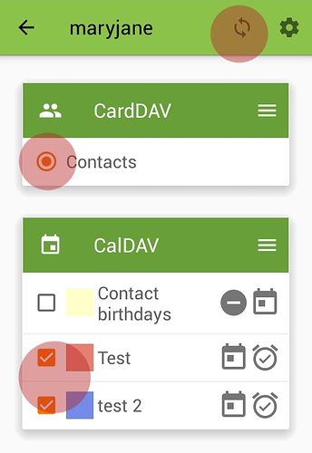
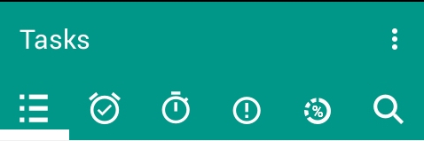

Disroot a activé les applications calendrier, contacts et tâches.

Dans ce tutoriel, nous vous montrerons comment configurer et utiliser votre calendrier, vos contacts et vos tâches disroot sur votre appareil Android.
Pour ce faire, vous devrez installer l'application DAVdroid et Open Tasks dans Android.
Pour qu'Open Tasks fonctionne, il faut que DAVdroid soit également installé, mais si vous voulez juste synchroniser votre agenda ou vos contacts, vous n'avez pas besoin d'installer Open Tasks.

----------
# Installer DAVdroid
## Depuis l'appstore
DAVdroid est disponible sur votre app store préféré. Nous vous encourageons à utiliser [F-Droid](https://f-droid.org/).

## Depuis l'application Nextcloud
Si l'application mobile nextcloud est installée et liée à votre cloud disroot, vous pouvez l'installer à partir de là:
 - Ouvrez application Android Nextcloud
-  Paramètres > **"Synchroniser calendrier et contacts"**

L'application Nextcloud va maintenant chercher, installer et configurer votre compte automatiquement.

 ---------------

## Ajouter votre compte disroot dans DAVdroid

Si vous n'avez pas installé DAVDroid via l'application Nextcloud, vous devrez configurer manuellement un compte.
Pour commencer, ouvrez "l'application DavDroid" et appuyez sur le bouton *"plus"* (**+**).

Sélectionnez "Se connecter avec une url et un nom d'utilisateur", puis indiquez l'adresse et les identifiants du serveur.

> Adresse serveur: https://cloud.disroot.org
> Nom d'utilisateur: votre nom d'utilisateur disroot
> Mot de passe: votre mot de passe disroot

Après avoir configuré votre compte, vous devez sélectionner les calendriers et carnets d'adresses que vous souhaitez synchroniser à partir de disroot vers votre appareil android.
Appuyez sur le gros bouton orange avec le nom du compte.

-------------------

# Calendrier
Désormais, vos calendriers disroot seront synchronisés avec votre appareil et apparaîtront dans l'application Calendrier de votre choix. Tout événement ajouté au téléphone sera automatiquement synchronisé vers disroot et vice versa.
Après cela, les calendriers sélectionnés de votre compte disroot seront synchronisés et visibles dans votre calendrier Android.

---------------------
# Contacts
Vos contacts sont immédiatement disponibles et synchronisés avec disroot.
**Note:**
Si vous voulez migrer vos contacts Android vers vos contacts disroot et arrêter la synchronisation avec google, alors suivez [ce tutoriel](https://forum.disroot.org/t/syncing-android-with-owncloud/186) réalisé par @muzirian.

---------------------

# Tâches

[Open Tasks](https://f-droid.org/packages/org.dmfs.tasks/) est disponible dans F-Droid et dans d'autres app store.

Si vous avez déjà suivi les étapes précédentes et que votre compte DAVdroid est configuré et que vous synchronisez vos calendriers à partir du cloud disroot, toutes les tâches devraient être disponibles au moment où vous installez et ouvrez l'application *"Open Tasks"*.
Toutes les tâches sont affectées à chaque calendrier. En tapant sur le nom du calendrier, vous verrez les tâches.

Open tasks est facile à utiliser. Vous pouvez créer des tâches supplémentaires, les regrouper, ajouter des mots clef, définir des dates d'échéance et des notifications, affecter des niveaux de priorité, etc.
Tous les changements seront automatiquement synchronisés avec le cloud. La page principale de l'application vous donne une vue d'ensemble de toutes les tâches courantes, groupées par:
* liste des tâches
* tâches dues
* début des tâches
* priorité de la tâche
* tâche en cours

-----------------------
