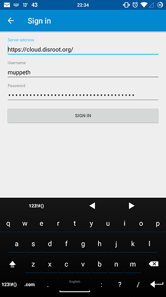
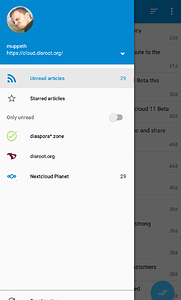
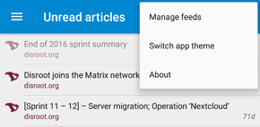

# News App on Android

## Get it
To get news app on your android device we recommend visiting f-droid and adding it's app store. [F-droid](https://f-droid.org/) provides free (as in freedom) and trusted applications. Using that store over Google Play is a great step forward to free yourself.

Once you have f-droid installed and running, you can search for [OCReader](https://f-droid.org/repository/browse/?fdfilter=news&fdid=email.schaal.ocreader) within the F-droid app or download and install it directly form the [website](https://f-droid.org/repository/browse/?fdfilter=news&fdid=email.schaal.ocreader)

## Setup
When that's done you can fire up the app, and login with your disroot account.

Once you're logged in, all your news feeds will be synced to your device, and you can start reading immediately.
Swiping to the left show you your account information and give you the list of subscribed feeds as well as number of unread posts.

## Add/remove feeds
You can also add and remove feeds directly on your phone. Tap on the 'three dot" icon on the top right corner of the main app window and select "Manage feeds".

## Synchronize
To synchronize your feeds, press **"Synchronize"** button on the left-side panel.

Happy reading! :grinning:

----------
