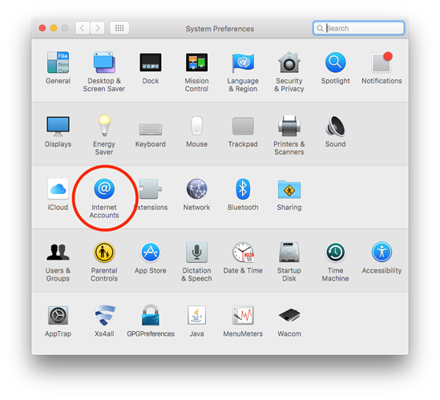
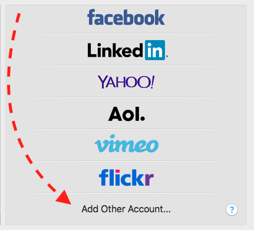
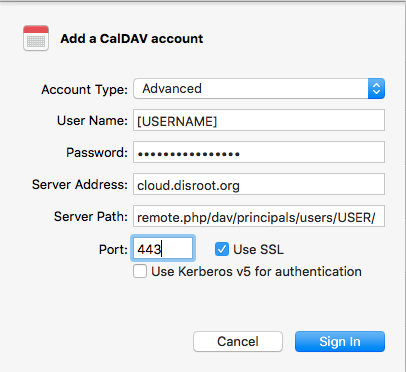

_This tutorial was last updated on 3 feb. 2017_

# Goal:
**Sync the macOSX Calendar App with the Disroot cloud.**

This will allow you to check, update and remove your events from any computer with an internet connection. Also it will enable syncing calendar items with your smartphone and/or tablet. Once it runs, and nothing breaks, you'll forget it is there.

# Requirements

* Your Disroot login name
* Your Disroot password
* An Apple computer with OSX (10.8 - 10.11.6) installed
* A working internet connection
* 15 minutes

# Set up Calendar Syncing.

1. Click on the **Apple icon** in the top left of your screen.
2. Open the menu item '**System Preferences...**'.
3. Click on the icon with the name '**Internet Accounts**'.

5. Scroll down in the right pane, until you can click at the bottom on '**Add Other Account...**'

7. Choose the third item from the top: '**CalDav Account**'

A window opens called **'Add CalDAV account'**

From the drop down menu:
**Account type:** Advanced.
**Username**: your username  (_without @disroot.org_)
**Password**: your password
**Server Address**: `cloud.disroot.org`
**Server Path**: `remote.php/dav/principals/users/USERNAME/` (replace USERNAME with your username)
**Port**: `443` and **Use SSL** ticked.

Click `Sign In`!

Now your calendar is added. If you now open the Calendar App, two new calendar will show in the left column. You can change the name and colors in the Calendar App preferences.

