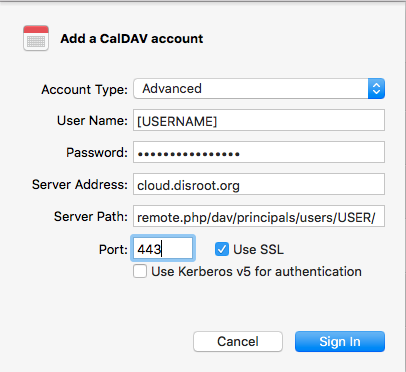

_Ce tutoriel a été mis à jour pour la dernière fois le 3 févr. 2017_

# But:
** Synchroniser l'application de calendrier macOSX avec le cloud Disroot.**

Ceci vous permettra de vérifier, mettre à jour et supprimer vos événements depuis n'importe quel ordinateur avec une connexion Internet. Cela permet également de synchroniser les éléments du calendrier avec votre smartphone et/ou votre tablette. Une fois que cela fonctionnera sans problème, vous oublierez que c'est là.

# Conditions nécessaires

* Votre nom d'utilisateur Disroot
* Votre mot de passe Disroot
* Un ordinateur Apple équipé d'OSX (10.8 - 10.11.6) installé
* Une connexion Internet fonctionnelle
* 15 minutes

# Configurer la synchronisation du calendrier.

1. Cliquez sur l'icône **Pomme** dans le coin supérieur gauche de votre écran.
2. Ouvrez le menu ' **Préférences du système...**'.
3. Cliquez sur l'icône avec le nom '**Comptes Internet**'.

5. Faites défiler vers le bas dans le volet de droite, jusqu' à ce que vous puissiez cliquer en bas sur '**Ajouter un autre compte...**''.

7. Choisissez le troisième élément en haut de la page: '**Compte CalDav**'.

Une fenêtre s'ouvre appelée **'Ajouter un compte CalDAV'**.

Dans le menu déroulant:
**Type de compte:** Avancé.
**Nom d'utilisateur**: votre nom d'utilisateur (_sans @disroot.org_)
**Mot de passe**: votre mot de passe
**Adresse du serveur**: `cloud.disroot.disroot.org`
**Chemin du serveur**: `remote.php/dav/principals/utilisateurs/NOMUTILISATEUR/` (remplacez NOMUTILISATEUR par votre nom d'utilisateur)
**Port**: `443` et **Utilisez SSL**** coché.

Cliquez sur `S'identifier`!

Votre calendrier est maintenant ajouté. Si vous ouvrez maintenant l'application Calendrier, deux nouveaux calendriers apparaîtront dans la colonne de gauche. Vous pouvez modifier le nom et les couleurs dans les préférences de l'application Calendrier.

