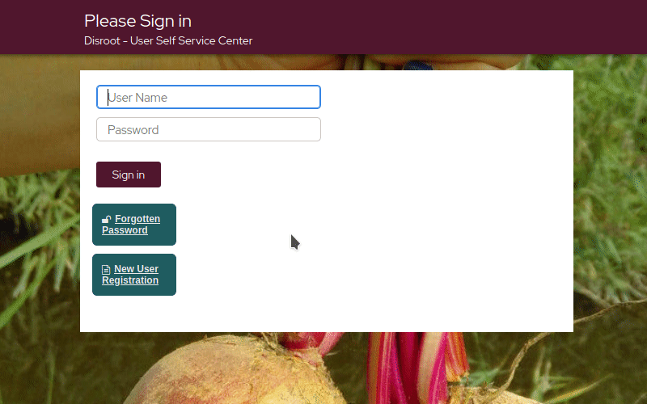

#  Reseting your Password
In order to reset your password, you must have previously

- a. configured the [**security questions**](../../questions) and that, of course, you remember the answers;
- b. entered a [**secondary email**](../../profile) (during the registration or prior to this process), otherwise the code will be sent to the address of the same account you are trying to reset.

!! ##### If none of the above conditions apply to your case then it will not be possible to recover the password and the account may be considered lost.

1. Go to [https://user.disroot.org](https://user.disroot.org)
2. Click on the "**Forgotten Password**" button
3. Type your username and then **Search**
4. Choose one of the methods
  - **Secret Questions and Answers**: If you choose this option, you will be prompted with the questions.  *Please, note that the answers are case sensitive*

  - **SMS/Email Verification**: This option allows you to request the password reset via a secondary email.

!! ##### Remember:
!! ##### the account and its security is your responsibility, **we cannot reset your password** so please, take all the necessary measures to keep it safe and secure.
