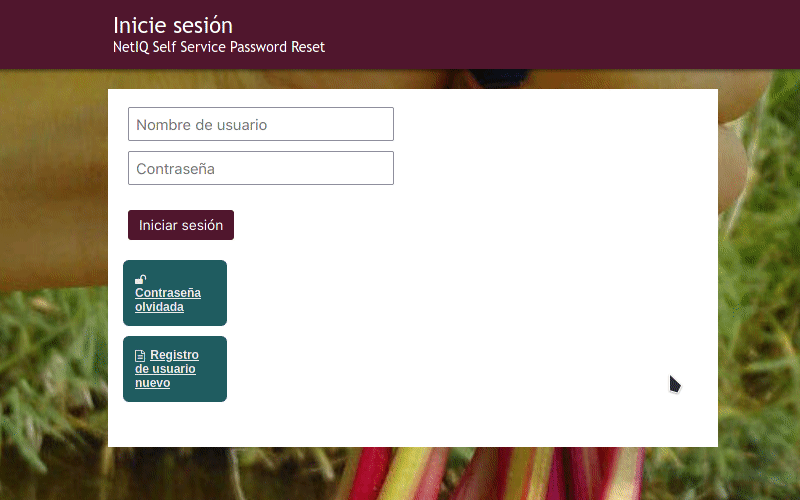

#  Restableciendo tu contraseña
Para poder restablecer tu contraseña, previamente debes haber

- a. configurado las [**preguntas de seguridad**](../../questions) y, por supuesto, recordar las respuestas;
- b. ingresado un [**correo secundario**](../../profile) (durante el registro o antes de este proceso), de lo contrario, el código será enviado a la dirección de la misma cuenta que estás tratando de restablecer.

!! ##### En el caso que ninguna de las condiciones arriba mencionadas se cumpla, entonces no será posible restablecer la contraseña y la cuenta puede considerarse perdida.

1. Ve a [https://user.disroot.org](https://user.disroot.org)
2. Haz click en el botón "**Contraseña olvidada**"
3. Escribe tu nombre de usuarix y luego click en **Buscar**
4. Elige uno de estos métodos:
  - **Preguntas y respuestas secretas**: Si eliges esta opción, las preguntas te serán presentadas.  *Por favor, ten en cuenta que las respuestas son sensibles a las mayúsculas y minúsculas*

  - **Verificación por SMS/correo electrónico**: Esta opción te permite realizar el restablecimiento de la contraseña a través de un correo secundario.

!! ##### Recuerda:
!! ##### la cuenta y su seguridad son tu responsabilidad, **no podemos restablecer tu contraseña**, así que, por favor, toma todas las medidas necesarias para mantenerla a salvo y segura.
