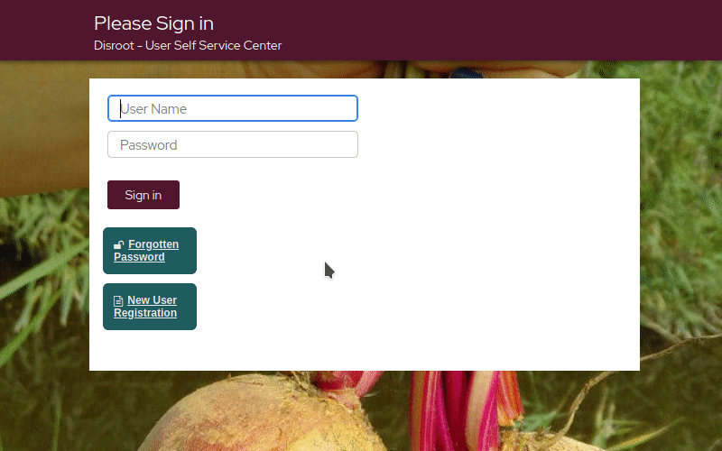

# Сброс пароля
Чтобы сбросить пароль, вы должны были предварительно:

- a. Создать и настроить [**контрольные вопросы**](../../questions) и конечно запомнить ответы;
- b. Добавить [**дополнительный e-mail адрес**](../../profile) (во время регистрации или до процесса сброса пароля), в противном случае код будет отправлен на адрес той же учётной записи, котоую вы пытаетесь сбросить.

!! ##### Если ни одно из вышеперечисленных условий не выполнено, то сбросить пароль будет невозможно и учетная запись может считаться утерянной.

1. Перейдите на [https://user.disroot.org](https://user.disroot.org)
2. Нажмите кнопку "**Забытый пароль**"
3. Введите свое имя пользователя и нажмите **Поиск**.
4. Выберите один из этих способов:
  - **Секретные вопросы и ответы**: если вы выберете этот способ, вам будет предложено ответить на вопросы.  *Обратите внимание, что ответы вводятся с учетом регистра*

  - **Подтверждение по SMS/e-mail**: этот способ позволяет запросить сброс пароля через дополнительный адрес электронной почты.

!! ##### Запомните:
!! ##### учетная запись и ее безопасность находятся под вашей ответственностью, **мы не можем сбросить ваш пароль**, поэтому, пожалуйста, примите все необходимые меры, чтобы сохранить его в безопасности.