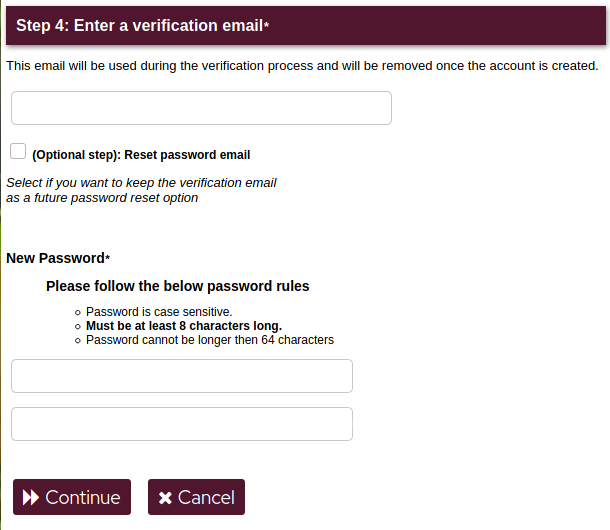

# Registrazione di un nuovo account
Sebbene il processo sia piuttosto semplice, lo vedremo passo dopo passo. 

!! **Quando registri un account, tieni presente quanto segue:**
!! - Utilizza lo stesso dispositivo con cui compili il modulo per aprire il link di verifica. 
!! - Dopo 15 minuti la sessione scade e sarà necessario riavviare il processo. 
!! - Se stai utilizzando TOR o una VPN e il tuo IP cambia durante il processo, sarà considerato un attacco alla sicurezza e quindi la tua sessione potrebbe essere bloccata. 

## Registrazione passo passo
###  01: Lo username
Questo sarà il nome del tuo account e dell'e-mail e non può essere modificato dopo averlo creato. Il nome del tuo account sarà simile a _**nomeutente@disroot.org**_ 

### 02: Il nome a schermo
Il nome a schermo è il nome che verrà visualizzato nei servizi che richiedono l'accesso, come **Cloud** o **Email**. Di solito è lo stesso del tuo nome utente, ma puoi scegliere quello che vuoi. 
Ad esempio, il tuo nome utente potrebbe essere _nomeutente_ e il tuo nome a schermo _Nome utente_. 

### 03: La domanda di verifica
La domanda di verifica ha lo scopo di verificare che tu sia umano, non uno spam bot e di tenere gli spammer il più lontano possibile. 
!! **La risposta dovrebbe soddisfare i seguenti requisiti**:
!! - Dovrebbe essere lunga almeno 150 caratteri.
!! - Deve essere la risposta alla domanda e niente di più.
!! - Non deve essere una citazione o un copia/incolla da una fonte esterna.
!! - Può essere espressa in qualsiasi lingua, anche se consigliamo l'inglese
!! - Non può contenere caratteri speciali di un'altra lingua diversa dall'inglese. Ciò significa che dovresti evitare di usare accenti o, ad esempio, la lettera ñ.

### 04: L'email di verifica
Per completare il processo di registrazione è necessario inviarti un codice di verifica a una email valida. Anche in questo passaggio, puoi scegliere di utilizzare questo stesso indirizzo per la futura reimpostazione della password nel caso in cui ne avessi bisogno. Se preferisci non farlo, **ricorda di mantenere la tua password al sicuro** in quanto **questo indirizzo email viene rimosso dal nostro database una volta che la richiesta è stata approvata/rifiutata e non possiamo reimpostarla**. 

Quindi inserisci la tua password due volte, verificando che soddisfi le regole della password e fai clic sul pulsante **Continua** per terminare. 

E questo è tutto **\0/**

!! #### ATTENZIONE 
!! **Le richieste di account vengono esaminate manualmente su base giornaliera e pertanto l'approvazione può richiedere fino a 48 ore.**
