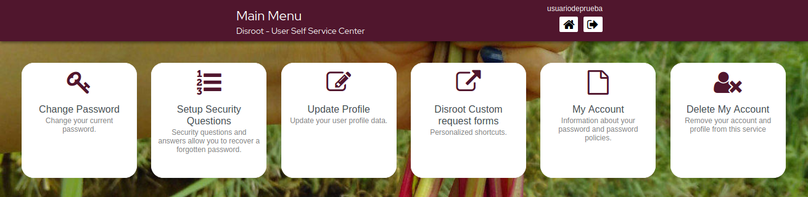

# User Self Service Center

The **User Self Service Center** is the place where you can manage your **Disroot** account settings, from changing the password to deleting it.

## Signing in
Go to [https://user.disroot.org](https://user.disroot.org) and log in with your **Disroot** username and password.

## The dashboard
Once you have logged in you will see the **dashboard**.

It is a quick access menu to the account settings and options.

- [Change your password](../password)
- [Setup your security questions](../questions)
- [Update your profile](../profile)
- [Request forms](../forms)
- [Account information](../info)
- [Delete your account](../delete)

From the **User Self Service Center** page you can also:

- [Reset your password](pwd_reset)
- [Register a new account](new_reg)
